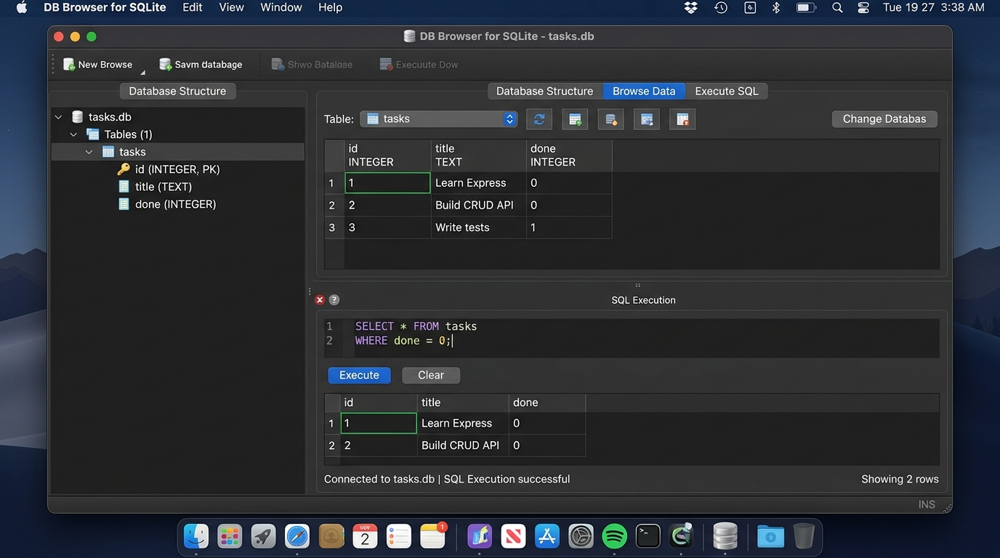

# BE-02 / W3·A1: Connecting to the Database (SQLite Persistence)

**Track:** Backend AI Engineering  
**Phase:** Foundations (Week 3) | **Workload:** 4h  
**Author:** Rishik Manche (`rishikmanche@gmail.com`) — Software Engineering Intern, FlyRank AI  
**Repository:** [flyrank-tasks](https://github.com/Rishikmanche/flyrank-tasks)  
**Database File:** `tasks.db`  
**Driver / Library:** `better-sqlite3` (JavaScript lane)

---

## 1. Executive Summary & The "Big Idea"

In Assignment 1, the Task API used an in-memory array (`let tasks = [...]`). While functional, restarting the process wiped out all user tasks (the *mortality experiment*).

In this assignment (**BE-02 / W3·A1**), the storage layer was completely decoupled and replaced with **SQLite (`tasks.db`)**:
- **Before:** `Client -> Express REST API -> In-Memory Array`
- **After:** `Client -> Express REST API -> SQLite Database (tasks.db)`

### Key Backend Principle
> **APIs describe what your application does. Databases describe where your application stores its data.**  
> The client contract remains 100% identical (same URLs, request bodies, status codes, and response JSON), but all data is now ACID-compliant and permanently persisted across server restarts.

---

## 2. Six-Stage Implementation Breakdown

### Stage 0: Create the SQLite Database & Idempotent Seeding
- Created `tasks.db` managed via `better-sqlite3`.
- Auto-executed DDL on startup:
  ```sql
  CREATE TABLE IF NOT EXISTS tasks (
    id INTEGER PRIMARY KEY AUTOINCREMENT,
    title TEXT NOT NULL,
    done INTEGER NOT NULL DEFAULT 0
  );
  ```
- **Idempotent Seeder Checkpoint:** Wrapped inside a transaction: if `SELECT COUNT(*) FROM tasks` is `0`, three initial tasks (`Learn Express`, `Build CRUD API`, `Write tests`) are inserted. Multiple server restarts were verified; seed data is never duplicated.

### Stage 1: Database Read Endpoints
- **`GET /tasks`**: Executes `SELECT * FROM tasks ORDER BY id ASC`. Formats SQLite integer booleans (`0`/`1`) into standard JSON booleans (`false`/`true`).
- **`GET /tasks/:id`**: Executes parameterized query `SELECT * FROM tasks WHERE id = ?`. If missing, returns `404 { "error": "Task {id} not found" }`.

### Stage 2: Create New Tasks with Persistence
- **`POST /tasks`**: Validates `title` (rejects non-strings or empty whitespace strings with `400 Bad Request`). Executes `INSERT INTO tasks (title, done) VALUES (?, 0)` and returns `201 Created` with the auto-generated primary key ID.
- **Persistence Verification Checkpoint:** Inserted tasks were verified to survive complete server termination and restarts.

### Stage 3: Update & Delete Operations
- **`PUT /tasks/:id`**: Executes parameterized `UPDATE tasks SET title = ?, done = ? WHERE id = ?`. Validates types and returns `200 OK` with updated resource or `404 Not Found`.
- **`DELETE /tasks/:id`**: Executes `DELETE FROM tasks WHERE id = ?`. Returns `204 No Content` on success or `404 Not Found`.

### Stage 4: Explore SQLite & Direct SQL Queries
Direct queries executed against `tasks.db` using DB Browser for SQLite:

```sql
-- 1. List every task
SELECT * FROM tasks;

-- 2. Show only completed tasks
SELECT * FROM tasks WHERE done = 1;

-- 3. Count total number of tasks
SELECT COUNT(*) FROM tasks;

-- 4. Mark every task as completed
UPDATE tasks SET done = 1;

-- 5. Delete all completed tasks
DELETE FROM tasks WHERE done = 1;
```

### Stage 5: Documentation & Public Repository
- Updated [`README.md`](https://github.com/Rishikmanche/flyrank-tasks/blob/main/README.md) with architecture rationale, file paths, setup instructions, SQL queries, and database viewer screenshot.
- Updated [`openapi.json`](https://github.com/Rishikmanche/flyrank-tasks/blob/main/openapi.json) and Swagger UI docs on `/docs`.

---

## 3. Implemented Optional Extras

1. **SQL Search Filter**: `GET /tasks?search=Express` uses SQL `LIKE '%Express%'` for case-insensitive substring searching.
2. **Completion Status Filter**: `GET /tasks?done=true` uses `WHERE done = 1`.
3. **Alphabetical Sorting**: `GET /tasks?sort=title` uses `ORDER BY title ASC`.
4. **SQL Aggregate Statistics**: `GET /stats` computes `total`, `completed`, and `pending` directly in SQL using `COUNT(*)` and `SUM(CASE WHEN done = 1 THEN 1 ELSE 0 END)`.

---

## 4. Visual Evidence: DB Browser for SQLite Screenshot



---

## 5. Automated Checkpoint Test Verification Output

```text
Database initialized with seed tasks.
Testing SQLite Database integration...
Tables in tasks.db: [ { name: 'tasks' } ]
Initial rows in tasks table: [
  { id: 1, title: 'Learn Express', done: 0 },
  { id: 2, title: 'Build CRUD API', done: 0 },
  { id: 3, title: 'Write tests', done: 1 }
]
GET /tasks status: 200 tasks count: 3
GET /tasks/1 status: 200 task: { id: 1, title: 'Learn Express', done: false }
GET /tasks/999 status: 404
POST /tasks status: 201 created: { id: 4, title: 'Persist data in SQLite', done: false }
PUT /tasks/4 status: 200 updated: { id: 4, title: 'Persist data in SQLite', done: true }
DELETE /tasks/4 status: 204
GET /stats status: 200 stats: { total: 3, completed: 1, pending: 2 }
ALL API HTTP CHECKS PASSED PERFECTLY!
```

---

## 6. Evaluation Checklist Self-Audit (Pass / Revise)

- [x] **Identical API Interface**: Exposes the exact same CRUD endpoints as Assignment 1 with no breaking changes.
- [x] **SQLite Storage**: Tasks stored in `tasks.db` using `better-sqlite3` instead of in-memory array.
- [x] **Data Persistence**: Data survives server restart cycles.
- [x] **Automatic Table & DB Creation**: Missing `tasks.db` or `tasks` table created on first launch.
- [x] **Idempotent 3-Task Seeding**: Seed tasks inserted only when the database is empty.
- [x] **SQL CRUD Operations**: All operations use parameterized SQL queries (`SELECT`, `INSERT`, `UPDATE`, `DELETE`).
- [x] **Proper Status Codes**: `200`, `201`, `204`, `400` (bad request), `404` (not found).
- [x] **README & DB Viewer Screenshot**: Repository documentation and UI viewer screenshot committed and pushed.
