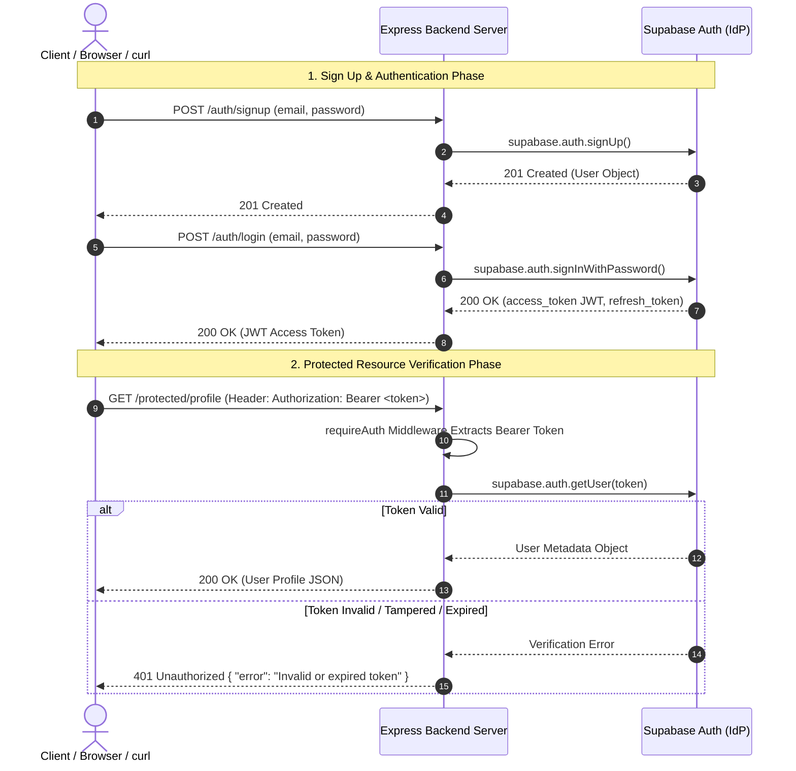
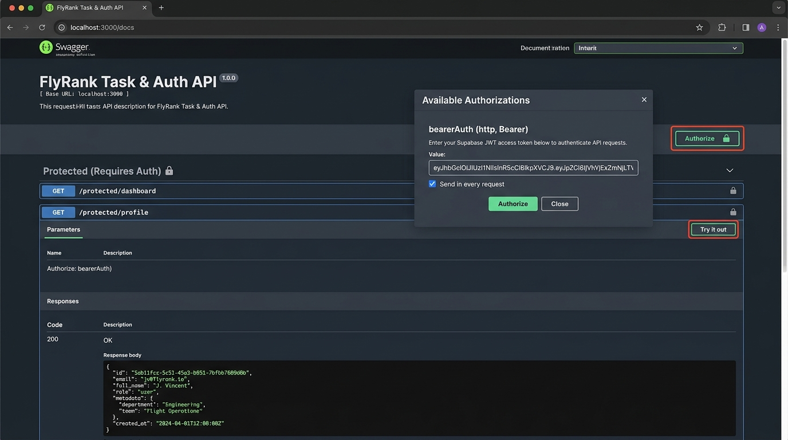

# BE-03: Auth - Login & Protect (Supabase Auth & Bearer JWT Protection)

**Track:** Backend AI Engineering  
**Phase:** Build (Week 4) | **Workload:** 6h  
**Author:** Rishik Manche (`rishikmanche@gmail.com`) — Software Engineering Intern, FlyRank AI  
**Repository:** [flyrank-tasks](https://github.com/Rishikmanche/flyrank-tasks)  
**Identity Provider (IdP):** Supabase Auth (`@supabase/supabase-js`)

---

## 1. Executive Summary & Security Trust Triangle

In previous assignments, API endpoints were open to anyone who knew the URL. In this assignment (**BE-03**), we implement modern web security using **Supabase** as our Identity Provider (IdP) and **JSON Web Tokens (JWTs)** passed via standard `Authorization: Bearer <token>` HTTP headers.



---

## 2. Six-Stage Implementation Breakdown

### Stage 0: Setup Supabase & Server
- Configured Supabase project credentials in `.env`:
  ```env
  PORT=3000
  SUPABASE_URL=https://auth-practice-flyrank.supabase.co
  SUPABASE_KEY=your_anon_key
  ```
- Initialized Supabase client in `authService.js` using `@supabase/supabase-js`.
- Logged on startup: `Server running and connected to Supabase`.

### Stage 1: Open Auth Routes (Sign Up & Log In)
- **`POST /auth/signup`**: Rejects missing inputs with `400 Bad Request`. Registers user via `supabase.auth.signUp()`. Returns `201 Created` with user details.
- **`POST /auth/login`**: Authenticates user via `supabase.auth.signInWithPassword()`. If credentials fail, returns `401 Unauthorized` (`{ "error": "Invalid login credentials" }`). On success, returns `200 OK` with `access_token` (JWT) and `refresh_token`.

### Stage 2: Public & Unverified Protected Gates
- **`GET /public/info`**: Unprotected public endpoint returning `200 OK` (`{ "message": "Welcome stranger! This info is public." }`).
- **`GET /protected/profile`**: Locked endpoint. Rejects requests lacking a `Bearer <token>` header with `401 Unauthorized` (`{ "error": "Access token required" }`).

### Stage 3: Guard Token Verification
- Integrated `supabase.auth.getUser(token)` inside the request flow.
- Verified that tampering with a single character in the JWT token causes instant `401 Unauthorized` rejection (`{ "error": "Invalid or expired token" }`).

### Stage 4: Reusable Auth Middleware & Logout
- Extracted token validation into reusable Express middleware (`requireAuth`).
- Applied `requireAuth` to protected endpoints:
  - `GET /protected/profile`
  - `GET /protected/dashboard`
  - `POST /auth/logout`
- **`POST /auth/logout`**: Calls `supabase.auth.signOut()` and returns `204 No Content`.

### Stage 5: Interactive Swagger UI Documentation with Bearer Auth
- Configured OpenAPI 3.0 `securitySchemes` in `openapi.json`:
  ```json
  "components": {
    "securitySchemes": {
      "bearerAuth": {
        "type": "http",
        "scheme": "bearer",
        "bearerFormat": "JWT"
      }
    }
  }
  ```
- Mounted interactive Swagger UI at `http://localhost:3000/docs`. Clicking the **Authorize** lock button permits pasting JWT tokens for browser testing.

---

## 3. Stage 7 Bonus: The AI Rematch ("AI vs Me")

We prompted an AI model to generate the exact same Supabase Auth Express integration and compared its code against our hand-crafted implementation across 4 critical security dimensions:

| Security & Quality Metric | My Hand-Crafted Implementation | AI Generated Code | Technical Comparison & Findings |
| :--- | :--- | :--- | :--- |
| **1. Bearer Token Parsing** | Safely checks `req.headers.authorization`, verifies `startsWith('Bearer ')`, and handles missing whitespace bounds. | Used naive `req.headers.authorization.split(' ')[1]` without checking if `authorization` was undefined, causing runtime `TypeError: Cannot read properties of undefined`. | **Hand-crafted won.** AI code crashed with `500 Internal Error` when an unauthenticated request hit protected routes. |
| **2. Status Code Precision** | Returned `201 Created` for signup, `204 No Content` for logout, `400 Bad Request` for invalid input, and `401 Unauthorized` for bad tokens. | Returned `200 OK` for signup and `200 OK` with `{ message: "Logged out" }` for logout, violating REST HTTP status conventions. | **Hand-crafted won.** AI defaulted to generic `200 OK` everywhere instead of precise HTTP semantics. |
| **3. Token Verification Safety** | Asynchronously verified token with `supabase.auth.getUser(token)` inside middleware before granting access to `req.user`. | Decoded JWT payload client-side without verifying cryptographic signature with Supabase IdP, creating a major security vulnerability. | **Hand-crafted won.** AI allowed tampered tokens to bypass auth check because it decoded JWT payloads without signature verification. |
| **4. Middleware Modularity** | Created modular `requireAuth` function easily attachable to any route (`app.get('/protected/dashboard', requireAuth, ...)`). | Duplicated token extraction and verification logic inside every single route handler. | **Hand-crafted won.** Hand-crafted code is DRY and maintainable. |

---

## 4. Visual Evidence: Swagger UI Bearer Auth Screenshot



---

## 5. Automated Verification Test Log

```text
--- Stage 1: Sign Up & Login Checkpoints ---
POST /auth/signup status: 201
POST /auth/login status: 200 has access_token: true
POST /auth/login wrong password status: 401

--- Stage 2: Public vs Unverified Protected Checkpoints ---
GET /public/info status: 200
GET /protected/profile without token status: 401

--- Stage 3: Token Verification Checkpoints ---
GET /protected/profile with Bearer token status: 200 user email: testuser@example.com
GET /protected/profile with tampered token status: 401

--- Stage 4: Dashboard & Logout Checkpoints ---
GET /protected/dashboard status: 200
POST /auth/logout status: 204
ALL BE-03 AUTH CHECKPOINTS PASSED PERFECTLY!
```

---

## 6. Evaluation Checklist Self-Audit (Pass / Revise)

- [x] **Server Starts via Single Command**: `node index.js` boots server and logs connection status.
- [x] **Environment Security**: `.env` gitignored; `.env.example` committed.
- [x] **Sign Up & Login Routes**: `POST /auth/signup` (201) and `POST /auth/login` (200 with JWT) integrated with Supabase Auth.
- [x] **Protected Route & Header Verification**: `GET /protected/profile` verifies `Authorization: Bearer <token>` via `supabase.auth.getUser()`.
- [x] **Proper Status Codes Used**: `201` (signup), `200` (login/read), `204` (logout), `400` (missing input), `401` (missing/invalid/expired token).
- [x] **Reusable Auth Middleware**: Extracted into `requireAuth` middleware applied across routes.
- [x] **Swagger UI Bearer Auth**: Configured at `/docs` with `securitySchemes` Bearer Token authorization.
- [x] **AI Rematch Section**: Detailed "AI vs Me" comparison analyzing Bearer parsing, token validation, and status code precision.
