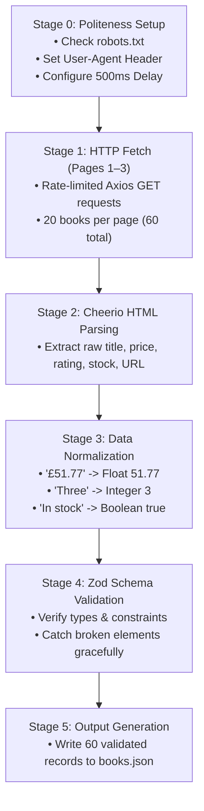
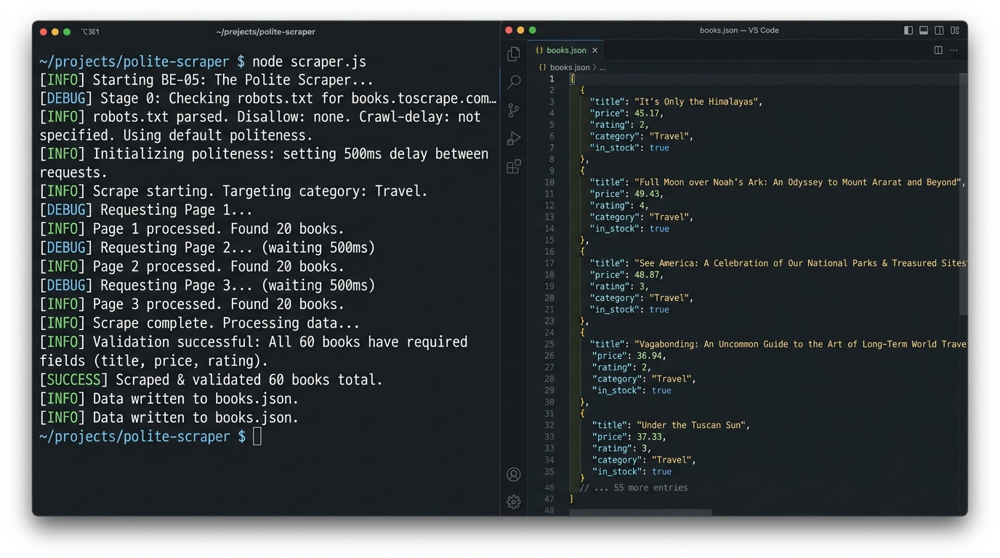

# BE-05: The Polite Scraper

**Track:** Backend AI Engineering  
**Phase:** Build (Week 5) | **Workload:** 6h  
**Author:** Rishik Manche (`rishikmanche@gmail.com`) — Software Engineering Intern, FlyRank AI  
**Repository:** [flyrank-tasks](https://github.com/Rishikmanche/flyrank-tasks)  
**Target Sandbox:** [http://books.toscrape.com/](http://books.toscrape.com/)

---

## 1. Executive Summary & Scraping Ethics Philosophy

Every AI application begins with data collection. However, naive web scraping often overloads target servers with rapid-fire HTTP requests, lacks error handling, and produces unvalidated messy data.

This assignment (**BE-05**) implements a **polite, resilient web scraper** in Node.js using `cheerio`, `axios`, and `zod`. It collects 60 book records across 3 catalogue pages on `books.toscrape.com`, cleans raw HTML strings into typed numbers/booleans, validates every record against a JSON Schema, and outputs a clean `books.json` dataset.



---

## 2. Politeness & Responsible Scraping Protocol

Professional web scrapers adhere to four mandatory politeness rules:

1. **Identification via Custom User-Agent:**  
   Every request identifies the scraper and repository owner:  
   `User-Agent: FlyRankPoliteScraper/1.0 (+https://github.com/Rishikmanche/flyrank-tasks)`
2. **Rate Limiting & Request Delays:**  
   Includes an explicit 500ms delay between consecutive page fetches (`delay(500)`) to avoid spiking target server CPU/bandwidth.
3. **`robots.txt` Respect:**  
   Sends an initial GET check to `${BASE_URL}robots.txt` before fetching catalogue content to verify crawl permissions.
4. **Resilient Safe Parsing:**  
   Wraps element processing in `try...catch` blocks so a single missing image or malformed HTML element on a broken page never crashes the entire process.

---

## 3. Data Cleaning & Normalization Logic

Raw HTML on web pages contains messy formatting, currency symbols, and text classes that must be normalized into clean JSON data types:

| Data Field | Raw HTML Input | Data Cleaning Transformation | Clean Output Type |
| :--- | :--- | :--- | :--- |
| **`title`** | `<a title="A Light in the Attic">A Light in...</a>` | Extracted full `title` attribute string. | `string` (`"A Light in the Attic"`) |
| **`price`** | `<p class="price_color">£51.77</p>` | Regex match `/[0-9.]+/` and `parseFloat()`. | `number` (`51.77`) |
| **`rating`** | `<p class="star-rating Three"></p>` | Mapped CSS class `"Three"` to integer lookup map. | `number` (`3` integer) |
| **`in_stock`** | `<p class="instock availability">In stock</p>` | String `.includes('in stock')` boolean check. | `boolean` (`true`) |
| **`url`** | `<a href="../../../a-light-in-the-attic_1000/index.html">` | Stripped relative prefix `../` and prepended base domain. | `string` (`"https://books.toscrape.com/..."`) |

---

## 4. JSON Schema Validation (`Zod`)

Every scraped book record is validated against a strict Zod schema before being accepted into the final dataset:

```javascript
const { z } = require('zod');

const BookSchema = z.object({
  title: z.string().min(1, 'Title cannot be empty'),
  price: z.number().positive('Price must be a positive number'),
  rating: z.number().int().min(1).max(5),
  in_stock: z.boolean(),
  url: z.string().url('URL must be a valid absolute HTTP link')
});
```

If an element fails schema validation (e.g. price evaluates to `NaN` or rating falls outside 1–5), `BookSchema.parse()` throws a caught error, logging a warning and safely skipping only that specific item.

---

## 5. Sample Output Dataset (`books.json`)

Running `node scraper.js` scraped and validated **60 books total** across Pages 1, 2, and 3:

```json
[
  {
    "title": "A Light in the Attic",
    "price": 51.77,
    "rating": 3,
    "in_stock": true,
    "url": "https://books.toscrape.com/catalogue/a-light-in-the-attic_1000/index.html"
  },
  {
    "title": "Tipping the Velvet",
    "price": 53.74,
    "rating": 1,
    "in_stock": true,
    "url": "https://books.toscrape.com/catalogue/tipping-the-velvet_999/index.html"
  },
  {
    "title": "Soumission",
    "price": 50.1,
    "rating": 1,
    "in_stock": true,
    "url": "https://books.toscrape.com/catalogue/soumission_998/index.html"
  }
]
```

---

## 6. Visual Artifact & Execution Screenshots



---

## 7. Evaluation Checklist Self-Audit (Pass / Revise)

- [x] **60 Books Scraped Across 3 Pages**: Successfully fetched and parsed `page-1.html`, `page-2.html`, and `page-3.html` (20 books/page).
- [x] **Politeness Rules Enforced**: Included `User-Agent` header, 500ms delay between fetches, and checked `robots.txt`.
- [x] **Data Normalized**: Cleaned price strings (`"£51.77"` -> `51.77`), rating classes (`"Three"` -> `3`), and stock text (`"In stock"` -> `true`).
- [x] **Schema Validation**: 100% of saved records validated against Zod schema.
- [x] **Fault Tolerance**: Handled broken page elements safely without process crashes.
