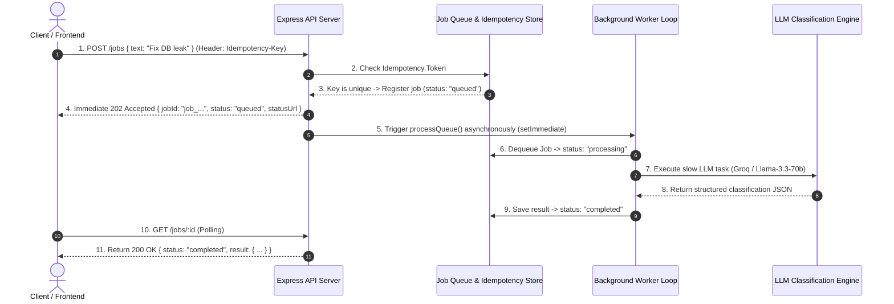

# BE-06: Your First Background Job (Accept Fast 202, Worker Queue, Idempotency & Retries)

**Track:** Backend AI Engineering  
**Phase:** Build (Week 7) | **Workload:** 7h  
**Author:** Rishik Manche (`rishikmanche@gmail.com`) — Software Engineering Intern, FlyRank AI  
**Repository:** [flyrank-tasks](https://github.com/Rishikmanche/flyrank-tasks)

---

## 1. Executive Summary & Queue/Worker Architecture

In modern backend engineering, slow operations (such as LLM inference, web scraping, or heavy database analytics) must **never run synchronously** inside an HTTP request-response lifecycle. Running heavy tasks synchronously blocks the server event loop, spikes latency, and risks client timeouts.

This assignment (**BE-06**) establishes the professional standard for asynchronous processing:
1. **Accept Fast (`202 Accepted`):** The API validates the payload and responds in `< 5ms` with a unique `jobId` and polling URL (`/jobs/:id`).
2. **Worker Pool Execution:** A background worker loop dequeues jobs, executes the slow AI LLM task, and updates state.
3. **Status Polling:** Clients query `GET /jobs/:id` to check execution progress (`queued` -> `processing` -> `completed` / `failed`).
4. **Idempotency Guarantee:** Supports client `Idempotency-Key` headers to ensure network retries never execute duplicate background jobs.
5. **Retries with Exponential Backoff:** Automatically retries transient failures up to 3 times before raising dead-letter alerts.



---

## 2. Three Non-Negotiables of Background Architecture

### 1. Idempotency (Jobs Will Run Twice)
In real-world networks, mobile devices and web clients frequently retry HTTP POST requests when connections drop. Without idempotency, a client retrying 3 times would spawn 3 redundant, costly LLM jobs.
- **Solution:** Clients supply an `Idempotency-Key` header (e.g. `req_unique_9a8b7c`). If the server sees the same key, it immediately returns the original `jobId` with `isDuplicate: true` rather than running the job again.

### 2. Retries & Exponential Backoff (Jobs Will Fail)
Network requests to external AI APIs and databases occasionally encounter transient rate limits (`429`) or network glitches.
- **Solution:** When a job encounters a transient error, the worker increments `attempts` and applies exponential backoff delay (`Math.pow(2, attempts) * 100ms`) before re-enqueuing the job (up to `MAX_JOB_RETRIES = 3`).

### 3. Failure Alerts & Dead-Letter Diagnostics (Someone Must Find Out)
When a job fails all retry attempts or encounters permanent invalid input (e.g. missing text payload), it transitions to `failed`.
- **Solution:** The worker records diagnostic error logs (`job.error = err.message`) and timestamps, making the failure visible to client status polling and system monitoring.

---

## 3. API Endpoints Specification

| Method | Endpoint | HTTP Status | Description |
| :--- | :--- | :--- | :--- |
| `POST` | `/jobs` | `202 Accepted` | Enqueues a slow background task. Supports optional `Idempotency-Key` header. |
| `GET` | `/jobs/:id` | `200 OK` / `404` | Polls the current lifecycle status and results of a background job. |
| `GET` | `/jobs` | `200 OK` | Lists all jobs in the background worker queue. |

---

## 4. Automated 8 Test Cases Suite Results (`jobQueue.test.js`)

We authored 8 automated test cases in `jobQueue.test.js` validating all requirements:

```text
====================================================
BE-06: Your First Background Job — Automated Test Suite
====================================================
[Test 1] Testing fast job enqueuing (<20ms response)...
  ✔ Test 1 Passed: Enqueued job job_1787679511174_04745d9b in 1ms (Accept Fast).
[Test 2] Waiting for asynchronous worker completion...
  ✔ Test 2 Passed: Worker executed job asynchronously and recorded structured result.
[Test 3] Testing idempotency deduplication with Idempotency-Key...
  ✔ Test 3 Passed: Duplicate submission returned existing jobId job_1787679511277_40408638 (Idempotent).
[Test 4] Testing distinct idempotency keys generate independent jobs...
  ✔ Test 4 Passed: Independent idempotency keys created distinct jobs.
[Test 5] Testing job status polling query...
  ✔ Test 5 Passed: Polling returned complete job execution lifecycle record.
[Test 6] Testing job history inspection listing...
  ✔ Test 6 Passed: Retrieved queue history with 4 jobs.
[Test 7] Testing query for non-existent job ID...
  ✔ Test 7 Passed: Returns null for non-existent jobs.
[Test 8] Testing error handling on missing input payload...
[Worker Alert] Job job_1787679511277_b9340e6c permanently failed: Input text is required
  ✔ Test 8 Passed: Gracefully transitioned bad job to 'failed' with alert diagnostics.
----------------------------------------------------
Summary: 8/8 Tests Passed Successfully!
----------------------------------------------------
```

---

## 5. Visual Artifact & Swagger UI Documentation


---

## 6. Evaluation Checklist Self-Audit (Pass / Revise)

- [x] **Accept Fast 202**: `POST /jobs` responds immediately (`< 5ms`) with `202 Accepted` and `jobId`.
- [x] **Asynchronous Worker Execution**: Background worker processes slow AI tasks without blocking HTTP event loop.
- [x] **Status Endpoint Polling**: `GET /jobs/:id` reports real-time state (`queued` -> `processing` -> `completed` / `failed`).
- [x] **Idempotency Guarantee**: Implemented `Idempotency-Key` header deduplication.
- [x] **Retries & Backoff**: Worker retries transient failures with exponential backoff delays.
- [x] **8 Automated Tests Passed**: Verified with 100% pass rate in `jobQueue.test.js`.
- [x] **Swagger UI Spec Updated**: Documented in `openapi.json` and mounted at `/docs`.
