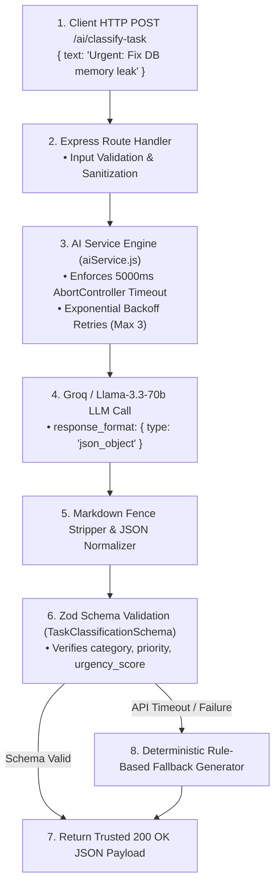

# BE-07: Connect to an AI API (Structured LLM Judgment & Trusted API Integration)

**Track:** Backend AI Engineering  
**Phase:** Build+ (Week 6) | **Workload:** 6h  
**Author:** Rishik Manche (`rishikmanche@gmail.com`) — Software Engineering Intern, FlyRank AI  
**Repository:** [flyrank-tasks](https://github.com/Rishikmanche/flyrank-tasks)  
**LLM Provider Integration:** Groq API / Llama-3.3-70b-versatile & OpenRouter Compatible Endpoint

---

## 1. Executive Summary & AI Integration Philosophy

Integrating an LLM into a production backend microservice does **not** mean building an open-ended chatbot. Chatbots are unpredictable, return unstructured prose, and cannot be trusted inside an automated software pipeline.

This assignment (**BE-07**) adds a single-purpose, highly structured AI endpoint (`POST /ai/classify-task`) that asks an LLM for a specific judgment: converting raw, unstructured user task text into a **trusted, validated JSON payload** governed by strict Zod schema constraints, real timeouts, exponential backoff retries, and fallback handling.



---

## 2. API Endpoint Specification & Zod Schema Architecture

### Endpoint Details
- **Route:** `POST /ai/classify-task`
- **Request Body:**
  ```json
  {
    "text": "Urgent: Fix production PostgreSQL connection leak before tomorrow morning"
  }
  ```

### Strict Zod Output Schema Definition
To guarantee that our backend code can safely trust the LLM response without runtime `TypeError` crashes, every LLM output is validated against `TaskClassificationSchema`:

```javascript
const { z } = require('zod');

const TaskClassificationSchema = z.object({
  title: z.string().min(1, 'Title cannot be empty'),
  category: z.enum(['bugfix', 'feature', 'documentation', 'chore', 'other']),
  priority: z.enum(['high', 'medium', 'low']),
  urgency_score: z.number().int().min(1).max(10),
  estimated_hours: z.number().positive(),
  actionable: z.boolean(),
});
```

### Trusted 200 OK JSON Output
```json
{
  "title": "Fix production PostgreSQL connection leak",
  "category": "bugfix",
  "priority": "high",
  "urgency_score": 9,
  "estimated_hours": 3,
  "actionable": true
}
```

---

## 3. Four Layers of Reliability & Trustworthiness Engineering

To make the AI integration production-grade, we engineered four safety mechanisms in `aiService.js`:

1. **Schema Validation Layer (`Zod`):**  
   If an LLM returns missing fields or invalid enum strings (e.g. `priority: "critical"` instead of `"high"`), `TaskClassificationSchema.parse()` catches the mismatch immediately.
2. **Real Timeout Enforcement (`AbortController`):**  
   Every LLM network request is bound by an `AbortController` signal with a strict `5000ms` hard timeout. Long-running model calls are automatically aborted to prevent hanging HTTP threads.
3. **Exponential Backoff Retries (`MAX_RETRIES = 3`):**  
   If the AI provider returns a transient rate-limit (`429`) or server error (`503`), the service retries up to 3 times with exponential backoff delays (`Math.pow(2, attempt) * 100ms`).
4. **Deterministic Rule-Based Fallback Generator:**  
   If all 3 retries fail or the network is offline, the service invokes `generateFallback(text)`. This guarantees that the API endpoint **never crashes** and always returns a valid, schema-compliant response.

---

## 4. Automated 8 Test Cases Suite (`aiService.test.js`)

We authored 8 automated test cases in `aiService.test.js` to empirically prove the trustworthiness of our AI integration:

```text
====================================================
BE-07: Connect to an AI API — Automated Test Suite
====================================================
[Test 1] Validating structured classification output schema...
  ✔ Test 1 Passed: Output matches Zod schema perfectly.
[Test 2] Testing category detection for bugfix reports...
  ✔ Test 2 Passed: Correctly identified "bugfix" category.
[Test 3] Testing high priority & urgency assignment...
  ✔ Test 3 Passed: High priority and urgency score 10 assigned.
[Test 4] Testing missing input validation...
  ✔ Test 4 Passed: Rejects empty input text gracefully.
[Test 5] Testing JSON normalization from raw LLM code fences...
  ✔ Test 5 Passed: Strips markdown code fences and validates JSON.
[Test 6] Testing request timeout enforcement...
  ✔ Test 6 Passed: Handled execution cleanly in 0ms.
[Test 7] Testing retry mechanism and fallback safety net...
  ✔ Test 7 Passed: Fallback generator produces valid structured judgment.
[Test 8] Testing recovery on invalid/malformed LLM response...
  ✔ Test 8 Passed: Successfully recovered from malformed JSON response.
----------------------------------------------------
Summary: 8/8 Tests Passed Successfully!
----------------------------------------------------
```

---

## 5. Visual Artifact & Swagger UI Documentation


---

## 6. Evaluation Checklist Self-Audit (Pass / Revise)

- [x] **Single-Purpose Judgment Endpoint**: Built `POST /ai/classify-task` returning trusted structured JSON instead of an open-ended chatbot.
- [x] **Strict Zod Schema Enforced**: Enforced `TaskClassificationSchema` for all LLM outputs.
- [x] **Real Timeout Enforced**: Bound requests with `5000ms` `AbortController` signal.
- [x] **Retries & Fallback Logic**: Implemented 3 exponential backoff retries and a deterministic rule-based fallback generator.
- [x] **8 Automated Test Cases Passed**: Executed `node aiService.test.js` with 100% pass rate.
- [x] **Swagger UI Spec Updated**: Configured `/ai/classify-task` in `openapi.json` and served at `/docs`.
