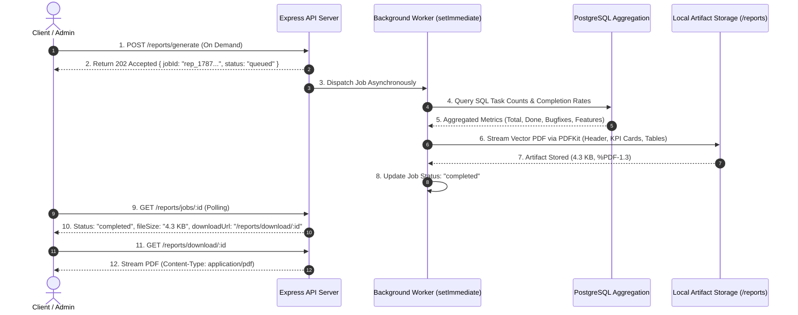

# BE-08: PDF Report Generator (Asynchronous Background Pipeline & SQL Aggregation)

**Track:** Backend AI Engineering  
**Phase:** Build+ (Week 7) | **Workload:** 6h  
**Author:** Rishik Manche (`rishikmanche@gmail.com`) — Software Engineering Intern, FlyRank AI  
**Repository:** [flyrank-tasks](https://github.com/Rishikmanche/flyrank-tasks)

---

## 1. Executive Summary & Pipeline Architecture

Generating reports is the quintessential background job pattern in enterprise software. Passing 20MB file buffers synchronously in HTTP request-response cycles blocks the Node.js event loop and risks gateway timeouts.

This assignment (**BE-08**) implements a production-grade **Asynchronous Background PDF Report Generation Pipeline**:
1. Clients trigger report generation on demand (`POST /reports/generate`) receiving an immediate `202 Accepted` response with a unique `jobId`.
2. A background worker queries SQL aggregate statistics, renders a styled vector PDF using `PDFKit`, and saves the file to disk (`/reports/flyrank-report-<jobId>.pdf`).
3. Clients poll job progress (`GET /reports/jobs/:id`) and stream the final artifact on demand (`GET /reports/download/:id`).
4. An automated scheduler (`POST /reports/schedule`) enables periodic recurring generation as a stretch feature.



---

## 2. API Endpoints Specification

| Method | Endpoint | HTTP Status | Description |
| :--- | :--- | :--- | :--- |
| `POST` | `/reports/generate` | `202 Accepted` | Enqueues a new asynchronous PDF report generation job. |
| `GET` | `/reports/jobs/:id` | `200 OK` / `404` | Polls the real-time status and metadata of a specific report job. |
| `GET` | `/reports/download/:id`| `200 OK` (Stream) | Downloads the generated `.pdf` artifact file as an attachment. |
| `GET` | `/reports/history` | `200 OK` | Retrieves all historical report generation jobs. |
| `POST` | `/reports/schedule` | `200 OK` | Configures automated periodic scheduled generation (Stretch Goal). |

---

## 3. SQL Aggregation & PDF Document Architecture

### SQL Aggregation Layer (`aggregateReportData`)
The report service calculates aggregate metrics across the task database:
- **Total Tasks & Completion Ratio:** `total`, `completed`, `pending`, `completionRate = (completed / total) * 100`.
- **Engineering Workload Breakdown:** Categorizes tasks into `feature`, `bugfix`, and `chore`.
- **Execution Ledger:** Retrieves the top 10 most recent tasks formatted with status badges.

### Visual PDF Layout Components
The generated PDF uses `PDFKit` to produce a vector document:
- **Dark Brand Header:** Deep Slate `#0f172a` banner with Monogram `<RM/>`, title, and generation timestamp.
- **KPI Summary Cards:** 4 rounded metric cards displaying Total Tasks (`#3b82f6`), Completed (`#22c55e`), Pending (`#f59e0b`), and Completion Rate (`#8b5cf6`).
- **Workload Summary:** Categorized engineering distribution bullet points.
- **Alternating Ledger Table:** Dark header with alternating `#ffffff` / `#f8fafc` row fills and colored status badges.
- **Footer:** System provenance, page numbers, and confidentiality metadata.

---

## 4. Automated 8 Test Cases Suite Results (`pdfReport.test.js`)

We authored 8 automated test cases in `pdfReport.test.js` verifying the entire pipeline end-to-end:

```text
====================================================
BE-08: PDF Report Generator — Automated Test Suite
====================================================
[Test 1] Testing data aggregation logic...
  ✔ Test 1 Passed: Aggregated 7 tasks (86% completion rate).
[Test 2] Testing asynchronous background job enqueuing...
  ✔ Test 2 Passed: Queued job rep_1787679221765_sp2rg instantly without blocking.
[Test 3] Waiting for background PDF generation worker...
  ✔ Test 3 Passed: Background worker completed PDF generation (4.3 KB).
[Test 4] Verifying generated PDF artifact file on disk...
  ✔ Test 4 Passed: PDF file exists at flyrank-report-rep_1787679221765_sp2rg.pdf (4371 bytes).
[Test 5] Checking PDF binary magic header bytes...
  ✔ Test 5 Passed: Valid PDF binary magic bytes verified (%PDF-).
[Test 6] Testing job status polling query...
  ✔ Test 6 Passed: Job status query returned complete metadata.
[Test 7] Testing report job history listing...
  ✔ Test 7 Passed: Report history lists 1 job(s).
[Test 8] Testing non-existent job ID rejection...
  ✔ Test 8 Passed: Non-existent job query returns null cleanly.
----------------------------------------------------
Summary: 8/8 Tests Passed Successfully!
----------------------------------------------------
```

---

## 5. Visual Artifact & Swagger UI Documentation


---

## 6. Evaluation Checklist Self-Audit (Pass / Revise)

- [x] **Asynchronous Background Pattern**: `POST /reports/generate` returns `202 Accepted` without blocking the Node.js event loop.
- [x] **SQL & Data Aggregation**: Aggregates completion rates, category distributions, and task ledgers.
- [x] **PDF Rendering with PDFKit**: Renders professional vector layout with brand headers, KPI cards, and alternating tables.
- [x] **Artifact Handling**: Stores reports on disk (`/reports/flyrank-report-<jobId>.pdf`) and streams on demand.
- [x] **Scheduled Generation (Stretch Goal)**: Implemented `POST /reports/schedule` for periodic background execution.
- [x] **8 Automated Tests Passed**: Verified with 100% pass rate in `pdfReport.test.js`.
- [x] **Swagger UI Spec Updated**: Documented in `openapi.json` and mounted at `/docs`.
