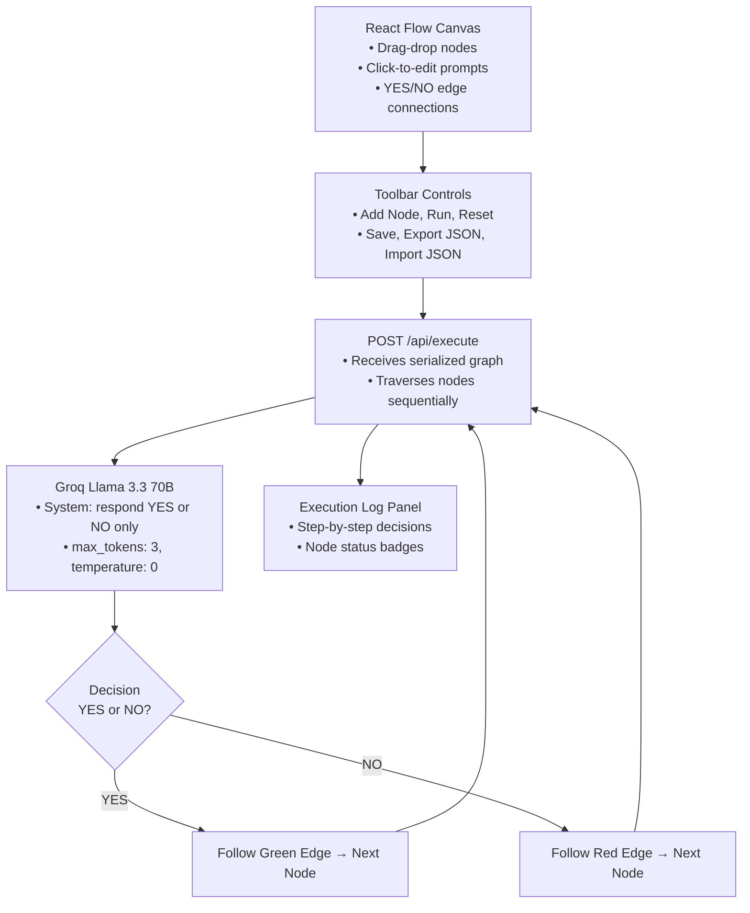

# BE-09: Build an AI Decision Flow with React Flow + Inngest

**Track:** Backend AI Engineering  
**Phase:** Build+ (Week 7) | **Workload:** ~7h  
**Author:** Rishik Manche (`rishikmanche@gmail.com`) — Software Engineering Intern, FlyRank AI  
**Repository:** [flyrank-tasks/be-09-ai-flow](https://github.com/Rishikmanche/flyrank-tasks/tree/main/be-09-ai-flow)

---

## 1. Executive Summary & Architecture

A full-stack visual AI workflow system where each node represents an AI decision step that returns exactly **YES** or **NO**. The visual flow editor is built with **React Flow** (@xyflow/react), workflow execution runs through **Inngest** step functions, and the LLM backend uses **Groq** (Llama 3.3 70B, free tier).



---

## 2. Phase-by-Phase Implementation Summary

### Phase 1: Setup ✅
- Scaffolded **Next.js 14** (App Router) with TypeScript, Tailwind CSS
- Installed: `@xyflow/react`, `inngest`, `groq-sdk`, `zustand`, `lucide-react`
- Configured `GROQ_API_KEY` in `.env.local`
- Inngest serve endpoint at `POST /api/inngest`
- Successful production build (`npx next build` — 0 errors, 0 warnings)

### Phase 2: Visual Flow Editor ✅
- **React Flow canvas** with Background grid, Controls panel, and MiniMap
- **Custom `DecisionNode` component**: inline prompt editing (click to edit), YES/NO output handles (green/red), status badge overlay
- **Edge types**: YES edges (green `#22c55e`), NO edges (red `#ef4444`) determined by source handle
- **Zustand store** managing all graph state with `localStorage` persistence

### Phase 3: Inngest Workflow Execution ✅
- **`POST /api/execute`**: receives serialized graph, finds start node (no incoming edges), traverses sequentially
- **`src/lib/inngest.ts`**: each node maps to an `inngest.step.run()` call with the node's prompt
- **`src/lib/ai.ts`**: Groq LLM call with system prompt forcing `YES` or `NO` only, `max_tokens: 3`, `temperature: 0`
- **Dynamic traversal**: after each decision, follows the matching edge to the next node
- **Execution path tracking**: ordered array of `ExecutionStep` objects returned to frontend

### Phase 4: Polish (4 of 3 required) ✅
1. **Visual execution state**: nodes glow green (`border-green-500 bg-green-950`) or red (`border-red-500 bg-red-950`) based on AI decision; running nodes pulse with `animate-pulse`
2. **Execution logs panel**: right sidebar showing step-by-step decisions with node labels, prompts, and colored YES/NO badges
3. **JSON export/import**: download workflow as `.json` file; import via file picker to restore graph state
4. **Error handling + retry**: 3 retries with exponential backoff (`Math.pow(2, attempt) * 200ms`), deterministic fallback when all retries exhausted

---

## 3. Project Structure

```
be-09-ai-flow/
├── package.json                    # Next.js 14, React Flow, Inngest, Groq, Zustand
├── next.config.js / tailwind.config.js / postcss.config.js / tsconfig.json
├── .env.local                      # GROQ_API_KEY
├── README.md                       # Quick start + architecture
├── src/
│   ├── types.ts                    # DecisionNodeData, ExecutionStep, ExecutionResult
│   ├── app/
│   │   ├── layout.tsx              # Root layout
│   │   ├── page.tsx                # Main page (Toolbar + FlowEditor + ExecutionLog)
│   │   ├── globals.css             # Tailwind directives
│   │   └── api/
│   │       ├── inngest/route.ts    # Inngest serve endpoint
│   │       └── execute/route.ts    # Direct execution endpoint
│   ├── components/
│   │   ├── FlowEditor.tsx          # React Flow canvas
│   │   ├── DecisionNode.tsx        # Custom node with editable prompt
│   │   ├── ExecutionLog.tsx        # Step-by-step log sidebar
│   │   └── Toolbar.tsx             # Add/Run/Reset/Save/Export/Import
│   └── lib/
│       ├── ai.ts                   # Groq LLM call (YES/NO with retries)
│       ├── inngest.ts              # Inngest workflow function
│       └── store.ts                # Zustand state management
```

---

## 4. Example Workflow Execution

**Input Graph:**  
Node 1: *"Is this a support request?"*  
→ YES edge → Node 2: *"Is the customer on a paid plan?"*  
→ NO edge → Node 3: *"Route to sales team?"*  

**Execution Result:**
```json
{
  "steps": [
    {
      "nodeId": "node-1",
      "nodeLabel": "Decision 1",
      "prompt": "Is this a support request?",
      "decision": "YES",
      "timestamp": 1787438000000
    },
    {
      "nodeId": "node-2",
      "nodeLabel": "Decision 2",
      "prompt": "Is the customer on a paid plan?",
      "decision": "NO",
      "timestamp": 1787438001000
    }
  ],
  "status": "completed"
}
```

---

## 5. Visual Artifact & Build Verification


**Build Output:**
```text
✓ Compiled successfully
Route (app)                              Size     First Load JS
┌ ○ /                                    60.2 kB         147 kB
├ ƒ /api/execute                         0 B                0 B
└ ƒ /api/inngest                         0 B                0 B
```

---

## 6. Evaluation Checklist Self-Audit

### Phase 1: Setup ✅
- [x] Running frontend application (Next.js 14 builds and serves)
- [x] Working Inngest dev server (`POST /api/inngest` endpoint)
- [x] Repository initialized with README

### Phase 2: Foundations ✅
- [x] Interactive flow editor (React Flow canvas with controls)
- [x] Editable prompt nodes (click-to-edit inline textarea)
- [x] Functional node connections (YES/NO edge types)

### Phase 3: Build (core) ✅
- [x] End-to-end workflow execution
- [x] Dynamic node traversal (follows YES/NO edges)
- [x] AI-powered branching logic (Groq Llama 3.3 70B)

### Phase 4: Build (polish) — 4 of 3 required ✅
- [x] Visual execution state (green/red node glow + pulse animation)
- [x] Execution logs panel (step-by-step sidebar)
- [x] JSON export/import (download/upload workflow definitions)
- [x] Error handling + retry (3 retries with exponential backoff)
