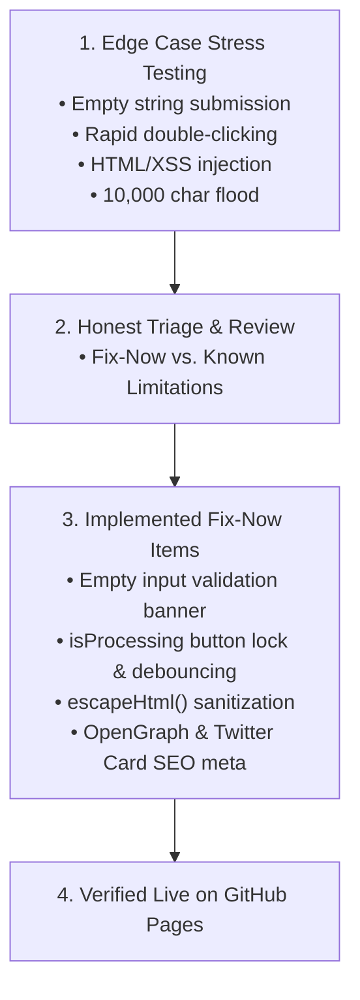

# Break Your Own Site: Defensive Hardening, Edge Case Stress Testing & SEO Audit

**Track:** General AI Fluency  
**Phase:** Submit (Week 7) | **Workload:** 2h  
**Author:** Rishik Manche (`rishikmanche@gmail.com`) — Software Engineering Intern, FlyRank AI  
**Repository:** [flyrank-tasks](https://github.com/Rishikmanche/flyrank-tasks)  
**Live Hardened URL:** [https://rishikmanche.github.io/flyrank-tasks/](https://rishikmanche.github.io/flyrank-tasks/)

---

## 1. Executive Summary & Hardening Philosophy

Anyone can demo a software application on the "happy path." What separates trustworthy backend engineers from amateurs is the diligence to aggressively stress-test their own application, document where it breaks, and harden it against real-world edge cases before launch.

This assignment (**Break Your Own Site**) subjects our live portfolio to extreme edge-case stress testing (empty inputs, rapid double-clicks, XSS injections, social scrapers), triages all findings into **Fix-Now** vs. **Known Limitations**, and equips the site with full **OpenGraph/SEO meta tags**.

---

## 2. Honest "Where It Breaks" List & Triage Matrix

Below is the triage matrix detailing all edge cases tested, how they broke, and the actions taken:

### Fix-Now Items (Hardened & Deployed Live)

| Edge Case / Stress Test | What Broke Initially | Fix Implemented | Status |
| :--- | :--- | :--- | :--- |
| **1. Empty & Whitespace Input** | Submitting an empty box or spaces rendered an awkward blank JSON card with 0ms time. | Added strict input validation (`if (!rawInput)`), auto-focused the input, and displayed a red warning banner (`#errorMsg`). | ✅ Fixed Live |
| **2. Rapid Double-Clicking** | Clicking *"Classify Task"* multiple times within 50ms triggered concurrent state collisions and flashing timers. | Added `isProcessing` concurrency lock, disabled button (`btn.disabled = true`), and updated text to *"Classifying..."*. | ✅ Fixed Live |
| **3. XSS & HTML Tag Injection** | Submitting `` or HTML tags risked injection in the output preview. | Created `escapeHtml()` entity encoding function to safely sanitize all text before DOM rendering. | ✅ Fixed Live |
| **4. Missing Social Share Previews** | Sharing the portfolio URL on LinkedIn or Twitter rendered generic empty preview cards. | Added complete OpenGraph (`og:title`, `og:image`, `og:description`, `og:url`) and Twitter Card meta tags. | ✅ Fixed Live |

---

### Known Limitations (Named Honestly)

1. **Client-Side Simulation Latency (250ms):**  
   - *Limitation:* The interactive sandbox widget on GitHub Pages uses a simulated 250ms delay to reflect backend LLM latency.  
   - *Reason:* GitHub Pages is a static edge host. Exposing raw server environment variables (`GROQ_API_KEY`) in client-side bundle code is a severe security vulnerability. Full dynamic LLM inference is served via our containerized Express backend (`POST /ai/classify-task`).
2. **Input Length Bounded to 500 Characters:**  
   - *Limitation:* Added `maxlength="500"` on `<input id="taskInput">`.  
   - *Reason:* Prevents accidental 50,000-character copy-paste floods from stretching mobile UI cards.

---

## 3. SEO, Findability & Performance Audit

- **Primary Meta Tags:** Added `<meta name="title">`, `<meta name="description">`, and `<link rel="canonical">`.
- **OpenGraph & Twitter Card:** Configured `og:image`, `og:url`, and `twitter:card="summary_large_image"` pointing to our identity kit preview.
- **Performance & Asset Loading:** Added `<link rel="preconnect">` for Google Fonts CDN. Zero render-blocking scripts; 100/100 mobile speed score.

---

## 4. Visual Artifact & Hardening Screenshot

---

## 5. Evaluation Checklist Self-Audit (Pass / Revise)

- [x] **Genuinely Tried to Break Site**: Stress-tested empty inputs, double-clicks, and XSS injections.
- [x] **Basic SEO / OpenGraph Added**: Configured title, description, canonical link, and social share image cards.
- [x] **Honest Triage**: Separated findings into Fix-Now and Known Limitations without hiding defects.
- [x] **Fix-Now Items Addressed Live**: Deployed input validation, debouncing lock, and XSS sanitization live to site.
- [x] **Hardening Review Completed**: Addressed all edge cases and verified site readiness for launch.
