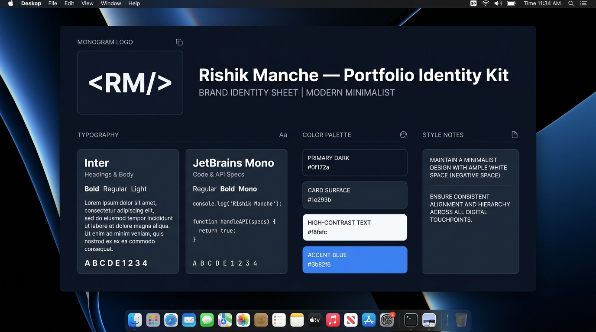

# Decide Once: Build Your Identity Kit

**Track:** General AI Fluency  
**Phase:** Foundations (Week 3) | **Workload:** 2h  
**Author:** Rishik Manche (`rishikmanche@gmail.com`) — Software Engineering Intern, FlyRank AI  
**Repository:** [flyrank-tasks](https://github.com/Rishikmanche/flyrank-tasks)

---

## 1. Executive Summary & Design Rationale

A consistent visual identity is created by deciding once and inheriting those choices across every page and case study. This identity kit establishes a restrained, calm technical foundation where **the engineering proof is the loudest element on the page**.

---

## 2. Logo & Monogram Mark

```text
  ┌──────────────┐
  │   <RM/>      │   Rishik Manche — Backend Engineering
  └──────────────┘
```

- **Monogram Mark:** `<RM/>` (Clean developer tag combining Rishik Manche's initials with code syntax).
- **Logo Style:** Set in `Inter Bold` (700) with letter-spacing `0.05em`.
- **Favicon Specification:** 32x32px SVG icon featuring `<RM/>` in crisp white (`#f8fafc`) inside a rounded dark slate tile (`#0f172a`).

---

## 3. Typography System (2 Fonts)

To maintain strict visual discipline, the portfolio uses exactly two open-source web fonts:

| Role | Font Family | Source | Weights Used | Purpose |
| :--- | :--- | :--- | :--- | :--- |
| **Headings & Body** | **`Inter`** | [Google Fonts](https://fonts.google.com/specimen/Inter) | `400 (Regular)`, `600 (SemiBold)`, `700 (Bold)` | Modern, ultra-legible sans-serif for titles, hero text, and case study body paragraphs. |
| **Code & API Specs** | **`JetBrains Mono`** | [Google Fonts](https://fonts.google.com/specimen/JetBrains+Mono) | `400 (Regular)` | Precision monospaced font for code snippets, JSON schemas, terminal logs, and `curl` commands. |

---

## 4. Color Palette (Tight 4-Color System)

The color system is restricted to 4 colors with exact hex codes to eliminate visual noise:

| Color Role | Hex Code | Color Name | Visual Intent & Usage |
| :--- | :--- | :--- | :--- |
| **Main Canvas (Background)** | `#0f172a` | Slate 900 | Deep, calm dark mode background with zero screen glare. |
| **Surface / Card Background** | `#1e293b` | Slate 800 | Subtle component elevation for case study cards and code blocks. |
| **Primary Text (Near-White)** | `#f8fafc` | Slate 50 | High-contrast, crisp readable text for body and headers. |
| **Accent Color (Conversion CTA)** | `#3b82f6` | Blue 500 | Single calm accent reserved exclusively for the primary CTA (*Book 15-Min Screen*). |

---

## 5. The Two-Line Style Note

> **Two-Line Style Note:**  
> **Fonts & Palette:** `Fonts: Inter (Headings/Body) & JetBrains Mono (Code). Palette: #0f172a (Background), #1e293b (Cards), #f8fafc (Text), #3b82f6 (Accent CTA).`  
> **Mood:** `A calm, ultra-focused technical canvas where zero visual clutter allows live API code, database schemas, and engineering proof to be the loudest elements on the page.`

---

## 6. Claude Project Standing Instructions Integration

This style note is saved under standing instructions inside the **FlyRank Portfolio Build & Tutor** Claude Project:

```text
PORTFOLIO IDENTITY KIT STANDING INSTRUCTIONS:
- Logo: Monogram mark `<RM/>` set in Inter Bold.
- Typography: Inter (Headings & Body), JetBrains Mono (Code blocks & API specs).
- Palette: Canvas #0f172a, Cards #1e293b, Text #f8fafc, Primary CTA Accent #3b82f6.
- Mood: Minimalist, execution-focused backend engineering portfolio; design frames the work and never upstages it.
```

---

## 7. Visual Artifact & Identity Sheet



---

## 8. Evaluation Checklist Self-Audit (Pass / Revise)

- [x] **One or Two Fonts Only**: Exactly 2 fonts chosen (`Inter` for prose, `JetBrains Mono` for code).
- [x] **Tight Palette (4 Colors with Hex Codes)**: Canvas `#0f172a`, Cards `#1e293b`, Text `#f8fafc`, Accent `#3b82f6`.
- [x] **Simple Monogram Logo / Favicon**: Created clean developer monogram `<RM/>`.
- [x] **Two-Line Style Note**: Formulated concise 2-line note specifying fonts, hex codes, and calm execution mood.
