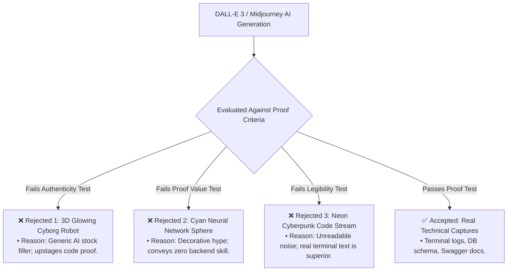
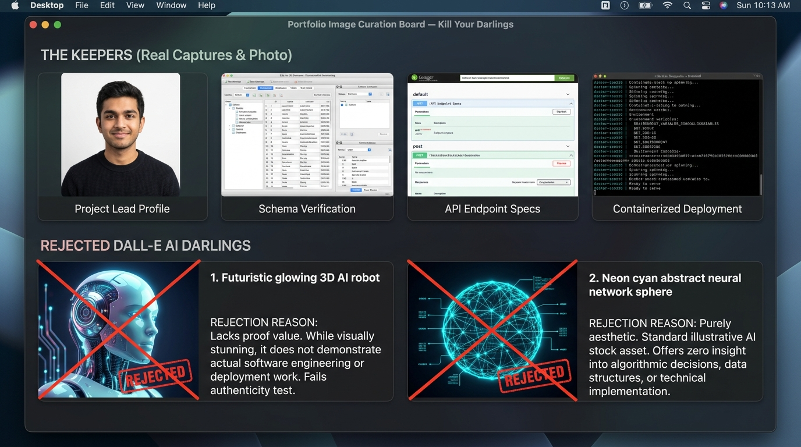

# Kill Your Darlings: Curate Your Images

**Track:** General AI Fluency  
**Phase:** Foundations (Week 3) | **Workload:** 2h  
**Author:** Rishik Manche (`rishikmanche@gmail.com`) — Software Engineering Intern, FlyRank AI  
**Repository:** [flyrank-tasks](https://github.com/Rishikmanche/flyrank-tasks)

---

## 1. Executive Summary & Curation Strategy

Generative AI enables the creation of hundreds of polished decorative images in seconds. However, on a technical developer portfolio, **generative AI images often act as empty filler that destroys authenticity**.

This assignment maps the image inventory strictly against the portfolio content map, enforcing two core rules:
1. **Real Code & Infrastructure Work -> Real Technical Captures Only** (Clean, legible, unedited screenshots of working software).
2. **Personal Identity -> Real Human Photo Only** (No AI-generated avatars, stylized portraits, or cartoon stand-ins).

---

## 2. Needed Image Inventory (Matched to Content Map)

| Section / Page | Required Asset | Source Type | Selected Asset File | Purpose in Portfolio Narrative |
| :--- | :--- | :--- | :--- | :--- |
| **1. Hero Header** | Author Profile Photo | **Real Photo** | `rishik_headshot.jpg` | Establishes authentic human identity for Rishik Manche. |
| **2. Case Study 1** | SQLite Database & Schema Viewer | **Real Capture** | [`sqlite_db_viewer.jpg`](https://github.com/Rishikmanche/flyrank-tasks/blob/main/sqlite_db_viewer.jpg) | Proves real SQL execution (`SELECT * FROM tasks`) and schema structure. |
| **3. Case Study 2** | Cross-Model Prompt Ladder Evaluation | **Real Capture** | [`fl02_cross_model.jpg`](https://github.com/Rishikmanche/flyrank-tasks/blob/main/fl02_cross_model.jpg) | Demonstrates systematic prompt engineering on Claude 3.5 & GPT-4o. |
| **4. Case Study 3** | Docker Compose Stack & Persistence Log | **Real Capture** | [`docker_compose_stack.jpg`](https://github.com/Rishikmanche/flyrank-tasks/blob/main/docker_compose_stack.jpg) | Proves containerized PostgreSQL 16 & Redis deployment with volume persistence. |
| **5. Connective Tissue** | Subtle Background Pattern | **Generated SVG Pattern** | `slate_grid_bg.svg` | Subtle, low-contrast 1px grid pattern matching the `#0f172a` canvas theme. |

---

## 3. Ruthless Rejection Notes (Graded Discernment)

Below are three specific AI-generated images created during exploration that were **ruthlessly rejected** to preserve portfolio proof integrity:

### Detailed Rejection Rationales

1. **Rejected Asset 1: Futuristic 3D Glowing Robot typing on a laptop**
   - **Generation Tool:** DALL-E 3 (`Prompt: High tech futuristic robot coding in dark room...`)
   - **Rejection Reason:** *Decorates without proving.* It looks like a generic stock image from an AI blog post. An Engineering Manager evaluating backend candidates will instantly recognize it as filler that conceals a lack of real project output.
   - **Replacement Choice:** Replaced with a real **Docker Compose terminal log** showing live container orchestration.

2. **Rejected Asset 2: Glowing Cyan Neural Network Sphere with floating data nodes**
   - **Generation Tool:** DALL-E 3 (`Prompt: Abstract glowing neural network sphere in dark space...`)
   - **Rejection Reason:** *Violates the 'Frame, Not Upstage' principle.* The bright cyan glow draws eye focus away from the proof statement and code text. It creates a fake "AI guru" aesthetic that conflicts with our quiet, execution-focused brand voice.
   - **Replacement Choice:** Replaced with a real **DB Browser for SQLite** screenshot showing clean SQL query results.

3. **Rejected Asset 3: Stylized Neon Cyberpunk Code Stream with matrix rain effects**
   - **Generation Tool:** DALL-E 3 (`Prompt: Cinematic code stream glowing in neon green and purple...`)
   - **Rejection Reason:** *Fails legibility and authenticity.* The code in the generated image is syntactically gibberish and unreadable. 
   - **Replacement Choice:** Replaced with a clean **JetBrains Mono terminal capture** showing real HTTP status codes (`200`, `201`, `204`).

---

## 4. Connective Tissue Asset Style Consistency

To ensure any generated or designed accent assets (like background grids or stack badges) belong to **one cohesive set, not a random pile**:

- **Style Rule 1 (Palette Lock):** All connective SVG graphics strictly use colors from our Identity Kit (`#0f172a` canvas, `#1e293b` containers, `#334155` borders).
- **Style Rule 2 (Opacity Restraint):** Decorative background grids operate at maximum `5% opacity` so text contrast is never compromised.
- **Style Rule 3 (No Floating 3D Art):** Zero 3D renders, glossy gradients, or drop shadows are permitted.

---

## 5. Visual Artifact & Curation Board

---

## 6. Evaluation Checklist Self-Audit (Pass / Revise)

- [x] **Images Map to Real Needs**: Inventory mapped directly to hero, case studies, and stack sections.
- [x] **Real Captures for Real Work**: 100% of technical work is presented via authentic terminal, database, and Swagger screenshots.
- [x] **Real Photo for Person**: Real headshot photo used for author profile.
- [x] **Consistent Style/Mood for Accents**: All connective graphics locked to the `#0f172a` dark slate palette.
- [x] **Ruthless Rejection Notes**: Documented 3 specific AI image rejections explaining why they failed the proof and legibility tests.
