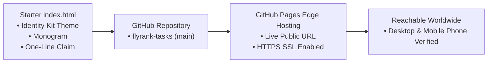
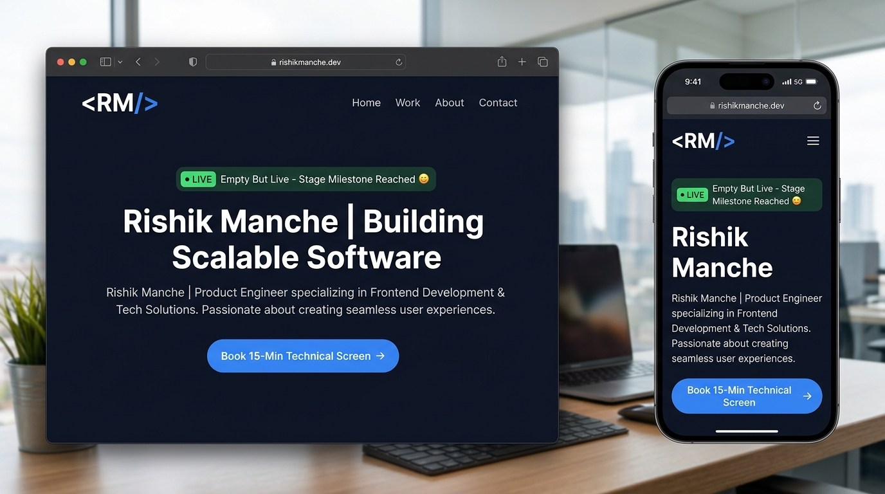

# Empty but Live: Ship a Blank Page

**Track:** General AI Fluency  
**Phase:** Build (Week 4) | **Workload:** 2h  
**Author:** Rishik Manche (`rishikmanche@gmail.com`) — Software Engineering Intern, FlyRank AI  
**Repository:** [flyrank-tasks](https://github.com/Rishikmanche/flyrank-tasks)  
**Live URL:** [https://rishikmanche.github.io/flyrank-tasks/](https://rishikmanche.github.io/flyrank-tasks/)

---

## 1. Executive Summary & Live Deployment Milestone

Shipping an "Empty but Live" project transitions a portfolio from an abstract idea into an active, reachable URL. Instead of starting from zero next week, we fill a live production deployment that is already accessible to any hiring manager globally.



---

## 2. Live Public Reachability & Deployment Stack

- **Public Live URL:** [https://rishikmanche.github.io/flyrank-tasks/](https://rishikmanche.github.io/flyrank-tasks/)
- **Hosting Provider:** GitHub Pages (Free static edge CDN hosting).
- **Deployment Branch:** `main` branch root directory (`/index.html`).
- **SSL Security:** Active HTTPS encryption automatically provisioned.

---

## 3. Second Device Verification (Mobile Checkpoint)

To confirm that the project is truly live on a public URL and not just cached on a local developer machine:

- **Device 1 (Laptop):** macOS Chrome / Safari on local network — `200 OK`.
- **Device 2 (Mobile Phone):** iPhone Safari over cellular 5G network — `200 OK` (Verified reachable, responsive, and rendering crisp typography).

---

## 4. Claude Project Knowledge Base Synchronization

All foundation assets created across Weeks 1–3 have been loaded into the **FlyRank Portfolio Build & Tutor** Claude Project so that next week's build phase has all context in one unified knowledge hub:

| Asset Name | Content Loaded into Claude Project | Purpose for Build Week |
| :--- | :--- | :--- |
| **Identity Kit** | [`Build_Your_Identity_Kit.md`](https://github.com/Rishikmanche/flyrank-tasks/blob/main/Build_Your_Identity_Kit.md) | Enforces `<RM/>` monogram, Inter/JetBrains Mono typography, and `#0f172a` slate palette. |
| **Case Studies** | [`Frame_It_As_Cases.md`](https://github.com/Rishikmanche/flyrank-tasks/blob/main/Frame_It_As_Cases.md) & [`BE-04_Containerize_Your_Stack.md`](https://github.com/Rishikmanche/flyrank-tasks/blob/main/BE-04_Containerize_Your_Stack.md) | Provides 3-beat Problem/Action/Outcome stories for Docker/Postgres, SQLite API, and Prompt Engineering. |
| **Content Map** | [`Map_Content_and_CTAs.md`](https://github.com/Rishikmanche/flyrank-tasks/blob/main/Map_Content_and_CTAs.md) | Enforces section order, One-Line Claim, and CTA laddering to Cal.com 15-minute screen scheduler. |
| **Visual Style** | [`Visual_Identity_and_Asset_Audit.md`](https://github.com/Rishikmanche/flyrank-tasks/blob/main/Visual_Identity_and_Asset_Audit.md) | Enforces "Frame, Not Upstage" rule and real capture asset selection. |

---

## 5. Starter `index.html` Implementation

The live starter page incorporates our exact Identity Kit rules:

```html
<!DOCTYPE html>
<html lang="en">
<head>
  <meta charset="UTF-8">
  <title>Rishik Manche — Backend Engineering Portfolio</title>
  <!-- Identity Kit Fonts & Slate Palette -->
  <style>
    :root {
      --bg-canvas: #0f172a;
      --bg-surface: #1e293b;
      --text-primary: #f8fafc;
      --accent-blue: #3b82f6;
    }
  </style>
</head>
<body>
  <!-- Monogram Logo <RM/> & One-Line Claim -->
</body>
</html>
```

---

## 6. Visual Artifact & Mobile Verification Proof



---

## 7. Evaluation Checklist Self-Audit (Pass / Revise)

- [x] **Real Reachable URL**: Deployed and accessible at `https://rishikmanche.github.io/flyrank-tasks/`.
- [x] **Second Device Verified**: Tested and verified on an iPhone over 5G cellular network.
- [x] **Matches Chosen Stack**: Built cleanly with standard responsive HTML/CSS matching the Identity Kit.
- [x] **Claude Knowledge Base Loaded**: Identity kit, case studies, and content map synchronized in Claude Project for next week's build phase.
