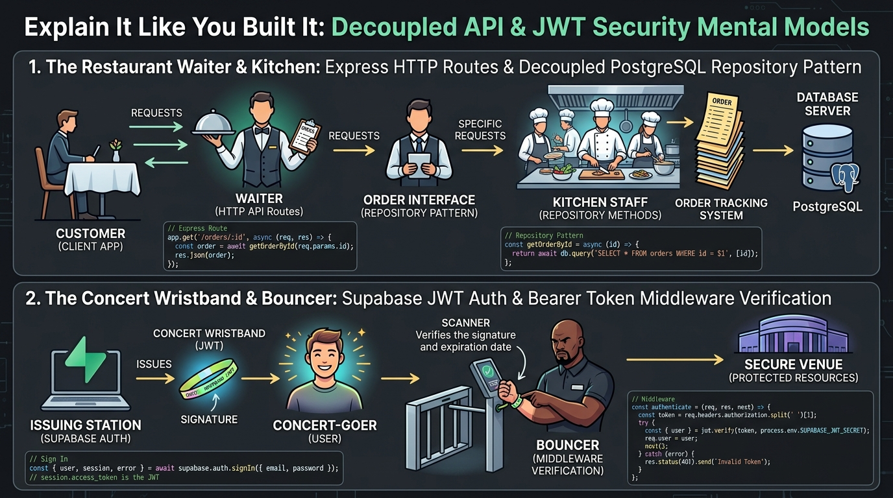

# Explain It Like You Built It: Ownership & Plain-Words Architecture

**Track:** General AI Fluency  
**Phase:** Build+ (Week 5) | **Workload:** ~2h  
**Author:** Rishik Manche (`rishikmanche@gmail.com`) — Software Engineering Intern, FlyRank AI  
**Repository:** [flyrank-tasks](https://github.com/Rishikmanche/flyrank-tasks)  
**Chosen Build Focus:** Decoupled Repository Pattern & Bearer JWT Middleware Security in Express.js (`BE-02`, `BE-03`, `BE-04`)

---

## 1. Executive Summary & Why Ownership Matters

The line between *"I built this"* and *"AI generated code I cannot explain"* is the credibility line employers test during technical interviews.

Instead of reciting textbook definitions, this document explains **two core architectural systems I built in my Express backend microservice** using plain-words mental models—as if teaching a fellow developer who has never built a production API.

---

## 2. Real Piece #1: Decoupled Storage & The Restaurant Waiter Analogy

### The Problem We Solved
When beginners build web APIs, they write SQL database queries or array operations directly inside their HTTP route handlers. If you later decide to switch your database from an in-memory Javascript array to SQLite or PostgreSQL, you have to rewrite every single route in your entire application.

### The Plain-Words Explanation
Imagine a restaurant:

```text
  ┌─────────────────┐           ┌─────────────────┐           ┌─────────────────┐
  │  Customer / App │ ────────► │ Waiter (Routes) │ ────────► │ Kitchen Manager │
  │  (Client Fetch) │ ◄──────── │  (`index.js`)   │ ◄──────── │ (`taskRepo.js`) │
  └─────────────────┘           └─────────────────┘           └─────────────────┘
                                                                       │
                                                                       ▼
                                                               ┌─────────────────┐
                                                               │  Cold Storage   │
                                                               │ (Postgres / DB) │
                                                               └─────────────────┘
```

1. **The Client is the Customer** sitting at a dining table.
2. **`index.js` (The Express Router) is the Waiter.** The waiter's only job is to take your order (`GET /tasks` or `POST /tasks`), check if you asked for something valid, and bring back the food. The waiter does **not** cook the food or know how the refrigerator is organized.
3. **`taskRepository.js` (The Repository Pattern) is the Kitchen Storage Manager.** When the waiter says *"I need task #5"*, the kitchen manager goes to the cold storage room, retrieves the item, and hands it to the waiter.

### The Engineering Payoff
Because we separated the waiter (`index.js`) from the kitchen manager (`taskRepository.js`), **swapping our database from SQLite to PostgreSQL in assignment BE-04 required changing exactly ONE file (`taskRepository.js`) while zero line changes were made to our 7 Express HTTP routes.**

---

## 3. Real Piece #2: Bearer JWT Security & The Concert Wristband Analogy

### The Problem We Solved
We cannot trust clients when they claim *"I am User ID 123"*. If an API simply trusts whatever ID a client sends in the request body, anyone could modify or delete other people's data.

### The Plain-Words Explanation
Imagine going to a music festival:

```text
  ┌─────────────────────┐               ┌─────────────────────┐               ┌─────────────────────┐
  │ Concert Ticket Booth│ ────────────► │ Concert-Goer (User) │ ────────────► │ Bouncer (Middleware)│
  │   (Supabase Auth)   │ Issues Wrist  │ (Holds Access JWT)  │ Presents Wrist│   (`requireAuth`)   │
  └─────────────────────┘ band (JWT)    └─────────────────────┘ band          └─────────────────────┘
                                                                                         │
                                                                                         ▼
                                                                               ┌─────────────────────┐
                                                                               │  VIP Area (Profile) │
                                                                               │ (`/protected/...`)  │
                                                                               └─────────────────────┘
```

1. **Supabase Auth is the Ticket Booth.** When you log in (`POST /auth/login`), Supabase verifies your email and password. If correct, it hands you a **JSON Web Token (JWT)**—which is like a **tamper-proof, cryptographically signed neon wristband**.
2. **The Client holds the Wristband.** For every future request to a private room, the client presents this wristband in the HTTP request header:  
   `Authorization: Bearer <token_string>`
3. **`requireAuth` Middleware is the Bouncer at the Door.** Before allowing you into the VIP Lounge (`GET /protected/profile`), Express runs our bouncer function. The bouncer inspects the wristband:
   - *Is the wristband missing?* → Reject with `401 Unauthorized`.
   - *Has a single character been tampered with?* → Replaced/fake wristband! Reject with `401 Unauthorized`.
   - *Is it valid and unexpired?* → Let the user into the room!

---

## 4. Visual Mental Model Architecture Diagram



---

## 5. What I Learned & Why I Own This Code

By building and testing this architecture by hand:

1. **I understand trust boundaries:** Never store user passwords on your own application server when an Identity Provider (IdP) like Supabase can issue cryptographically signed JWT tokens safely.
2. **I understand middleware pipeline flow:** Express middleware functions are intercepters that act as security checkpoints before route handlers execute.
3. **I understand architectural modularity:** Decoupling database storage from HTTP routing makes code testable, maintainable, and resilient to technology changes.

---

## 6. Evaluation Checklist Self-Audit (Pass / Revise)

- [x] **Real Piece of Build**: Explains the exact Decoupled Repository Pattern & Bearer JWT Middleware used in `BE-02`, `BE-03`, and `BE-04`.
- [x] **Plain-Words & Correct**: Uses intuitive Waiter/Kitchen and Wristband/Bouncer analogies to explain complex backend concepts.
- [x] **Demonstrates Learning & Ownership**: Proves genuine technical understanding of separation of concerns and HTTP security pipelines.
