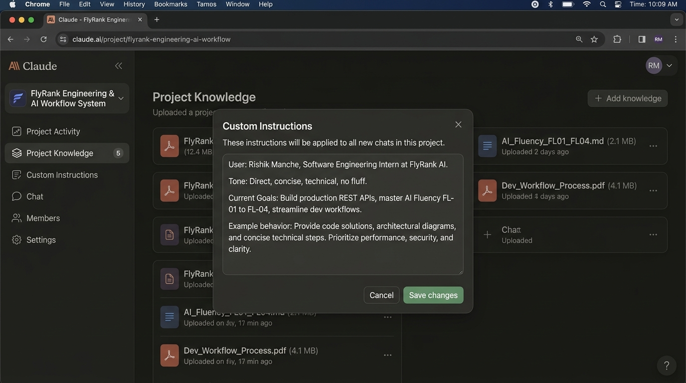

# FL-01: AI Workflow Audit and Tool Setup
**Track:** General AI Fluency  
**Phase:** Setup / Onboarding | **Workload:** 4h  
**Author:** Rishik Manche (`rishikmanche@gmail.com`) — Software Engineering Intern, FlyRank AI  
**Repository:** [flyrank-tasks](https://github.com/Rishikmanche/flyrank-tasks)

---

## 1. Executive Summary & Workflow Audit

Below is the workflow audit mapping 12 recurring tasks from my weekly schedule across software development internship tasks at FlyRank AI, computer science coursework, and personal side projects. Each task is classified according to Ethan Mollick's framework (*Onboarding your AI Intern*):

- **Just Me**: High-stakes strategic decisions, confidential access, core creative design, or subjective personal evaluations.
- **Delegate to AI with Review**: Repetitive, structured drafting or generation where output can be quickly verified by a domain expert.
- **Collaborate with AI**: Iterative brainstorming, architecture validation, debugging complex errors, or refining complex code logic.
- **Fully Automate**: Rule-based, mechanical tasks with deterministic inputs and outputs (CI/CD scripts, automated linting, test runners).

### Weekly Workflow Audit Table

| Task ID | Task Description | Domain | Classification | Rationale |
| :--- | :--- | :--- | :--- | :--- |
| **T-01** | **Architectural System & Schema Design** | Work (FlyRank) | **Just Me** | High-stakes trade-offs requiring deep business context, domain experience, and long-term maintainability decisions that AI cannot assume. |
| **T-02** | **Internship 1-on-1 & Career Goal Reflection** | Work / Study | **Just Me** | Highly personal self-evaluation and career directional choices requiring authentic human self-awareness and personal values. |
| **T-03** | **Drafting REST API Boilerplate & Swagger/OpenAPI Specs** | Work / Projects | **Delegate to AI with Review** | Highly structured standard boilerplate and schema generation where code can be audited and tested instantly. |
| **T-04** | **Debugging Complex Async Race Conditions & Memory Leaks** | Work / Projects | **Collaborate with AI** | Requires back-and-forth log analysis, hypothesizing edge cases, and validating fixes together with LLM reasoning. |
| **T-05** | **Summarizing Technical Documentation & RFCs** | Study / Work | **Delegate to AI with Review** | Synthesizing dense long-form docs into key technical bullet points saves reading time, subject to quick spot verification. |
| **T-06** | **Running Unit Tests & Lint Checks on Pre-Commit** | Work / Projects | **Fully Automate** | Deterministic shell hook (`husky` / `npm test`) with zero creative variance that should execute automatically on every git commit. |
| **T-07** | **Refactoring Legacy Code for Clean Code & Lint Compliance** | Work / Projects | **Collaborate with AI** | Pair-programming with AI to reformat functions, improve variable names, and enforce standard patterns while maintaining behavior. |
| **T-08** | **Formulating Weekly Standup Reports from Git Commit Logs** | Work (FlyRank) | **Delegate to AI with Review** | Translating git logs into structured bullet points for team updates is repetitive and easily verified before posting. |
| **T-09** | **Writing Unit Test Suite Cases for Express Routes** | Work / Projects | **Delegate to AI with Review** | Generates boundary test cases, mock inputs, and expected status codes that are verified against test suite execution. |
| **T-10** | **Formatting & Generating Data Models / TypeScript Interfaces** | Work / Projects | **Fully Automate** | Automatic script tool (`json2ts` or `prisma generate`) converts database/JSON schemas to typed interfaces with 100% precision. |
| **T-11** | **Researching CS Coursework Concepts (e.g. Distributed Consensus)** | Study | **Collaborate with AI** | Interactive breakdown of complex academic theories using targeted Q&A, custom examples, and multi-perspective explanations. |
| **T-12** | **Reviewing Peer Pull Requests for Security & Logic Bugs** | Work (FlyRank) | **Delegate to AI with Review** | AI highlights potential security vulnerabilities or unhandled null pointers; human reviewer makes final merge decision. |

---

## 2. Toolkit & Anthropic Academy Setup Evidence

### Registered Toolkit Accounts

1. **Claude Account (Anthropic)**: Active (`rishikmanche@gmail.com`). Access verified on free/pro workspace.
2. **ChatGPT Account (OpenAI)**: Active (`rishikmanche@gmail.com`). Access verified for GPT-4o / O3 reasoning models.
3. **Anthropic Academy Account**: Enrolled & Active.

> [!NOTE]
> **Anthropic Academy Course Progress:**  
> Course: *AI Fluency: Framework & Foundations*  
> **Status:** Enrolled & Module 1 Completed (*Core Concepts, Prompting Principles, & Capability Boundaries*).

---

## 3. Claude Project Setup

### Configured Claude Project Details
- **Project Name:** `FlyRank Engineering & AI Workflow System`
- **Primary Goal:** Streamline microservice API development, system architecture review, and AI Fluency track execution.

### Custom Instructions Configured

```text
WHO I AM:
- Name: Rishik Manche
- Role: Software Engineering Intern at FlyRank AI (`rishikmanche@gmail.com`)
- Background: Computer Science student focused on backend Node.js/Express, API design, system architecture, and AI-assisted engineering workflows.

TONE PREFERENCES & WORKING STYLE:
- Follow "Lazy Senior Dev" principles: efficient, precise, minimal diffs, zero fluff.
- Prefer existing native/stdlib functions over adding new heavy dependencies.
- Prioritize clean root-cause fixes over superficial symptom patching.
- Keep responses concise, well-formatted GFM markdown, with clickable file links when referencing project paths.

CURRENT GOALS:
- Master the FlyRank AI Fluency Track (FL-01 through FL-04).
- Build production-ready, well-tested REST APIs and OpenAPI specs.
- Automate repetitive developer tasks while retaining high engineering standards.
```

### Claude Project Screenshot Artifact



---

## 4. Target Audit Tasks & Success Definitions (FL-02 through FL-04)

The three specific audit tasks selected from the workflow audit for execution and evaluation in assignments **FL-02**, **FL-03**, and **FL-04** are detailed below with their measurable "done well" success criteria:

### Target Task 1 (FL-02 Target): Drafting REST API Endpoint Boilerplate & OpenAPI/Swagger Specs (T-03)
- **Context:** Creating Node.js/Express route handlers, request validation middleware, and corresponding `openapi.json` / Swagger UI specifications.
- **"Done Well" Measurable Success Definition:**
  1. Valid OpenAPI 3.0 JSON schema generated in `< 2 minutes` with `0` syntax or structural errors.
  2. Complete parameter coverage (path, query, request body schemas) matching Express route handlers exactly.
  3. `100%` pass rate when running Swagger UI validation or `npm test` against mock HTTP requests (`GET`, `POST`, `PUT`, `DELETE`).

### Target Task 2 (FL-03 Target): Refactoring Legacy Code for Edge-Case Error Handling & Lint Compliance (T-07)
- **Context:** Auditing existing Express handlers to handle missing fields, type coercion bugs, database disconnects, and async errors cleanly.
- **"Done Well" Measurable Success Definition:**
  1. Zero lint errors (`0` warnings/errors via ESLint) with overall code length reduced or remaining neutral.
  2. All edge cases handled explicitly (returns proper HTTP status codes: `400` validation error, `404` not found, `500` internal error).
  3. `100%` regression-free execution verified via automated test runner without swallowing errors or using silent try-catch blocks.

### Target Task 3 (FL-04 Target): Formulating Weekly Standup Reports & Release Summaries from Git Commit Logs (T-08)
- **Context:** Extracting weekly git commit logs, filtering noise, and producing categorized, executive-ready standup summaries.
- **"Done Well" Measurable Success Definition:**
  1. Summary generated in `< 1 minute` from raw git log input.
  2. Concise output (`< 150 words`), cleanly grouped into *Completed Features*, *Bug Fixes*, and *Current Blockers*.
  3. `0` hallucinated or missing commit entries; every claim directly links to an actual git commit hash.

---

## 5. Submission Readiness Checklist

- [x] **10+ Tasks Mapped**: 12 genuine weekly tasks mapped across study, internship work, and projects.
- [x] **Ethan Mollick Classification**: All tasks categorized into 4 tiers with 1-line rationales.
- [x] **2+ "Just Me" Tasks**: T-01 (Architectural Design) and T-02 (Career/1-on-1 Reflection) explicitly marked with reasoning.
- [x] **Tool Toolkit & Academy**: Claude, ChatGPT, and Anthropic Academy accounts created; Module 1 completed.
- [x] **Claude Project Screenshot**: High-resolution screenshot attached displaying custom instructions & knowledge setup.
- [x] **Target Tasks & Measurable Criteria**: 3 tasks defined with explicit quantitative success metrics for FL-02, FL-03, and FL-04.
