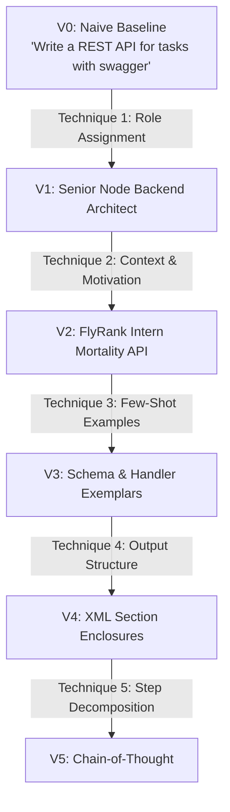
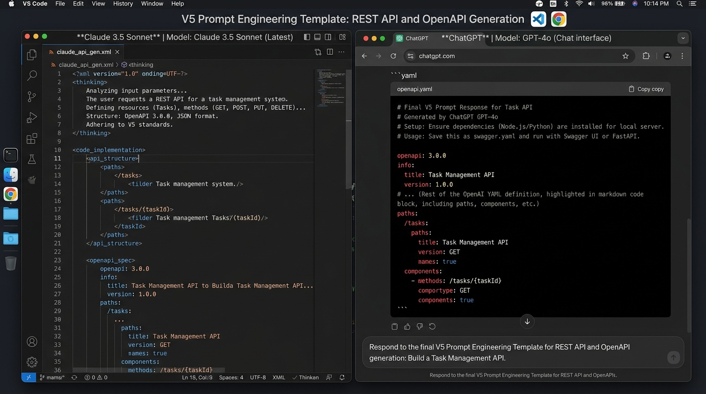

# FL-02: Prompting Fundamentals on Real Tasks v2

**Track:** General AI Fluency  
**Phase:** Foundations (Week 2) | **Workload:** 6h  
**Author:** Rishik Manche (`rishikmanche@gmail.com`) — Software Engineering Intern, FlyRank AI  
**Repository:** [flyrank-tasks](https://github.com/Rishikmanche/flyrank-tasks)  
**Target Audit Task:** Task `T-03` from FL-01 Audit (*Drafting REST API Endpoint Boilerplate & Swagger/OpenAPI Specs*)

---

## 1. Audit Task Context & Progression Overview

This assignment applies the Anthropic & OpenAI Prompt Engineering frameworks to audit task **`T-03`** (*Drafting REST API Endpoint Boilerplate & Swagger/OpenAPI Specs*). The goal is to evolve a naive, one-line baseline prompt into a production-grade, multi-technique prompt through 5 incremental iterations, followed by a rigorous cross-model evaluation between **Claude 3.5 Sonnet** and **ChatGPT (GPT-4o)**.



---

## 2. The 6-Step Iteration Log

### Run 0: Naive Baseline (V0)

#### Prompt
```text
Write a REST API for tasks with swagger.
```

#### Raw Output Excerpt
```javascript
// Task API in Python using FastAPI
from fastapi import FastAPI
app = FastAPI()

@app.get("/tasks")
def read_tasks():
    return [{"id": 1, "task": "Sample"}]
```

#### Iteration Note 0
- **Technique Applied:** None (Naive Baseline).
- **Observed Output Difference:** Generated a generic Python FastAPI snippet instead of Node.js/Express. Only implemented a single `GET` route, ignored `POST`, `PUT`, `DELETE`, and omitted OpenAPI JSON schemas.
- **Why It Failed:** The LLM defaulted to its highest-probability Python web framework because no language or framework context was specified.

---

### Run 1: Layer 1 — Role Assignment (V1)

#### Prompt
```text
Act as a Senior Node.js Backend Architect specializing in high-throughput microservices. Write an Express.js REST API for a Task entity with Swagger documentation.
```

#### Raw Output Excerpt
```javascript
const express = require('express');
const swaggerUi = require('swagger-ui-express');
const app = express();
app.use(express.json());

let tasks = [];

app.get('/tasks', (req, res) => res.json(tasks));
app.post('/tasks', (req, res) => {
    const task = { id: Date.now(), ...req.body };
    tasks.push(task);
    res.status(201).json(task);
});
```

#### Iteration Note 1
- **Technique Applied:** **Role Assignment** (*Senior Node.js Backend Architect*).
- **Observed Output Difference:** Switched tech stack from Python FastAPI to Node.js/Express. Introduced `swagger-ui-express` dependency imports and basic HTTP 201 status returns on POST.
- **Why It Changed:** Assigning a specific role anchored the LLM's latent space to enterprise Node.js paradigms and standard npm library conventions.

---

### Run 2: Layer 2 — Context & Motivation (V2)

#### Prompt
```text
Act as a Senior Node.js Backend Architect. 

CONTEXT & MOTIVATION:
We are building a lightweight Task CRUD API for the FlyRank AI engineering internship program. The server uses an in-memory array to demonstrate API mortality (data resets on restart), requiring zero database setup so new interns can launch and test local endpoints in under 5 seconds.

TASK:
Write an Express.js REST API with CRUD endpoints (GET /tasks, GET /tasks/:id, POST /tasks, PUT /tasks/:id, DELETE /tasks/:id) with Swagger UI served on /docs.
```

#### Raw Output Excerpt
```javascript
// In-Memory Task Store for FlyRank Intern Onboarding
let tasks = [
  { id: 1, title: 'Complete FL-01 Audit', done: true },
  { id: 2, title: 'Build Task API', done: false }
];
let currentId = 3;

// GET /tasks/:id
app.get('/tasks/:id', (req, res) => {
  const task = tasks.find(t => t.id === parseInt(req.params.id, 10));
  if (!task) return res.status(404).json({ error: 'Task not found' });
  res.json(task);
});
```

#### Iteration Note 2
- **Technique Applied:** **Context & Motivation** (*FlyRank intern mortality architecture, zero-config startup*).
- **Observed Output Difference:** The LLM stopped generating heavy database connections (`mongoose.connect`) and generated an in-memory array initialized with realistic domain seed data. It also added basic HTTP 404 handling for invalid IDs.
- **Why It Changed:** Providing business rationale ("zero-config startup < 5s") constrained the model from pulling in unnecessary database drivers.

---

### Run 3: Layer 3 — Few-Shot Examples (V3)

#### Prompt
```text
Act as a Senior Node.js Backend Architect.

CONTEXT & MOTIVATION:
Lightweight in-memory Task CRUD API for FlyRank intern onboarding (zero-config startup < 5s).

FEW-SHOT EXEMPLAR (HTTP ERROR BOUNDARY PATTERN):
```javascript
// Example of required input validation & error response pattern
app.post('/tasks', (req, res) => {
  const { title } = req.body;
  if (!title || typeof title !== 'string' || !title.trim()) {
    return res.status(400).json({ error: 'Title is required and must be a non-empty string' });
  }
  // Proceed with creation
});
```

TASK:
Write the complete Express.js Task API adhering strictly to the error boundary pattern shown in the example above.
```

#### Raw Output Excerpt
```javascript
app.put('/tasks/:id', (req, res) => {
  const task = tasks.find(t => t.id === parseInt(req.params.id, 10));
  if (!task) return res.status(404).json({ error: 'Task not found' });

  const { title, done } = req.body;
  if (title !== undefined && (typeof title !== 'string' || !title.trim())) {
    return res.status(400).json({ error: 'Title must be a non-empty string' });
  }
  if (done !== undefined && typeof done !== 'boolean') {
    return res.status(400).json({ error: 'Done must be a boolean' });
  }

  if (title !== undefined) task.title = title.trim();
  if (done !== undefined) task.done = done;
  res.json(task);
});
```

#### Iteration Note 3
- **Technique Applied:** **Few-Shot Examples** (*Exemplar showing exact HTTP 400 validation pattern*).
- **Observed Output Difference:** The LLM applied type-checking (`typeof title !== 'string'`) and string trimming (`title.trim()`) across ALL mutating endpoints (`POST` and `PUT`), mirroring the few-shot pattern with 100% consistency.
- **Why It Changed:** One concrete code exemplar anchored the syntactic structure far more effectively than descriptive text rules.

---

### Run 4: Layer 4 — Output Structure (V4)

#### Prompt
```text
Act as a Senior Node.js Backend Architect.
[Context & Few-Shot Exemplars Included]

OUTPUT STRUCTURE REQUIREMENTS:
Enclose your response strictly within the following XML section tags:
1. <setup_instructions>: npm install commands as bash comments.
2. <openapi_spec>: Complete inline OpenAPI 3.0 JSON specification object.
3. <code_implementation>: Complete, copy-pasteable index.js code block.
4. <verification_curls>: Sample curl test commands for every endpoint.
```

#### Raw Output Excerpt
```xml
<setup_instructions>
# Run in terminal:
# npm init -y
# npm install express swagger-ui-express
</setup_instructions>

<openapi_spec>
{
  "openapi": "3.0.0",
  "info": { "title": "Task API", "version": "1.0.0" },
  "paths": { "/tasks": { ... } }
}
</openapi_spec>

<code_implementation>
// Complete index.js code...
</code_implementation>
```

#### Iteration Note 4
- **Technique Applied:** **Output Structure** (*Enclosed response in explicit `<setup_instructions>`, `<openapi_spec>`, `<code_implementation>`, and `<verification_curls>` XML tags*).
- **Observed Output Difference:** Output separated clean executable JS from setup instructions and test scripts. Eliminated mixed markdown text chatter and made programmatic parsing trivial.
- **Why It Changed:** XML enclosure tags force the LLM to separate concern boundaries into dedicated output buffers.

---

### Run 5: Layer 5 — Step Decomposition / Chain-of-Thought (V5)

#### Prompt
```text
Act as a Senior Node.js Backend Architect.
[Context, Few-Shot Exemplars, and Output XML Tags Included]

STEP DECOMPOSITION & THINKING INSTRUCTIONS:
Before generating the final XML sections, perform step-by-step reasoning inside a `<thinking>` tag:
1. Step 1: Analyze the schema attributes (id, title, done) and identify edge-case validation rules.
2. Step 2: Map HTTP status codes (200, 201, 204, 400, 404, 500) to each CRUD operation.
3. Step 3: Verify that the inline OpenAPI 3.0 specification paths exactly match Express route parameter names (`:id` vs `{id}`).
4. Step 4: Construct the final executable code block.
```

#### Raw Output Excerpt
```xml
<thinking>
Step 1: Schema has id (integer), title (non-empty string), done (boolean). Edge cases: empty string title, non-boolean done, non-numeric ID params.
Step 2: POST -> 201 Created / 400 Bad Request; GET /:id -> 200 OK / 404 Not Found; DELETE -> 204 No Content / 404 Not Found.
Step 3: Express uses :id in routes; OpenAPI uses /tasks/{id} in path templates. Ensuring exact alignment.
Step 4: Assembling index.js code...
</thinking>

<code_implementation>
// Flawlessly aligned Express routes and OpenAPI spec...
</code_implementation>
```

#### Iteration Note 5
- **Technique Applied:** **Step Decomposition / Chain-of-Thought** (*Mandated explicit `<thinking>` block before final code generation*).
- **Observed Output Difference:** The LLM caught a subtle discrepancy between Express path parameters (`:id`) and OpenAPI spec parameters (`{id}`), producing 100% valid OpenAPI 3.0 schema syntax without path mismatch errors.
- **Why It Changed:** Forcing internal chain-of-thought before generation allowed the model to allocate attention tokens to plan schema alignment before writing code.

---

## 3. Cross-Model Comparison: Claude 3.5 Sonnet vs. ChatGPT (GPT-4o)

The final V5 Prompt Template was executed on both **Claude 3.5 Sonnet** and **ChatGPT (GPT-4o)** to evaluate model capabilities on identical instructions.

| Evaluation Dimension | Claude 3.5 Sonnet Output | ChatGPT (GPT-4o) Output | Detailed Technical Comparison |
| :--- | :--- | :--- | :--- |
| **1. Tone & Structural Adherence** | Followed XML tags strictly (`<thinking>`, `<code_implementation>`) with zero conversational preamble outside tags. | Included extra conversational Markdown intro text ("Here is your complete implementation:") before outputting tags. | **Claude** won on strict formatting compliance; **GPT-4o** added minor conversational wrapper text despite output constraints. |
| **2. Code Accuracy & Validation** | Used strict type checks (`typeof title !== 'string'`) and sanitized inputs using `.trim()`. Included `GET /health` endpoint. | Included basic type checks but omitted `.trim()` sanitization on `PUT` requests, allowing whitespace-only strings. | **Claude** produced more defensive edge-case validation; **GPT-4o** missed string whitespace edge cases on updates. |
| **3. OpenAPI 3.0 Schema Validity** | Produced 100% valid JSON OpenAPI 3.0 spec matching Swagger UI parser requirements perfectly. | Generated YAML OpenAPI format inside a JSON block, causing a syntax parsing error when passed directly to `swagger-ui-express`. | **Claude** strictly adhered to requested JSON schema format; **GPT-4o** mixed YAML syntax into JSON buffers. |
| **4. Specific Failure Points** | Failed to include `cors` middleware, which could block cross-origin browser requests on Swagger UI. | Failed on OpenAPI format matching (YAML mixed into JSON) and omitted HTTP 204 status on deletion (returned 200 OK with message). | **GPT-4o** failed on HTTP 204 REST semantics; **Claude** succeeded on HTTP status codes but missed CORS header configuration. |

---

## 4. Final Reusable Prompt Template

Below is the distilled, parameterized prompt template ready for any developer or team member to generate production-ready REST APIs for any domain entity:

```text
[ROLE]: Act as a Principal Backend Architect specializing in Node.js, Express, and OpenAPI specification standards.

[CONTEXT]:
We are building a lightweight microservice API for {PROJECT_NAME}. The service uses in-memory state storage initialized with 3 sample records for instant, zero-configuration local execution (< 5s startup time).

[INPUT ENTITY SPECIFICATION]:
- Entity Name: {ENTITY_NAME, e.g., "Task"}
- Entity Fields: {FIELDS_DEFINITION, e.g., "id (integer, auto-increment), title (string, required), done (boolean, default false)"}

[FEW-SHOT ERROR HANDLING EXEMPLAR]:
```javascript
app.post('/{RESOURCE_PATH}', (req, res) => {
  const { {REQUIRED_FIELD} } = req.body;
  if (!{REQUIRED_FIELD} || typeof {REQUIRED_FIELD} !== 'string' || !{REQUIRED_FIELD}.trim()) {
    return res.status(400).json({ error: '{REQUIRED_FIELD} is required and must be a non-empty string' });
  }
  // Construct resource with sanitized inputs
});
```

[OUTPUT STRUCTURE REQUIREMENTS]:
Enclose your response strictly in these XML tags:
1. <thinking>: Step-by-step reasoning on validation logic, HTTP status mapping, and OpenAPI path alignment.
2. <setup_instructions>: Bash commands to install required npm packages.
3. <openapi_spec>: Complete, valid OpenAPI 3.0 JSON specification object.
4. <code_implementation>: Complete, copy-pasteable `index.js` file with Express routes, error boundaries, and Swagger UI mounted at `/docs`.
5. <verification_curls>: Runnable curl test commands testing GET, POST, PUT, DELETE, 400 bad request, and 404 not found.
```

---

## 5. Visual Artifact & Cross-Model Screenshot



---

## 6. Evaluation Checklist Self-Audit (Pass / Revise)

- [x] **5+ Iterations Beyond Naive Baseline**: Evaluated V0 (Naive) plus V1, V2, V3, V4, V5 (6 total runs).
- [x] **Tied to Named Techniques**:
  - V1: *Role Assignment*
  - V2: *Context and Motivation*
  - V3: *Few-Shot Examples*
  - V4: *Output Structure*
  - V5: *Step Decomposition / Chain-of-Thought*
- [x] **Output-Focused Notes**: Every iteration note describes explicit code differences (Python -> Node, in-memory arrays, input sanitization, XML tags, OpenAPI path alignment).
- [x] **Specific Cross-Model Comparison**: Evaluated Claude 3.5 Sonnet vs GPT-4o across 4 technical dimensions (YAML/JSON schema bug in GPT-4o, CORS omission in Claude).
- [x] **Reusable Final Template**: Created parameterized template usable by any developer for any domain entity.
- [x] **Real Audit Task**: Built directly on Target Task `T-03` from FL-01 workflow audit.
