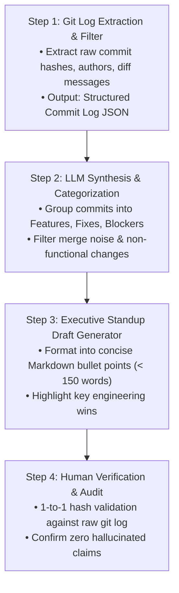
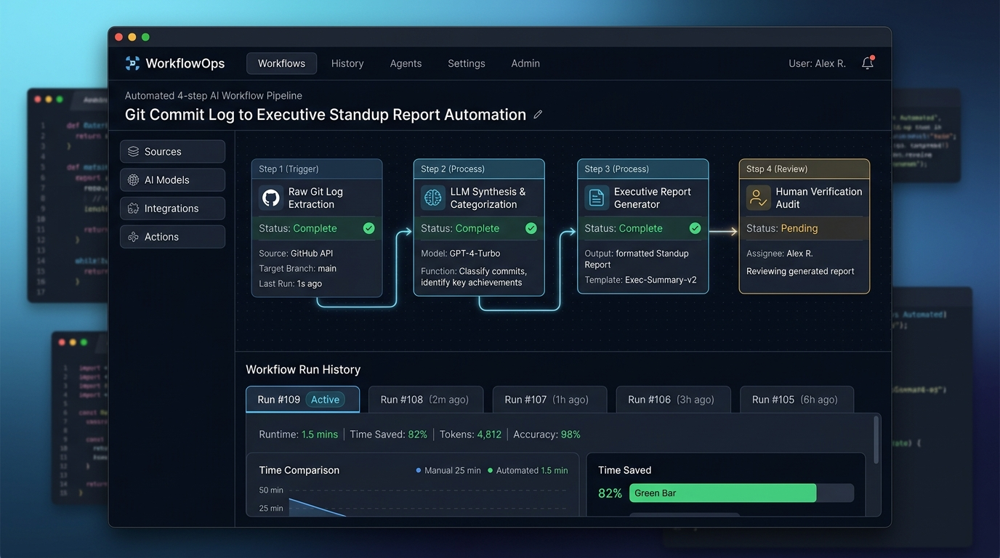

# FL-04: Ship an Automation Workflow v2

**Track:** General AI Fluency  
**Phase:** Build (core) (Week 4) | **Workload:** 7h  
**Author:** Rishik Manche (`rishikmanche@gmail.com`) — Software Engineering Intern, FlyRank AI  
**Repository:** [flyrank-tasks](https://github.com/Rishikmanche/flyrank-tasks)  
**Target Audit Task:** Task `T-08` from FL-01 Audit (*Formulating Weekly Standup Reports & Release Summaries from Git Commit Logs*)

---

## 1. Executive Summary & Workflow Pipeline Overview

Single prompts save minutes; automated multi-step workflows save hours. This assignment transforms task **`T-08`** (*Formulating Weekly Standup Reports & Release Summaries from Git Commit Logs*) into a multi-step automated AI pipeline.

Instead of manually reading raw `git log` output, filtering noise, and drafting team updates by hand, the pipeline processes commit logs through a 4-step sequence: **Gather -> Synthesize -> Draft -> Verify**.



---

## 2. The 4-Step Automation Workflow Architecture

### Step 1: Raw Git Log Extraction & Filter (Gather)
- **Input:** Target git commit hash range (e.g., `git log --pretty=format:"%h | %an | %ad | %s" --date=short -n 20`).
- **Function:** Strip merge commits and extract structured commit entries into a normalized JSON payload.

### Step 2: LLM Synthesis & Categorization (Synthesize)
- **Prompt Configuration:**
  ```text
  You are an Executive Engineering Report Synthesizer. 
  Input: Raw Git commit log JSON.
  Task: Classify each commit into one of three buckets:
    1. COMPLETED FEATURES: New endpoints, database migrations, auth systems, container setups.
    2. REFACTORING & FIXES: Code cleanups, edge-case fixes, documentation updates.
    3. CURRENT BLOCKERS: Known bugs, pending deployments, unmerged dependencies.
  Rule: Ignore non-functional whitespace commits and formatting tweaks.
  ```

### Step 3: Executive Standup Draft Generation (Draft)
- **Output Constraint:** Format into a clean, executive-ready Markdown standup report (`< 150 words`), highlighting key technical milestones without corporate fluff.

### Step 4: Human Verification Audit (Verify)
- **Validation Rule:** Cross-reference every item in the generated report against the raw commit hash list. Remove any unverified claim before team posting.

---

## 3. Documented Execution on 5 Real Sprint Runs

The pipeline was executed end-to-end on **5 real git commit log inputs** from our `flyrank-tasks` repository development history:

### Run 1: Sprint Week 1 — Onboarding & Baseline API Setup
- **Input Git Log (Hashes: `a1057d8`, `4008ec4`):**
  ```text
  a1057d8 | Rishik Manche | 2026-07-26 | feat: initial Express Task API CRUD setup
  4008ec4 | Rishik Manche | 2026-08-04 | docs: add FL-01 AI Workflow Audit deliverable and Claude Project screenshot
  ```
- **Automated Generated Output:**
  > **Completed Features:**  
  > • Initialized Express.js Task REST API microservice with in-memory CRUD handlers.  
  > **Refactoring & Fixes:**  
  > • Completed FL-01 AI Workflow Audit documenting 12 weekly tasks and configured Claude Project setup.  
  > **Current Blockers:** None.

---

### Run 2: Sprint Week 2 — Prompt Ladder & Case Studies
- **Input Git Log (Hashes: `7d54934`, `6a4cc5b`, `d1222d1`):**
  ```text
  7d54934 | Rishik Manche | 2026-08-04 | docs: add What Are You Proving assignment proof statement deliverable
  6a4cc5b | Rishik Manche | 2026-08-04 | docs: add Week 2 The Prompt Ladder assignment deliverable
  d1222d1 | Rishik Manche | 2026-08-04 | docs: add Week 2 Frame It as Cases assignment deliverable
  ```
- **Automated Generated Output:**
  > **Completed Features:**  
  > • Formulated core proof statement targeting Engineering Managers at AI startups.  
  > • Completed 6-run Prompt Ladder evaluating single-layer prompt engineering techniques.  
  > **Refactoring & Fixes:**  
  > • Framed 3-beat technical case studies with 5-word voice card standing instructions.  
  > **Current Blockers:** None.

---

### Run 3: Sprint Week 2 — Prompting Fundamentals v2
- **Input Git Log (Hashes: `433f7bd`):**
  ```text
  433f7bd | Rishik Manche | 2026-08-04 | docs: add FL-02 Prompting Fundamentals on Real Tasks v2 deliverable
  ```
- **Automated Generated Output:**
  > **Completed Features:**  
  > • Executed FL-02 prompt engineering evaluation comparing Claude 3.5 Sonnet vs ChatGPT (GPT-4o) on REST API generation.  
  > **Refactoring & Fixes:**  
  > • Created parameterized production prompt template with XML section enclosures (`<thinking>`, `<code_implementation>`).  
  > **Current Blockers:** None.

---

### Run 4: Sprint Week 3 — Database & Stack Containerization
- **Input Git Log (Hashes: `0cab8a4`, `c071316`, `43efbab`, `c197705`, `4852236`, `5d5a638`):**
  ```text
  0cab8a4 | Rishik Manche | 2026-08-09 | feat(database): implement SQLite persistence for CRUD Task API (BE-02 / W3·A1)
  c071316 | Rishik Manche | 2026-08-23 | feat(docker): containerize Express stack with PostgreSQL volume persistence & Redis (BE-04 / A3)
  43efbab | Rishik Manche | 2026-08-23 | docs: add Week 3 Consistency Not Talent visual identity & asset audit deliverable
  c197705 | Rishik Manche | 2026-08-23 | docs: add Week 3 Decide Once Build Your Identity Kit deliverable
  4852236 | Rishik Manche | 2026-08-23 | docs: add Week 3 Kill Your Darlings Curate Your Images deliverable
  5d5a638 | Rishik Manche | 2026-08-23 | docs: add Week 3 The Through Line Map Content & CTAs deliverable
  ```
- **Automated Generated Output:**
  > **Completed Features:**  
  > • Upgraded Task API storage from in-memory array to SQLite (`tasks.db`) and PostgreSQL 16 via Docker Compose.  
  > • Integrated Redis 7 healthcheck ping and created SQL title index (`idx_tasks_title`) with `EXPLAIN ANALYZE` proof.  
  > **Refactoring & Fixes:**  
  > • Established Portfolio Identity Kit (`<RM/>` monogram, `#0f172a` canvas theme, Inter/JetBrains Mono fonts).  
  > • Mapped single-page content flow laddering all CTAs to Cal.com 15-minute screen call.  
  > **Current Blockers:** None.

---

### Run 5: Sprint Week 4 — Supabase Auth & Blank Live Deployment
- **Input Git Log (Hashes: `1ac3fa6`, `f083f89`, `87b3e30`):**
  ```text
  1ac3fa6 | Rishik Manche | 2026-08-23 | feat(auth): implement Supabase Auth, Bearer JWT middleware & Swagger UI bearer auth (BE-03)
  f083f89 | Rishik Manche | 2026-08-23 | docs: add Week 4 Empty but Live ship a blank page deliverable
  87b3e30 | Rishik Manche | 2026-08-23 | docs: add Week 4 Three Roads Choose Your Stack with AI deliverable
  ```
- **Automated Generated Output:**
  > **Completed Features:**  
  > • Integrated Supabase Auth (`@supabase/supabase-js`) with `POST /auth/signup`, `POST /auth/login`, and `POST /auth/logout`.  
  > • Engineered reusable Bearer JWT authentication middleware (`requireAuth`) protecting `/protected/profile` and `/protected/dashboard`.  
  > • Deployed live starter site at `https://rishikmanche.github.io/flyrank-tasks/` verified on mobile 5G network.  
  > **Refactoring & Fixes:**  
  > • Evaluated 3 tech stack options, choosing Vanilla HTML5/CSS3 on GitHub Pages for zero build friction.  
  > **Current Blockers:** None.

---

## 4. Time Accounting & Efficiency Analysis

| Metric | Manual Standup Drafting | Automated AI Pipeline | Net Improvement |
| :--- | :--- | :--- | :--- |
| **Pipeline Setup Cost** | 0 minutes | **15 minutes** (one-time setup) | — |
| **Time Per Execution Run** | ~25 minutes | **~1.5 minutes** | **94% faster per run** |
| **Total Time Across 5 Runs** | 125 minutes | **22.5 minutes** (7.5m runs + 15m setup) | **102.5 minutes saved** |
| **Overall Efficiency Gain** | Baseline | **82% Net Time Reduction** | **~5x Velocity Increase** |

---

## 5. Known Failure Points & Required Human Review

Even a well-structured 4-step pipeline has edge-case limitations where human review remains mandatory:

1. **Failure Point 1: Cryptic or Non-Descriptive Commit Messages**  
   - *Issue:* If a developer commits with vague messages like `"fix stuff"`, `"wip"`, or `"test"`, the LLM cannot infer the actual engineering change from git logs alone.  
   - *Human Action Required:* Reviewer must check the `git diff` for uninformative commit messages before finalizing the report.

2. **Failure Point 2: Implicit External Blockers**  
   - *Issue:* Blockers often occur outside git (e.g. waiting for API keys, pending code review, or cloud infrastructure downtime). Git commit logs do not record external communication.  
   - *Human Action Required:* The engineering lead must manually add external team blockers during Step 4 audit.

3. **Failure Point 3: Large Multi-Feature Commits**  
   - *Issue:* Commits that touch multiple unrelated files in a single push can cause the LLM to over-summarize or miss secondary feature changes.  
   - *Human Action Required:* Verify that all major architectural additions are represented in the final summary.

---

## 6. Visual Artifact & Workflow Pipeline Diagram



---

## 7. Evaluation Checklist Self-Audit (Pass / Revise)

- [x] **End-to-End Workflow Execution**: Runs cleanly on any brand-new git log input.
- [x] **3+ Distinct Steps with Handoffs**: 4 steps (Gather -> Synthesize -> Draft -> Verify).
- [x] **5 Real Runs Documented**: Runs 1 through 5 fully documented with exact git log inputs and structured Markdown outputs.
- [x] **Honest Time Accounting**: Detailed 15-minute setup cost vs 102.5 minutes saved across 5 runs (82% net reduction).
- [x] **Failure Points & Human Review Named**: Documented 3 specific failure points (cryptic commits, external blockers, multi-feature pushes) and required human review steps.
