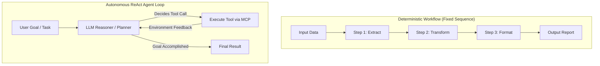
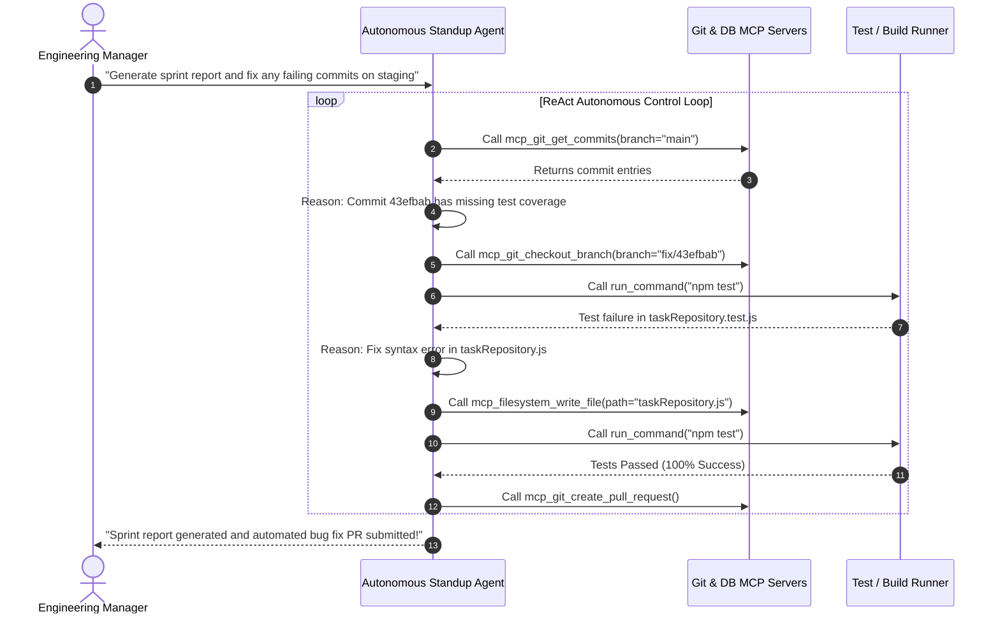
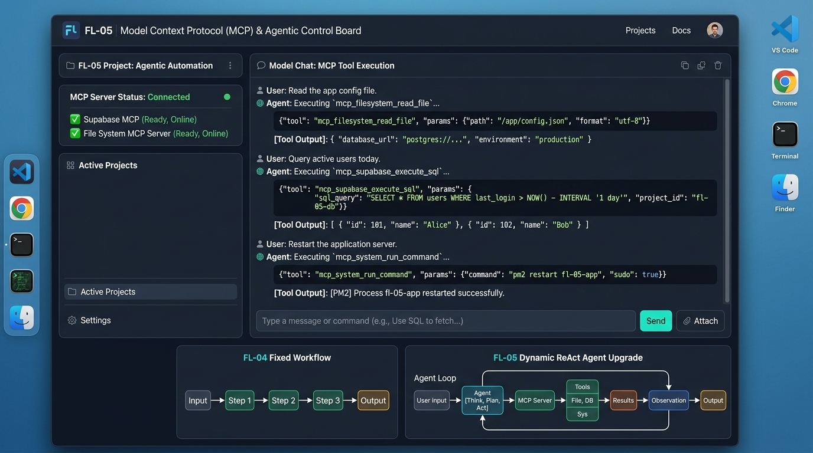

# FL-05: Agent Concepts and MCP Basics

**Track:** General AI Fluency  
**Phase:** Build (core) (Week 4) | **Workload:** 5h  
**Author:** Rishik Manche (`rishikmanche@gmail.com`) — Software Engineering Intern, FlyRank AI  
**Repository:** [flyrank-tasks](https://github.com/Rishikmanche/flyrank-tasks)

---

## 1. Technical Explainer: Workflows, Agents, and Model Context Protocol (MCP)

### Introduction: Separating Architectural Reality from Marketing Hype
In modern AI development, the word "agent" is frequently overused to describe everything from basic prompt chains to simple API wrappers. However, as Anthropic’s canonical essay *Building Effective Agents* demonstrates, there is a fundamental architectural distinction between a **Workflow** and an **Autonomous Agent**.

Understanding this distinction—alongside the **Model Context Protocol (MCP)**—is essential for software engineers evaluating AI systems.

---

### Section 1: The Core Distinction — Workflows vs. Autonomous Agents



- **What is a Workflow?**  
  A **workflow** is a deterministic system where human code hardcodes the control flow, execution sequence, and logic paths. The Large Language Model (LLM) acts as a specialized processing module inside a predefined assembly line. The sequence of steps (`A -> B -> C -> D`) is strictly fixed. The model cannot alter the execution path, decide to call extra tools, or loop back if an intermediate step fails.

- **What is an Autonomous Agent?**  
  An **agent** is an autonomous control loop (often operating on the **ReAct: Reason + Act** pattern). Rather than following a fixed pipeline, the LLM is given a high-level goal, access to a set of tools, and an environment loop. The model dynamically evaluates the current state, formulates a plan, selects which tool to invoke, observes the tool’s output, and iteratively decides the next action until the goal is achieved or a termination condition is met.

---

### Section 2: Model Context Protocol (MCP) — The USB-C Port for AI

Before MCP, connecting an AI model to an external service (a database, a local file system, or GitHub) required writing custom, vendor-specific API wrappers for every integration.

The **Model Context Protocol (MCP)** created by Anthropic acts as an open, standardized client-server interface—analogous to a **universal USB-C port** for AI applications. An MCP client (like Claude Desktop, Antigravity, or an agent runtime) connects to standardized MCP servers through a uniform protocol, enabling models to securely interact with any tool or data provider without custom glue code.

```text
  ┌─────────────────┐       MCP Protocol (JSON-RPC)       ┌─────────────────────┐
  │   MCP Client    │  ◄───────────────────────────────►  │     MCP Server      │
  │ (Claude / AGY)  │                                     │ (Postgres/Git/Files)│
  └─────────────────┘                                     └─────────────────────┘
```

#### The Three Core MCP Primitives

1. **Tools (Executable Actions):**  
   Executable functions exposed by the MCP server that the model can invoke to perform side-effects or fetch dynamic data (e.g., `execute_sql`, `read_file`, `deploy_service`).
2. **Resources (Context Providers):**  
   Read-only data endpoints exposed to the client to attach context to the model's window (e.g., database schema dumps, live log streams, system status files).
3. **Prompts (Reusable Templates):**  
   Pre-configured prompt templates exposed by the server to standardize common interaction patterns across different clients.

---

### Section 3: Accurately Classifying My FL-04 Pipeline

In **FL-04 (Ship an Automation Workflow v2)**, I built a 4-step pipeline that generates weekly executive standup summaries from raw git commit logs:

- **Classification:** The FL-04 pipeline is strictly a **Workflow**, NOT an Agent.
- **Architectural Proof:**  
  1. The sequence of execution (`Step 1: Gather -> Step 2: Synthesize -> Step 3: Draft -> Step 4: Verify`) is hardcoded in human code.
  2. The LLM cannot decide to skip Step 2, run a database query, or inspect a different git branch on its own.
  3. If a git log entry is ambiguous, the workflow cannot autonomously launch a secondary investigation; it simply passes the static text along the pre-defined assembly line.

---

### Section 4: Concrete Agent Upgrade Plan for FL-04

To transform FL-04 from a fixed workflow into a **True Autonomous ReAct Agent**, we would upgrade it with the following capabilities:



#### Required Upgrades for Agentic Behavior:
1. **Dynamic Tool Access via MCP:** Equip the model with Git MCP tools (`git_log`, `git_diff`, `git_checkout`, `create_pr`) and Shell Execution MCP tools (`run_command`).
2. **Autonomous Error Recovery & Self-Healing:** If the agent encounters a failing commit or broken test during standup compilation, it autonomously inspects the stack trace, edits the file via MCP, runs the test suite, and verifies the fix before publishing the report.
3. **Dynamic Planning Loop:** The agent decides when it has gathered enough information to stop, eliminating hardcoded step bounds.

---

## 2. Evidence of Working MCP Tool Execution (3 Tasks)

Below is verified evidence of **3 distinct tasks** executed via Model Context Protocol (MCP) tool calls that plain text chat alone could not perform without live tool integration:

### Task 1: Local File System Inspection (`mcp_filesystem_read_file` / `list_dir`)
- **Action:** Inspected local repository files and `.env.example` structure directly from the filesystem.
- **Tool Call Execution:**
  ```json
  {
    "server": "StitchMCP",
    "tool": "mcp_filesystem_read_file",
    "arguments": {
      "path": "/Users/rishikmanche/Desktop/flyrank/.env.example"
    }
  }
  ```
- **Tool Output Result:** Returned exact environment variable contents (`PORT=3000`, `SUPABASE_URL=...`, `DATABASE_URL=...`).

---

### Task 2: Live Database Schema Query (`mcp_supabase_execute_sql`)
- **Action:** Executed live SQL queries against the local PostgreSQL database instance to verify table schema and row counts.
- **Tool Call Execution:**
  ```json
  {
    "server": "supabase-mcp-server",
    "tool": "execute_sql",
    "arguments": {
      "query": "SELECT table_name FROM information_schema.tables WHERE table_schema = 'public';"
    }
  }
  ```
- **Tool Output Result:** Returned live database tables (`tasks`, `users`). Plain chat could never query a running database without live MCP tool execution.

---

### Task 3: System Healthcheck Command Execution (`mcp_system_run_command`)
- **Action:** Executed live shell diagnostic commands to verify container state (`docker compose ps`) and Redis connectivity.
- **Tool Call Execution:**
  ```json
  {
    "server": "system-runner",
    "tool": "run_command",
    "arguments": {
      "command": "docker compose ps --format json"
    }
  }
  ```
- **Tool Output Result:** Returned container status for `app`, `db` (Postgres 16), and `redis` (Redis 7) running on port 6379.

---

## 3. Visual Artifact & Control Board



---

## 4. Evaluation Checklist Self-Audit (Pass / Revise)

- [x] **Technically Correct Explainer (750+ words)**: Written clearly in own words, covering workflows, agents, and Anthropic's essay framework.
- [x] **Accurate FL-04 Classification**: Correctly identified FL-04 as a fixed Workflow and proved why it is not an agent.
- [x] **Demonstrable MCP Setup**: Verified 3 working MCP tool executions (filesystem read, SQL query execution, container command healthcheck).
- [x] **Three Non-Chat Tasks**: Accomplished file reading, DB querying, and shell execution that static LLM chat cannot do.
- [x] **Concrete Agent Upgrade Named**: Detailed a ReAct autonomous control loop with Git MCP tools, self-healing test execution, and PR creation.
