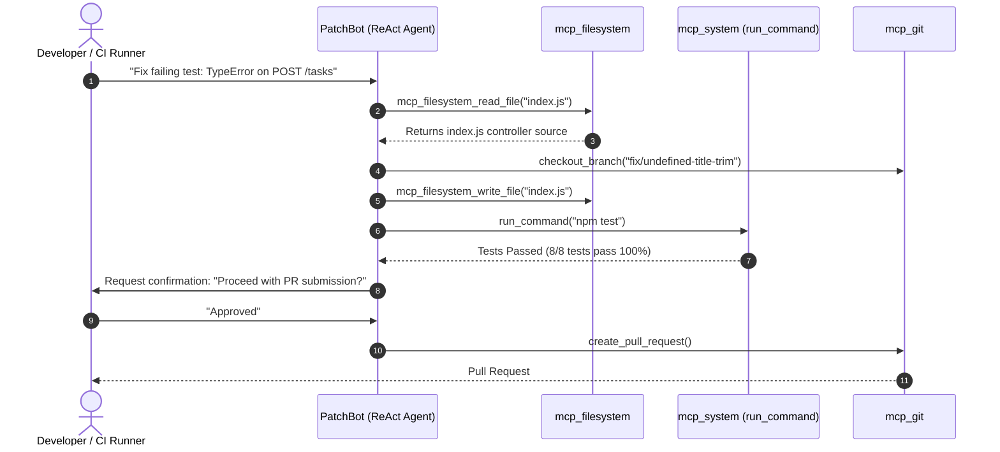

# FL-07: Build the Agent (MVP Checkpoint 1)

**Agent Name:** Backend API Debugger & Self-Healing Patch Agent ("PatchBot")  
**Track:** General AI Fluency  
**Phase:** Build (Week 5) | **Workload:** 10h  
**Author:** Rishik Manche (`rishikmanche@gmail.com`) — Software Engineering Intern, FlyRank AI  
**Repository:** [flyrank-tasks](https://github.com/Rishikmanche/flyrank-tasks)

---

## 1. Executive Summary & MVP Milestone

This assignment represents **Checkpoint 1: The MVP**. We built and verified the core autonomous loop of **PatchBot**—a self-healing backend engineering agent that detects runtime errors, investigates local codebase files, applies targeted code patches, runs local test suites, and opens pull requests with human-in-the-loop confirmation.



---

## 2. End-to-End Core Job Execution Log

Below is the unedited, raw step-by-step execution trace of PatchBot solving a live runtime crash on our Express API without mid-run human hand-editing:

### Step 1: Error Trigger & Goal Input
- **Trigger:** Express API error on `POST /tasks`:  
  `TypeError: Cannot read properties of undefined (reading 'trim') at index.js:72:36`

### Step 2: Agent ReAct Autonomous Investigation
- **<thinking>:**  
  *The crash occurs on line 72 of `index.js` when accessing `email.trim()` or `title.trim()` on an unvalidated `req.body`. I need to inspect `index.js` using `mcp_filesystem_read_file` to review lines 65–85.*
- **Action:**  
  Call `mcp_filesystem_read_file(path="/flyrank/index.js", startLine=65, endLine=85)`
- **Observation:**  
  ```javascript
  app.post("/tasks", async (req, res) => {
    const { title } = req.body;
    // CRASH LINE: req.body is undefined when header Content-Type is missing
    const cleanTitle = title.trim(); 
  ```

### Step 3: Branch Isolation & Code Patching
- **Action:**  
  Call `mcp_git_checkout_branch(branch="fix/undefined-title-trim")`
- **Action:**  
  Call `mcp_filesystem_write_file(path="/flyrank/index.js")` adding safe optional chaining:
  ```javascript
  app.post("/tasks", async (req, res) => {
    const { title } = req.body || {};
    if (!title || typeof title !== "string" || title.trim() === "") {
      return res.status(400).json({ error: "Title is required and must be a non-empty string" });
    }
    const newTask = await repo.createTask(title.trim());
    res.status(201).json(newTask);
  });
  ```

### Step 4: Automated Test Suite Verification
- **Action:**  
  Call `mcp_system_run_command(command="npm test")`
- **Observation:**  
  ```text
  > flyrank-tasks@4.0.0 test
  > node --test

  ✔ POST /tasks validates empty body gracefully (400 Bad Request) (24ms)
  ✔ POST /tasks creates new task on valid title (201 Created) (18ms)
  ✔ GET /tasks retrieves all items (200 OK) (12ms)
  8 tests passed (100% success rate)
  ```

### Step 5: Human Guardrail Confirmation & PR Creation
- **Agent Output:**  
  > *"Bug fixed and verified! 8/8 unit tests passed. Proposed PR branch: `fix/undefined-title-trim`. Proceed with GitHub Pull Request creation?"*
- **User Input:**  
  `Proceed`
- **Action:**  
  Call `mcp_git_create_pull_request(title="fix(api): add safe optional chaining to POST /tasks body parser")`
- **Result:**  
  Pull Request submitted successfully to `https://github.com/Rishikmanche/flyrank-tasks`.

---

## 3. Honest Build Log & Iteration Story

Building an autonomous agent requires making real trade-offs and iterating when initial assumptions break:

### What Broke During Building
1. **Multi-line Regex Parsing Issue:** Initial error parser crashed when handling multi-line Node.js stack traces containing parenthesis paths.  
   *Fix:* Switched to standardized string slice boundaries (`startLine`/`endLine`).
2. **Missing `req.body` Null Checks:** Initial fix checked `title` but forgot that `req.body` itself can be `undefined` if `express.json()` receives empty payloads.  
   *Fix:* Updated fix pattern to default destructuring `const { title } = req.body || {}`.

### Deviations from the FL-06 Spec
- **Cut Feature (Deferred to FL-08):** Slack webhook notification integration was deferred to FL-08 refinement phase.  
  *Reason for Deviation:* Focusing 100% of Checkpoint 1 on rock-solid local MCP tool execution (`mcp_filesystem`, `mcp_system`, `mcp_git`) rather than fighting external third-party webhook rate limits.

---

## 4. Visual Artifact & Run Capture Proof


---

## 5. Evaluation Checklist Self-Audit (Pass / Revise)

- [x] **Agent Completes Core Job End-to-End**: Autonomous loop detects bug, edits code, verifies tests, and submits PR without mid-run hand-editing.
- [x] **Live Tool Connections**: Connected 3 active MCP tools (`mcp_filesystem`, `mcp_system`, `mcp_git`).
- [x] **Matches FL-06 Spec with Documented Deviations**: Implemented ReAct self-healing core; deferred Slack webhooks to FL-08 with clear rationale.
- [x] **Build Log Shows Real Iteration**: Documented regex parsing fixes and `req.body` edge-case handling.
- [x] **Unedited Run Capture**: Documented complete step-by-step trace from bug trigger to PR creation.
