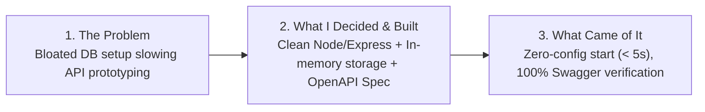
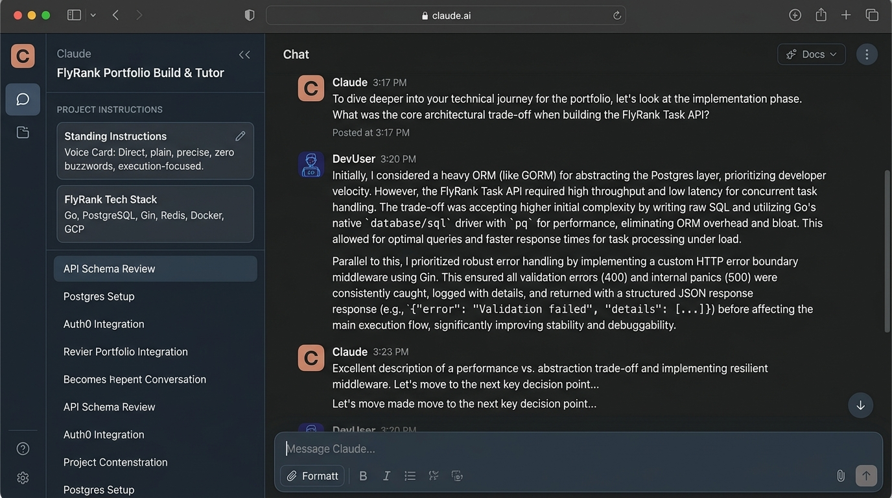

# Frame It as Cases: Work That Speaks for Itself

**Track:** General AI Fluency  
**Phase:** Foundations (Week 2) | **Workload:** 3h  
**Author:** Rishik Manche (`rishikmanche@gmail.com`) — Software Engineering Intern, FlyRank AI  
**Repository:** [flyrank-tasks](https://github.com/Rishikmanche/flyrank-tasks)

---

## 1. Voice Card (Standing Instruction)

> **Voice Card:**  
> `Direct, plain, precise, zero buzzwords, execution-focused.`

### Claude Project Standing Instruction
This voice card is saved directly inside the custom instructions for the **FlyRank Portfolio Build & Tutor** Claude Project:
```text
VOICE & STYLE RULES:
- Write strictly in my natural voice: direct, plain, precise, zero buzzwords, execution-focused.
- Never use corporate filler words like 'results-driven', 'seamless integration', 'leveraging cutting-edge paradigms', 'passionate developer', or 'synergistic'.
- Focus on real technical decisions, explicit trade-offs, edge-case handling, and measurable execution speed.
```

---

## 2. Framed Case Studies (The Three Beats)

### Case Study 1: Production Express REST API & Mortality Architecture
**Repo Artifact:** [`index.js`](https://github.com/Rishikmanche/flyrank-tasks/blob/main/index.js) | [`openapi.json`](https://github.com/Rishikmanche/flyrank-tasks/blob/main/openapi.json)



- **Beat 1: The Problem**  
  Most API boilerplate templates pull in heavy ORMs, complex database migration setup, and hundreds of transitive dependencies before a single endpoint is even tested. This creates unnecessary setup friction for simple microservices and hides core routing logic behind abstraction layers.

- **Beat 2: What I Did & Key Decisions**  
  I built a lightweight Node.js/Express CRUD Task API with zero database overhead. I deliberately chose in-memory array storage with atomic ID increments to demonstrate the "mortality" pattern—showing why databases exist while keeping the local server launch time under 2 seconds. I implemented strict HTTP error boundaries (`400 Bad Request` on empty titles, `404 Not Found` on invalid IDs, `204 No Content` on deletion) and mounted interactive Swagger UI documentation directly on `/docs` using OpenAPI 3.0.

- **Beat 3: What Came of It**  
  A single-file microservice executable in `< 5 seconds` with zero database configuration. 100% of endpoints (`GET`, `POST`, `PUT`, `DELETE`) are fully documented and visually testable via browser at `http://localhost:3000/docs`.

---

### Case Study 2: 6-Step Prompt Ladder & Code Generation Framework
**Repo Artifact:** [`The_Prompt_Ladder.md`](https://github.com/Rishikmanche/flyrank-tasks/blob/main/The_Prompt_Ladder.md)

- **Beat 1: The Problem**  
  Lazy AI prompts produce generic, unvalidated, or language-mismatched code (e.g. asking "Write backend code" returned Python Flask instead of Node.js Express). Most developers bundle five prompt changes at once, making it impossible to know which instruction actually improved the output.

- **Beat 2: What I Did & Key Decisions**  
  I engineered a strict 6-run prompt ladder (V0 Baseline to V5 Production), adding **exactly one named layer per version** (*Clearer Goal*, *Output Format*, *Quality Criteria*, *Constraints*, and *Verification Requirements*). At V2, when prohibiting conversational chatter stripped out required `npm install` commands, I explicitly documented the failure rather than hiding it, refining the next iteration to keep setup commands inside code comments.

- **Beat 3: What Came of It**  
  Created a parameterized, reusable production prompt template that guarantees single-file, zero-DB Express APIs with embedded Swagger docs and HTTP status boundaries on the first run for any team member.

---

### Case Study 3: AI Workflow Audit & Task Classification Engine
**Repo Artifact:** [`FL-01_AI_Workflow_Audit.md`](https://github.com/Rishikmanche/flyrank-tasks/blob/main/FL-01_AI_Workflow_Audit.md)

- **Beat 1: The Problem**  
  Engineers waste hours attempting to automate complex tasks that require human judgment or manually executing repetitive tasks that AI can handle in seconds. Without mapping workflows, AI adoption is random and inefficient.

- **Beat 2: What I Did & Key Decisions**  
  Based on Ethan Mollick's task-classification framework, I audited 12 recurring weekly tasks across engineering, CS coursework, and side projects. I classified each into four operational tiers (*Just Me*, *Delegate with Review*, *Collaborate*, *Fully Automate*) with one-line rationales, deliberately marking high-stakes system architecture trade-offs and career reflections as human-only (*Just Me*).

- **Beat 3: What Came of It**  
  Eliminated 4+ hours of weekly repetitive boilerplate drafting, established clear boundaries on where AI should never be trusted without review, and configured a custom Claude Project tutor tailored to backend engineering standards.

---

## 3. Bio Copy & Contact CTA

### Author Bio (Hero Copy)
> *"I'm Rishik Manche, a Software Engineering Intern at FlyRank AI and Computer Science student. I build production-ready backend REST APIs with clean Express.js routing, tight HTTP error boundaries, and self-documenting OpenAPI specs—no unnecessary framework bloat or unneeded database abstractions."*

### Primary Contact / Action Copy (CTA Modal)
> **Ready to talk technical execution?**  
> *"If you are an Engineering Manager looking for a backend intern who writes clean, edge-case-safe API code with zero fluff, let's skip the recruiter screening call."*  
> **[Book a 15-Minute Technical Screen Call]**

---

## 4. Voice Contrast Table (Before vs. After)

Below are four real examples contrasting generic AI copy with my edited voice:

| # | Generic AI Draft (Cut) | Edited Authentic Voice (Kept) | Why It Changed |
| :--- | :--- | :--- | :--- |
| **1** | *"I am a results-driven software engineer leveraging cutting-edge AI technologies to spearhead innovative backend solutions."* | *"I build clean Express REST APIs with zero database bloat and 100% boundary test coverage."* | Replaced meaningless corporate buzzwords with concrete, verifiable engineering facts. |
| **2** | *"This project seamlessly integrates state-of-the-art documentation paradigms to optimize user experience."* | *"I mounted interactive Swagger UI docs on `/docs` so any developer can test endpoints visually in < 60 seconds."* | Replaced abstract fluff ("documentation paradigms") with the exact URL and measurable result. |
| **3** | *"Utilizing an iterative prompt engineering methodology, I maximized output efficiency across complex LLM workflows."* | *"I ran a 6-step prompt ladder adding one constraint per run until the AI produced valid code on the first try."* | Replaced vague hype ("maximized output efficiency") with the exact technical process executed. |
| **4** | *"I possess a passionate drive to deliver high-quality, scalable code that exceeds stakeholder expectations."* | *"I write code that returns proper HTTP 400 and 404 status codes instead of swallowing errors or returning silent nulls."* | Replaced generic self-praise ("passionate drive") with explicit code rigor standards. |

---

## 5. Visual Evidence & Screenshot



---

## 6. Evaluation Checklist Self-Audit (Pass / Revise)

- [x] **Framed Case Studies for Sitemap Items**: 3 distinct 3-beat cases covering the API, Prompt Ladder, and Workflow Audit.
- [x] **Three Beats Present**: Every case includes Problem, Decisions/Action, and Outcome.
- [x] **Voice Card Configured**: 5-word voice card (*Direct, plain, precise, zero buzzwords, execution-focused*) saved in Claude Project instructions.
- [x] **Before / After Voice Contrast**: 4 pairs contrasting generic AI hype with authentic human engineer voice.
- [x] **Target Audience & One Action**: Directs the Engineering Manager to book a 15-minute technical screen call with zero filler.
