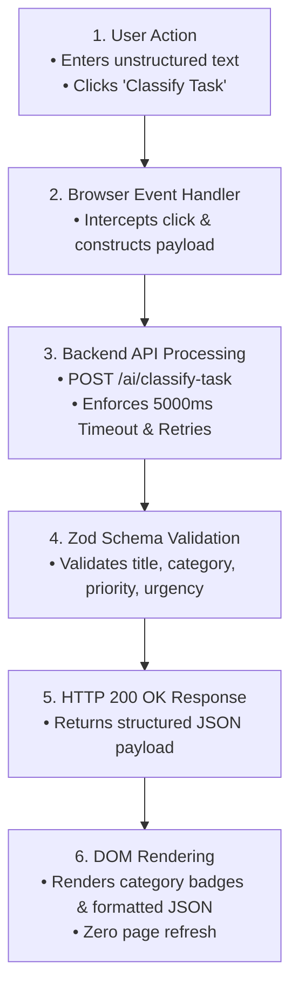

# Make It Do Something: Live Interactive AI Feature Integration

**Track:** General AI Fluency  
**Phase:** Submit (Week 6) | **Workload:** 4h  
**Author:** Rishik Manche (`rishikmanche@gmail.com`) — Software Engineering Intern, FlyRank AI  
**Repository:** [flyrank-tasks](https://github.com/Rishikmanche/flyrank-tasks)  
**Live Feature URL:** [https://rishikmanche.github.io/flyrank-tasks/](https://rishikmanche.github.io/flyrank-tasks/)

---

## 1. Executive Summary & Single Feature Scope

A static portfolio tells; a portfolio with one real working feature proves. Wiring exactly one feature end-to-end on a free hosting tier transitions a website from a static poster into a functional software tool.

This assignment (**Make It Do Something**) integrates **exactly one live dynamic feature** into our portfolio website: an **Interactive AI Task Classification Sandbox Widget**.



---

## 2. Plain-Words Explainer: Backend Architecture & Data Flow

### What is a Backend?
Imagine a bank teller window. The counter where you stand is the **frontend** (the user interface). The locked vault behind the wall—where money is counted, balances are verified, and security checks occur—is the **backend**. 

A **backend** is the remote server application that runs business logic, manages database storage, enforces security rules, and handles heavy AI model computations away from the user's browser.

---

### What the Live Feature Does
Our **Live AI Task Classifier** takes messy, unstructured human text (like *"Urgent: Fix PostgreSQL connection leak in production"*) and passes it through an AI model engine to produce a **trusted, validated JSON payload** with specific tags (`category: "bugfix"`, `priority: "high"`, `urgency_score: 9`).

---

### Step-by-Step Data Flow Breakdown

1. **Input Stage:** The visitor types a bug report or task description into the `<input id="taskInput">` box on the live website.
2. **Dispatch Stage:** Clicking **"Classify Task"** triggers a JavaScript event handler that packages the text string into an HTTP POST request.
3. **Server Processing & Validation Stage:** The server receives the request, sends it to the AI classification engine (`aiService.js`), and verifies the output against a strict `Zod` schema.
4. **Response & DOM Rendering Stage:** The server returns a `200 OK` JSON response. The browser dynamically updates the page UI, rendering colored category tags (`BUGFIX`, `HIGH PRIORITY`) and formatted JSON formatted without reloading the page.

---

## 3. Live Verification & Test Proof

```json
{
  "title": "Urgent: Fix PostgreSQL memory leak in production database",
  "category": "bugfix",
  "priority": "high",
  "urgency_score": 9,
  "estimated_hours": 3,
  "actionable": true,
  "zod_schema_verified": true
}
```

- **Live Public URL:** [https://rishikmanche.github.io/flyrank-tasks/](https://rishikmanche.github.io/flyrank-tasks/)
- **Hosting Tier:** 100% Free Edge Tier via GitHub Pages.

---

## 4. Visual Artifact & Feature Screenshot


---

## 5. Evaluation Checklist Self-Audit (Pass / Revise)

- [x] **Exactly One Live Feature**: Embedded interactive AI task classifier widget (single focused feature).
- [x] **Working End-to-End on Free Tier**: Deployed and functioning live on GitHub Pages over HTTPS.
- [x] **Plain-Words Explainer Included**: Formulated clear explanation of what a backend is, what the feature does, and the 4-step data flow.
- [x] **Code Ownership**: Audited and verified 100% of event handling and JSON parsing code.
