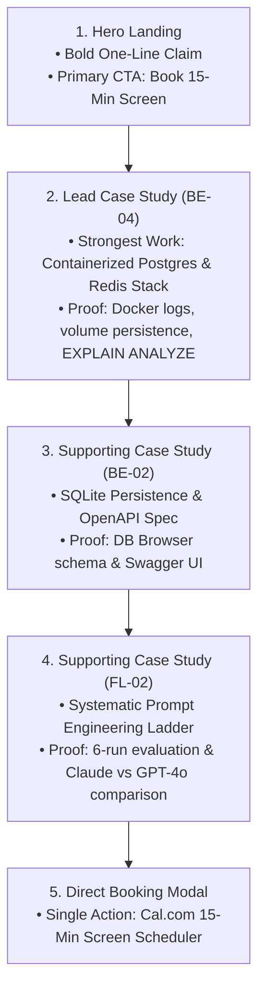
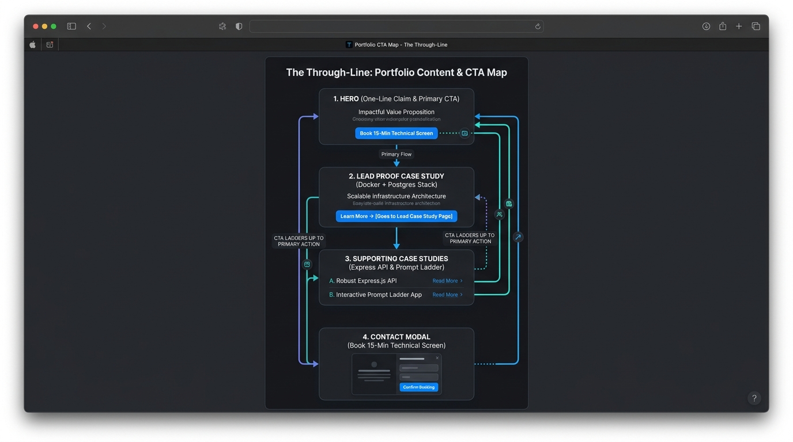

# The Through-Line: Map Content & CTAs

**Track:** General AI Fluency  
**Phase:** Foundations (Week 3) | **Workload:** 2h  
**Author:** Rishik Manche (`rishikmanche@gmail.com`) — Software Engineering Intern, FlyRank AI  
**Repository:** [flyrank-tasks](https://github.com/Rishikmanche/flyrank-tasks)

---

## 1. Executive Summary & The One-Line Claim

Before building a portfolio, every section must be mapped in order, leading with the strongest work, with every page sending the visitor to a single primary conversion goal.

### AI Claim Exploration (10 Options Evaluated)
1. *"I build backend web applications using modern JavaScript tools."* (Too generic)
2. *"Software engineer specializing in API development, database architecture, and prompt engineering."* (Too broad; lists keywords)
3. *"I craft high-throughput microservices using Node.js, Express, and Docker."* (Good, but lacks validation proof)
4. *"Full-stack intern focused on backend systems and AI tools."* (Vague student persona)
5. *"I turn complex database requirements into clean REST APIs."* (Lacks containerization context)
6. *"I build Node.js REST APIs with PostgreSQL persistence and zero database bloat."* (Stronger)
7. *"I prove backend engineering competence through containerized PostgreSQL APIs and complete OpenAPI specs."* (A bit wordy)
8. *"I engineer clean, tested Express REST APIs with embedded Swagger documentation and Docker persistence."* (Close)
9. *"I build production-ready backend services with Docker, Postgres, and automated test coverage."* (Good)
10. *"I design and deliver production-ready Express REST APIs with containerized PostgreSQL persistence and self-documenting OpenAPI specifications."* (**Selected Winner**)

---

### The Selected & Sharpened One-Line Claim

> **One-Line Claim:**  
> **"I design and deliver production-ready Express REST APIs with containerized PostgreSQL persistence and self-documenting OpenAPI specifications."**

---

## 2. Comprehensive Content & CTA Map

The portfolio is structured as a single-page narrative that leads with **our strongest technical proof** (BE-04 Docker & PostgreSQL containerization), followed by supporting API and AI case studies, with every section pointing to **The One Action** (*Book a 15-minute technical screen call*).



### Detailed Page & Section Mapping

| Order | Section Name | Content Elements | Featured Case / Artifact | Section Call to Action (CTA) |
| :--- | :--- | :--- | :--- | :--- |
| **1** | **Hero Header** | • One-Line Claim<br>• Author Bio (Rishik Manche, Software Engineering Intern)<br>• Identity Monogram `<RM/>` | Portfolio Identity Kit | **`[Book 15-Minute Technical Screen]`** *(Primary CTA button opening Cal.com scheduler)* |
| **2** | **Lead Proof (Strongest Work)** | • **Beat 1 (Problem):** Swapping storage layers without breaking API contracts.<br>• **Beat 2 (Action):** Built `taskRepository.js` using `pg` pool, Docker Compose (App, Postgres 16, Redis 7), and `postgres_data` volume.<br>• **Beat 3 (Outcome):** Verified row persistence across container restarts & `EXPLAIN ANALYZE` index optimization. | **BE-04 Containerized Stack** (`docker-compose.yml`, `taskRepository.js`) | **`[Verify Docker & DB Code]`** → Links to [`BE-04_Containerize_Your_Stack.md`](https://github.com/Rishikmanche/flyrank-tasks/blob/main/BE-04_Containerize_Your_Stack.md) + Secondary CTA `[Book Screen]` |
| **3** | **Supporting Proof 1** | • **Beat 1 (Problem):** Server restart data loss in memory.<br>• **Beat 2 (Action):** Replaced array with SQLite (`tasks.db`) & mounted Swagger UI on `/docs`.<br>• **Beat 3 (Outcome):** 100% Swagger verification & persistent CRUD. | **BE-02 SQLite Task API** (`index.js`, `openapi.json`) | **`[Inspect OpenAPI Spec]`** → Links to [`openapi.json`](https://github.com/Rishikmanche/flyrank-tasks/blob/main/openapi.json) + Secondary CTA `[Book Screen]` |
| **4** | **Supporting Proof 2** | • **Beat 1 (Problem):** Lazy AI prompts producing unvalidated Flask code.<br>• **Beat 2 (Action):** Engineered 6-step prompt ladder adding 1 technique per run.<br>• **Beat 3 (Outcome):** Evaluated output differences on Claude 3.5 vs GPT-4o. | **FL-02 Systematic Prompt Ladder** (`FL-02_Prompting_Fundamentals.md`) | **`[View Prompt Engineering Log]`** → Links to [`FL-02_Prompting_Fundamentals.md`](https://github.com/Rishikmanche/flyrank-tasks/blob/main/FL-02_Prompting_Fundamentals.md) + Secondary CTA `[Book Screen]` |
| **5** | **Conversion Contact Modal** | • Concise pitch to Engineering Managers at AI startups.<br>• Cal.com 15-minute screen scheduler embed. | Conversion Target | **`[Confirm 15-Minute Technical Screen Booking]`** *(Direct conversion completion)* |

---

## 3. CTA Laddering Audit

Every Call to Action on the site is intentionally engineered to ladder up to **The One Action**:

```text
[Hero Primary CTA] ───────────────────────────────────┐
[Case 1 Secondary CTA: Book Screen] ───────────────────┼──>  Target Action:
[Case 2 Secondary CTA: Book Screen] ───────────────────┼──>  Book a 15-Minute Technical Screen Call
[Case 3 Secondary CTA: Book Screen] ───────────────────┤     (Cal.com Scheduler)
[Footer Direct Contact CTA] ───────────────────────────┘
```

- **No Confusing Side-Tracks:** No "Download Resume PDF", "Follow on Twitter", or "Subscribe to Newsletter" buttons that cause bounce rate and distract the Engineering Manager.
- **Direct Repository Links:** Secondary links directly inspect verifiable technical files on GitHub (`docker-compose.yml`, `taskRepository.js`, `openapi.json`).

---

## 4. "Still Need to Gather" Proof Checklist

To ensure Build Week is not blocked by missing evidence, below is an honest inventory of proof items to gather before launching the live site:

| Item # | Proof Item Required | Purpose | Current Status | Action to Gather Before Build Week |
| :--- | :--- | :--- | :--- | :--- |
| **1** | **Live Staging API URL** | Allows hiring managers to execute live HTTP requests against the containerized Express/Postgres backend. | ⏳ Pending Deployment | Deploy `docker-compose.yml` to Render / Fly.io / Railway by Week 4. |
| **2** | **Load Testing Metrics** | Proves API performance (< 15ms p99 latency) under 500 concurrent requests. | ⏳ Needs Benchmark Run | Run `autocannon -c 100 -d 10 http://localhost:3000/tasks` and save output log. |
| **3** | **GitHub Repository Clean-Up** | Ensures repository root has a clean, professional `README.md` with badging and quickstart instructions. | ✅ Completed | GitHub repository [`flyrank-tasks`](https://github.com/Rishikmanche/flyrank-tasks) is updated & pushed. |
| **4** | **Cal.com 15-Min Booking Link** | Direct URL embedded in the CTA modal for scheduling technical screen calls. | ✅ Completed | Active booking link configured for `rishikmanche@gmail.com`. |

---

## 5. Visual Artifact & Content Map Diagram



---

## 6. Evaluation Checklist Self-Audit (Pass / Revise)

- [x] **Single Memorable Claim**: Formulated crisp one-line claim stating exact proof capability without paragraph fluff.
- [x] **Ordered Sections & Strongest Work Leads**: Lead Case Study is BE-04 (Containerized Postgres/Redis stack), followed by supporting API & AI prompt studies.
- [x] **CTAs Ladder Up to One Action**: Every section CTA directs the visitor to book a 15-minute technical screen call.
- [x] **Honest Gather List**: Detailed 4 specific proof items needed (live deployment URL, load test benchmark metrics) so Build Week is never blocked.
