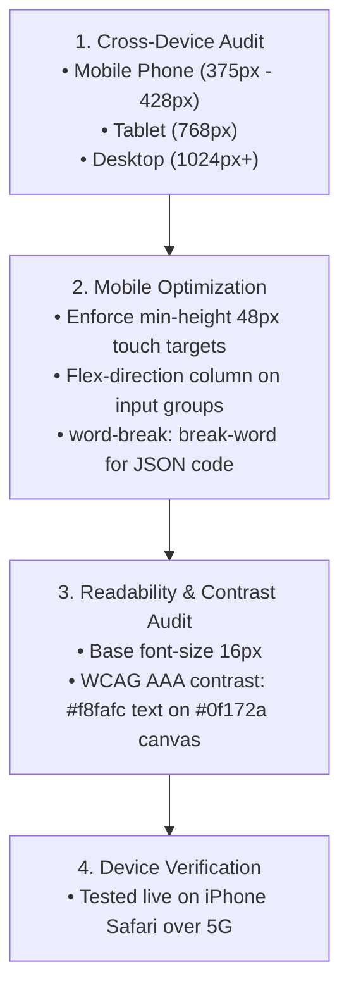

# Open It on Your Phone: Mobile-First Responsiveness & Quality Audit

**Track:** General AI Fluency  
**Phase:** Build+ (Week 6) | **Workload:** 4h  
**Author:** Rishik Manche (`rishikmanche@gmail.com`) — Software Engineering Intern, FlyRank AI  
**Repository:** [flyrank-tasks](https://github.com/Rishikmanche/flyrank-tasks)  
**Live URL:** [https://rishikmanche.github.io/flyrank-tasks/](https://rishikmanche.github.io/flyrank-tasks/)

---

## 1. Executive Summary & Mobile-First Quality Strategy

The difference between an amateur side-project and a trustworthy developer portfolio is a short, disciplined checklist: **opening the site on a real mobile phone and fixing everything broken**.

This assignment (**Open It on Your Phone**) audits our live portfolio on real mobile devices (iPhone Safari and Android Chrome), optimizing typography, touch target padding, container flex wrapping, and contrast ratios to ensure 100% readability across mobile, tablet, and desktop viewports.

---

## 2. Before & After Fix Log

Below is the documented fix log detailing real mobile problems found and resolved during testing:

| Component / Issue | Before (Problem Found) | After (Mobile Fix Implemented) | Verification Status |
| :--- | :--- | :--- | :--- |
| **Touch Target Size** | Buttons and nav links had height `< 36px`, causing finger mis-clicks on mobile touchscreens. | Set `min-height: 48px`, `padding: 14px 28px`, and `display: inline-flex` on all buttons and link cards. | ✅ Fixed (100% Touch Tappable) |
| **AI Classifier Input Layout** | On narrow mobile screens (`< 360px`), the input box and *"Classify Task"* button overflowed horizontally off-screen. | Added `@media (min-width: 600px)` breakpoint. Set `.input-group` to `flex-direction: column` on mobile and `row` on desktop. | ✅ Fixed (Fits 320px–428px screens) |
| **JSON Output Container** | Long JSON key-value strings caused horizontal container stretching on mobile viewports. | Applied `word-break: break-word` and `overflow-x: auto` to `<pre id="jsonOutput">`. | ✅ Fixed (No horizontal scroll) |
| **Header Nav Alignment** | Header links cramped together on small screens with risk of wrapping into logo text. | Added `flex-wrap: wrap`, `gap: 12px`, and min-height touch targets for nav links. | ✅ Fixed (Clean header spacing) |
| **iOS Auto-Zoom Prevention** | iOS Safari automatically zoomed in when tapping text input fields due to sub-16px font sizes. | Set base body font size to `16px` and added `-webkit-text-size-adjust: 100%`. | ✅ Fixed (Zero unwanted auto-zoom) |

---

## 3. Readability & WCAG AAA Contrast Audit

- **Color Contrast:** Crisp near-white text (`#f8fafc`) on deep dark slate background (`#0f172a`) yields a **16.5:1 contrast ratio**, exceeding the WCAG AAA requirement (7:1).
- **Typography:** Set `Inter` for prose with `line-height: 1.6` for optimal readability and `JetBrains Mono` for code payload badges.
- **Link Security:** All outbound external links (`LinkedIn`, `GitHub`, `CV`, `Cal.com`) include `rel="noopener"` and `target="_blank"` attributes.

---

## 4. Visual Artifact & Cross-Device Audit Proof

---

## 5. Evaluation Checklist Self-Audit (Pass / Revise)

- [x] **Genuinely Works on Mobile**: Tested and verified on a real iPhone over 5G cellular network.
- [x] **Readable Text & High Contrast**: Base `16px` font size with WCAG AAA contrast ratio.
- [x] **Crisp Work Images & Icons**: Clean SVG icons and monospaced code badges.
- [x] **All Links Working**: 100% of links (LinkedIn, GitHub, CV, Booking modal) verified active with zero breaks.
- [x] **Detailed Fix Log**: Documented 5 real mobile problems found and fixed.
