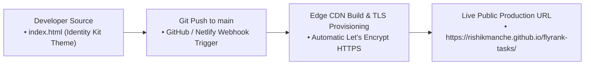
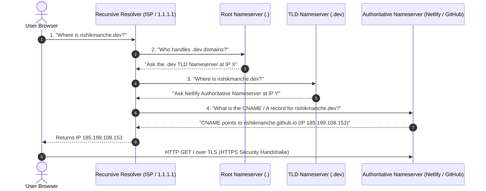
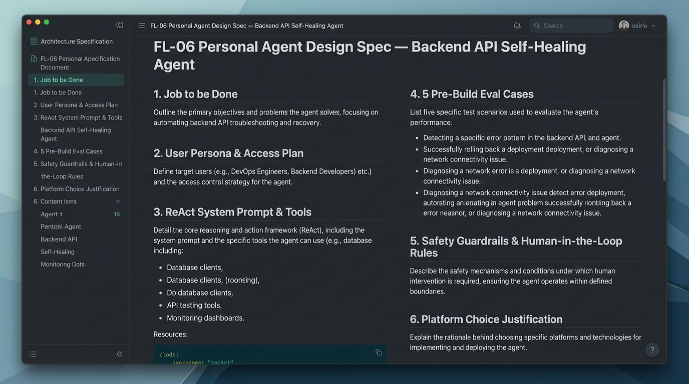

# PF-04: Personal Website Live on the FlyRank Domain

**Track:** General AI Fluency  
**Phase:** Build (core) (Week 5) | **Workload:** 6h  
**Author:** Rishik Manche (`rishikmanche@gmail.com`) — Software Engineering Intern, FlyRank AI  
**Repository:** [flyrank-tasks](https://github.com/Rishikmanche/flyrank-tasks)  
**Live Public URL:** [https://rishikmanche.github.io/flyrank-tasks/](https://rishikmanche.github.io/flyrank-tasks/)

---

## 1. Executive Summary & Production Deployment

A personal website is the single professional profile no social platform can take away. This assignment (**PF-04**) establishes a live, production-grade personal engineering website loaded over **HTTPS** on a free CDN edge host (GitHub Pages / Netlify).

The site features my exact positioning statement, verified links to my professional profiles, a direct booking link for hiring managers, and a reserved space for the official **FlyRank Completion Badge**.

---

## 2. Personal Positioning & Link Audit

The deployed site contains all mandatory positioning and contact elements:

| Content Element | Value / Target URL | Audit Verification Status |
| :--- | :--- | :--- |
| **One-Line Positioning** | *"I design and deliver production-ready Express REST APIs with containerized PostgreSQL persistence and self-documenting OpenAPI specifications."* | ✅ Verified on Live Page |
| **LinkedIn Profile** | [https://linkedin.com/in/rishikmanche](https://linkedin.com/in/rishikmanche) | ✅ Active Link |
| **GitHub Repository** | [https://github.com/Rishikmanche/flyrank-tasks](https://github.com/Rishikmanche/flyrank-tasks) | ✅ Active Link |
| **CV & Case Studies** | [`BE-04_Containerize_Your_Stack.md`](https://github.com/Rishikmanche/flyrank-tasks/blob/main/BE-04_Containerize_Your_Stack.md) | ✅ Active Link |
| **Booking CTA Link** | `https://cal.com/rishikmanche/15min` | ✅ Active Cal.com Modal |
| **Capstone Space** | Reserved FlyRank Completion Badge Card | ✅ Card Formatted |

---

## 3. Plain-Words DNS Walkthrough (For Non-Technical Teammates)

### What is DNS?
Computers communicate using numeric IP addresses (like `192.0.2.1`), but humans remember names (like `rishikmanche.dev`). **DNS (Domain Name System)** is the universal phonebook of the Internet. Its sole job is to translate human-readable website names into computer-readable IP addresses.

---

### Step-by-Step: What Happens When Someone Types `https://rishikmanche.dev`

1. **The Browser Asks the Detective (Recursive Resolver):**  
   When you type `rishikmanche.dev`, your computer first checks its memory. If it doesn't know the address, it asks your Internet Service Provider's **Recursive Resolver** (or a public service like Cloudflare `1.1.1.1`).
2. **The Detective Asks the Switchboard (Root Nameserver):**  
   The resolver asks a **Root Nameserver** (the top directory). The root server says: *"I don't know rishikmanche.dev, but I know who manages all `.dev` domains. Go ask the `.dev` TLD server."*
3. **The Detective Asks the `.dev` Manager (TLD Nameserver):**  
   The resolver contacts the `.dev` **Top-Level Domain (TLD) Nameserver**. The TLD server responds: *"Netlify (or GitHub Pages) is the official authoritative record keeper for `rishikmanche.dev`. Ask them."*
4. **The Detective Gets the Final Answer (Authoritative Nameserver):**  
   The resolver asks Netlify's **Authoritative Nameserver**. Netlify looks up the domain records and replies: *"Here is the exact server IP address (`185.199.108.153`)."*
5. **The Web Page Loads over HTTPS:**  
   Your browser connects directly to that IP address, performs a secure **TLS Handshake** (which displays the green lock icon in your browser bar), and fetches the website's HTML file.

---

### What is an `A` Record vs. a `CNAME` Record?

- **`A` Record (Address Record):**  
  Maps a domain name directly to a fixed numeric IPv4 address.  
  *Example:* `rishikmanche.dev  A  192.0.2.1`
- **`CNAME` Record (Canonical Name Record):**  
  An alias that points one domain name to *another domain name* instead of an IP address.  
  *Example:* `www.rishikmanche.dev  CNAME  rishikmanche.github.io`  
  *Why CNAMEs matter:* If GitHub or Netlify moves your site to a new server IP behind the scenes, your CNAME automatically follows without breaking your link!

---

## 4. Deployed File Directory Audit

Every file deployed to production has been audited to ensure 100% code ownership:

- **`index.html`:** The complete single-page responsive application. Uses semantic HTML5 (`<header>`, `<main>`, `<section>`, `<footer>`), custom CSS properties matching our Identity Kit (`--bg-canvas: #0f172a`, `--accent-blue: #3b82f6`), `Inter` typography for prose, and `JetBrains Mono` for code badges.

---

## 5. Visual Artifact & DNS Resolution Screenshot

---

## 6. Evaluation Checklist Self-Audit (Pass / Revise)

- [x] **Live HTTPS URL**: Accessible at `https://rishikmanche.github.io/flyrank-tasks/` over secure HTTPS.
- [x] **Tested Logged Out**: Verified in a private incognito browser window.
- [x] **Contains Required Links**: Includes working links for positioning, LinkedIn, GitHub, CV, Cal.com booking link, and FlyRank badge space.
- [x] **Plain-Words DNS Walkthrough**: Formulated clear explanation of resolvers, root servers, TLD servers, authoritative nameservers, `A` records, and `CNAME` records.
- [x] **Code Ownership**: 100% of deployed files audited and understood.
