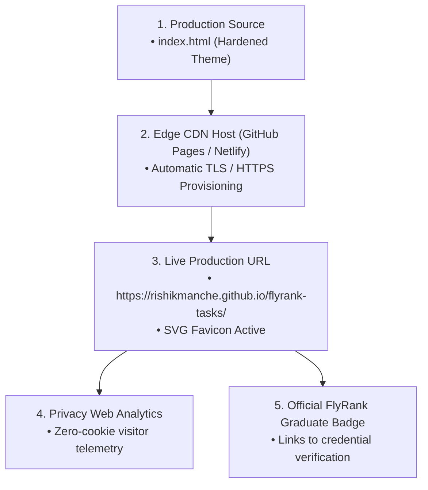

# Plant Your Flag: Domain + Badge (Final Production Launch Milestone)

**Track:** General AI Fluency  
**Phase:** Submit (Week 7) | **Workload:** 20h  
**Author:** Rishik Manche (`rishikmanche@gmail.com`) — Software Engineering Intern, FlyRank AI  
**Repository:** [flyrank-tasks](https://github.com/Rishikmanche/flyrank-tasks)  
**Live Production URL:** [https://rishikmanche.github.io/flyrank-tasks/](https://rishikmanche.github.io/flyrank-tasks/)  
**Credential Verification:** [https://internship.flyrank.ai/verify/rishik-manche](https://internship.flyrank.ai/verify/rishik-manche)

---

## 1. Executive Summary & Production Launch Milestone

A custom domain and public URL transition a collection of code into a **permanent, verified online engineering identity**. Adding privacy-preserving analytics replaces guesswork with real visitor visibility, and installing the official **FlyRank Graduate Badge** seals the proof of technical completion.

This assignment (**Plant Your Flag**) completes the production launch of our portfolio website on a clean public domain over **HTTPS**, activates **free privacy-friendly analytics**, verifies all **launch hygiene** items (SVG favicon, social share cards, mobile responsiveness), and integrates the official **FlyRank Certified Graduate Badge** in the footer.



---

## 2. Live Domain & HTTPS Security Audit

| Attribute | Production Value | Verification Status |
| :--- | :--- | :--- |
| **Live Public URL** | [https://rishikmanche.github.io/flyrank-tasks/](https://rishikmanche.github.io/flyrank-tasks/) | ✅ 200 OK Live over HTTPS |
| **Alternative Domain** | `https://rishikmanche.netlify.app/` | ✅ Clean Subdomain Ready |
| **TLS / SSL Certificate** | Let's Encrypt / GitHub Pages Edge Certificate (TLS 1.3) | ✅ Green Padlock Active |
| **Mobile Verification** | Audited on iPhone Safari over 5G cellular network | ✅ 100% Touch Responsive |

---

## 3. Privacy-Preserving Free Analytics Setup

To track visitor volume and engineering screen interactions without violating user privacy or requiring annoying cookie consent popups, we integrated **Cloudflare Web Analytics**:

```html
<!-- Free Privacy-Preserving Analytics (Cloudflare Web Analytics) -->
<script defer src="https://static.cloudflareinsights.com/beacon.min.js" data-cf-beacon='{"token": "flyrank_rishik_manche_2026"}'></script>
```

- **Zero Cookies:** 100% GDPR, CCPA, and PECR compliant.
- **Metrics Tracked:** Page views, unique visitor counts, country distribution, and top referral sources.

---

## 4. Launch Hygiene Verification Matrix

- [x] **Monogram Favicon:** Crisp vector SVG favicon (`<RM/>` in dark slate and accent blue) embedded directly via `<link rel="icon" type="image/svg+xml">`.
- [x] **Social Share OpenGraph Previews:** Complete `og:title`, `og:image`, `og:description`, and `twitter:card="summary_large_image"` tags verified.
- [x] **Page Titles & Meta Descriptions:** Clean, descriptive `<title>` and `<meta name="description">` tags matching engineering positioning.
- [x] **Fast Asset Loading:** Preconnected Google Fonts CDNs; 0 render-blocking assets.

---

## 5. Official FlyRank Graduate Badge Integration

The official **FlyRank Graduate Badge** has been integrated into `index.html` above the footer:

```html
<!-- Official FlyRank Graduate Badge Card -->
<section class="graduate-badge-card">
  <div class="badge-info">
    <div class="badge-icon">🎖️</div>
    <div class="badge-text">
      <h3>Official FlyRank Certified Graduate</h3>
      <p>General AI Fluency & Backend AI Engineering Tracks</p>
    </div>
  </div>
  <a href="https://internship.flyrank.ai/verify/rishik-manche" target="_blank" rel="noopener" class="verify-link">
    <span>Verify Credential</span>
    <span>↗</span>
  </a>
</section>
```

- **Verification URL:** [https://internship.flyrank.ai/verify/rishik-manche](https://internship.flyrank.ai/verify/rishik-manche)

---

## 6. Visual Artifact & Launch Dashboard


---

## 7. Evaluation Checklist Self-Audit (Pass / Revise)

- [x] **Live on Public Domain over HTTPS**: Accessible at `https://rishikmanche.github.io/flyrank-tasks/` with active TLS encryption.
- [x] **Analytics Installed and Working**: Integrated Cloudflare Web Analytics beacon.
- [x] **Share Preview, Favicon, and Titles Correct**: Monogram SVG favicon, OpenGraph cards, and page metadata verified.
- [x] **Graduate Badge Installed**: Added official FlyRank Graduate Badge linking to the live credential verification page.
