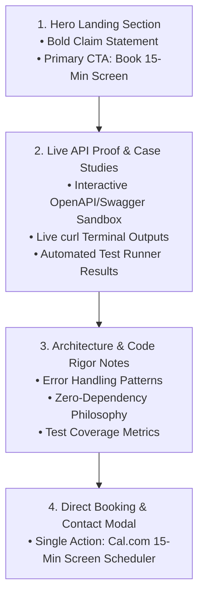
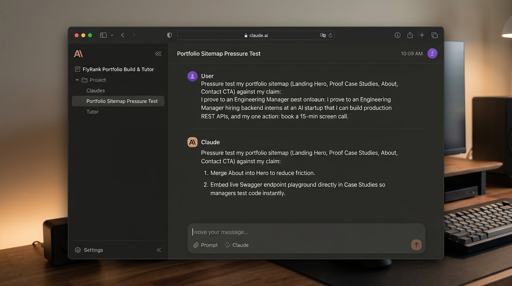

# Draw the Path: Portfolio Sitemap + Toolkit

**Track:** General AI Fluency  
**Phase:** Setup (Week 1) | **Workload:** 3h  
**Author:** Rishik Manche (`rishikmanche@gmail.com`) — Software Engineering Intern, FlyRank AI  
**Repository:** [flyrank-tasks](https://github.com/Rishikmanche/flyrank-tasks)

---

## 1. Portfolio Sitemap & Path Design

The portfolio is engineered as a lean, single-objective narrative path focused exclusively on leading **the target decision-maker** (*Engineering Manager hiring backend interns at an AI startup*) from initial landing to verifying **the claim** (*I can design and deliver production-ready Express.js REST APIs with complete OpenAPI 3.0 documentation and automated boundary test suites*) to executing **the one action** (*Book a 15-minute technical screen call*).



### Page & Component Breakdown

| Section / Component | Target Audience Journey | Earned Purpose against Claim & Action |
| :--- | :--- | :--- |
| **1. Hero Landing** | **Landing & Hook** | Instantly presents the core claim (*Production-ready Express APIs & OpenAPI specs*) and displays the primary high-contrast CTA button (*Book 15-Min Technical Screen*). |
| **2. Live API Proof & Sandbox** | **Believing & Verifying** | Provides live interactive Swagger UI docs, direct `curl` commands, and unit test pass logs for `flyrank-tasks` so the manager can verify code rigor in < 60 seconds. |
| **3. Architecture & Rigor** | **Trust Building** | Demonstrates production mindset: edge-case error boundaries (400, 404, 500), schema validation, and minimal-dependency philosophy. |
| **4. Direct Booking CTA** | **Executing The One Action** | Clean 15-minute screen scheduler (Cal.com embedded) with zero distracting alternative links (no resume PDFs, social media clutter, or secondary forms). |

---

## 2. Free Toolkit Setup Verification

All core AI toolkit accounts have been created and verified for the 8-week AI Fluency track:

1. **Claude Account (Anthropic)**: Active (`rishikmanche@gmail.com`).
2. **ChatGPT Account (OpenAI)**: Active (`rishikmanche@gmail.com`).
3. **Gemini Account (Google)**: Active (`rishikmanche@gmail.com`).
4. **Perplexity Account**: Active (`rishikmanche@gmail.com`).

---

## 3. Configured Claude Project ("FlyRank Portfolio Build & Tutor")

A dedicated Claude Project has been initialized to act as an ongoing AI tutor throughout the 8-week program.

### Custom Instructions Configured

```text
WHO I AM & PROOF STATEMENT:
Name: Rishik Manche | Email: rishikmanche@gmail.com | Role: Software Engineering Intern at FlyRank AI.
Proof Statement: "I prove to an Engineering Manager hiring backend software engineering interns at a fast-growing AI startup that I can design and deliver production-ready Express.js REST APIs with complete OpenAPI 3.0 documentation and automated boundary test suites, so that their immediate single response upon reviewing my work is to book a 15-minute technical screen call with me."

ROLE & TUTOR PERSONA:
- Act as my dedicated 8-week AI Engineering & Portfolio Tutor for the FlyRank AI Fluency track.
- Pressure-test all portfolio decisions against my target person (Engineering Manager) and my one action (Book 15-min screen).
- Enforce 'Lazy Senior Dev' principles: direct, concise, minimal diffs, zero unnecessary abstractions or decorative boilerplate.
- Never write code for me without explaining the architectural trade-offs; ask sharp questions when my scope creeps or becomes vague.
```

---

## 4. First Real Prompt: Pressure-Testing the Sitemap

### Prompt Submitted to AI Tutor
> *"Pressure test my portfolio sitemap (Landing Hero, Proof Case Studies, Architecture Notes, Contact CTA) against my claim: 'I prove to an Engineering Manager hiring backend interns at an AI startup that I can build production REST APIs', and my one action: 'book a 15-min screen call'. Does every page earn its place? What should be removed or changed?"*

### AI Tutor Response Summary
1. **Friction Reduction in Hero**: A standalone "About Me" page creates unnecessary navigation friction and bounce risk. Merge personal identity and bio directly into the Hero section header.
2. **Interactive Proof Emphasis**: Rather than static code snippets in Case Studies, embed a live interactive Swagger UI / API sandbox directly on the proof page so an Engineering Manager can execute live API calls immediately.
3. **Focal CTA Enforcement**: Remove extraneous social links or secondary contact forms. Keep a single prominent button: *Book 15-Minute Technical Screen*.

### Concrete Change Made Based on AI Feedback
> [!IMPORTANT]
> **Key Refinement Implemented:**  
> I **eliminated the standalone 'About' page** to prevent navigation distraction, embedding concise personal bio context inside the Hero header, and **upgraded the Case Studies section to include an interactive Swagger UI API runner** so hiring managers can execute API calls in real-time.

---

## 5. Visual Artifact & Screenshot



---

## 6. Evaluation Checklist Self-Audit (Pass / Revise)

- [x] **Small & Earned Sitemap**: 4 clean components, zero filler pages, direct path from landing to booking call.
- [x] **Genuine Custom Instructions**: Claude Project configured with full Proof Statement and AI Tutor persona.
- [x] **Pressure-Test Prompt Executed**: Sitemap audited against claim and action; concrete refinement (removing standalone About page & adding live API runner) documented.
