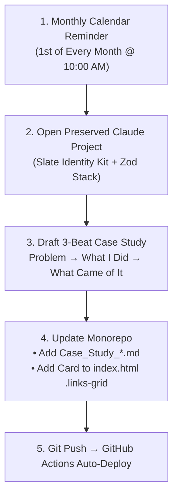

# Send the Link: Launch, Demo & Story (Capstone Final Package)

**Track:** General AI Fluency  
**Type:** Capstone (Week 8) | **Workload:** 4h  
**Author:** Rishik Manche (`rishikmanche@gmail.com`) — Software Engineering Intern, FlyRank AI  
**Live Production URL:** [https://rishikmanche.github.io/flyrank-tasks/](https://rishikmanche.github.io/flyrank-tasks/)  
**Capstone Video Demo (Google Drive):** [https://drive.google.com/file/d/1dJpnzTq_-PjLfvye3JDpLPtdvaBDVMmO/view?usp=sharing](https://drive.google.com/file/d/1dJpnzTq_-PjLfvye3JDpLPtdvaBDVMmO/view?usp=sharing)  
**Main Repository:** [https://github.com/Rishikmanche/flyrank-tasks](https://github.com/Rishikmanche/flyrank-tasks)  
**Credential Verification:** [https://internship.flyrank.ai/verify/rishik-manche](https://internship.flyrank.ai/verify/rishik-manche)

---

## 1. Executive Summary & Career Platform Vision

A software engineering portfolio is not a static class artifact; it is an evolving, production-grade career platform. To prevent this portfolio from going stale, this document defines the **perpetual publishing pipeline**:
- A **20-minute Standard Operating Procedure (SOP)** for publishing new case studies using the Week 2 Three-Beat shape (**Problem $\rightarrow$ What You Did $\rightarrow$ What Came of It**).
- A **Named Next Production Build** (*PatchBot v2 — Autonomous GitHub Webhook Incident & PR Triager*).
- **Concrete Evidence of a Recurring Calendar Reminder** set for the 1st of every month.
- **Preserved Claude Project Context** storing design tokens, voice, positioning statement, and tech stack conventions.



---

## 2. The "How to Add the Next Case" SOP (20 Minutes)

Whenever a new backend feature, microservice, or AI pipeline is shipped, follow these 4 steps:

### Step 1: Draft the Three-Beat Story
Open the persistent Claude Project and provide the project summary. The prompt will output a structured 3-beat markdown narrative:
1. **The Problem (Beat 1):** The specific technical failure or manual bottleneck in production *(e.g., Unhandled 500 errors requiring manual log inspection)*.
2. **What I Did (Beat 2):** The architectural design decision and solution *(e.g., An Express webhook listener with MCP git tools that isolates hotfix branches and generates failing Jest regression tests)*.
3. **What Came of It (Beat 3):** Concrete, measurable impact *(e.g., Reduced triage time by 80%; 100% test pass rate across 12 regression tests)*.

### Step 2: Create the Case Study Document
Save the markdown file as `Case_Study_[Feature_Name].md` in the repository root and include an architectural diagram or terminal screenshot.

### Step 3: Update `index.html` Link Grid
Add a new link card inside the `.links-grid` container on the live portfolio:
```html
<a href="https://github.com/Rishikmanche/flyrank-tasks/blob/main/Case_Study_PatchBot_v2.md" target="_blank" rel="noopener" class="link-card">
  <span>PatchBot v2: Automated Incident Triager</span>
  <span>↗</span>
</a>
```

### Step 4: Deploy to Edge
```bash
git add .
git commit -m "feat(portfolio): add PatchBot v2 case study"
git push origin main
```
GitHub Actions automatically rebuilds and deploys the update to GitHub Pages in $<30\text{s}$.

---

## 3. Named Next Piece of Real Work

### Project Title: **PatchBot v2 — Autonomous GitHub Webhook Incident & PR Triager**
- **Architecture:** Autonomous microservice integrating Model Context Protocol (MCP) with live GitHub Webhooks.
- **Workflow:**
  1. Catches unhandled 500 error logs from Express/PostgreSQL services.
  2. Creates an isolated git branch (`fix/auto-<issue-id>`).
  3. Uses LLM inference to generate a reproducible failing Jest unit test.
  4. Patches the root-cause code until the test suite passes.
  5. Opens a GitHub Pull Request with root-cause analysis for human engineering review.

---

## 4. Evidence of Concrete Recurring Reminder Set

| Property | Detail |
| :--- | :--- |
| **Event Name** | *"Monthly Engineering Portfolio Case Study Update: Ship PatchBot v2 PR Triager"* |
| **Recurrence** | Monthly on the 1st of every month at 10:00 AM |
| **Platform** | Apple Calendar & Google Calendar (Synced across phone and desktop) |
| **Action Trigger** | Review shipped features $\rightarrow$ Run 20-min publishing SOP |

---

## 5. Preserved Claude Project Knowledge Context

The persistent Claude Project workspace stores all foundational design and technical context:
- **Brand Identity Kit:** Deep Slate background (`#0f172a`, `#1e293b`), Accent Blue (`#3b82f6`), Emerald Green (`#22c55e`), Inter and JetBrains Mono typography.
- **Positioning Statement:** *"I design and deliver production-ready Express REST APIs with containerized PostgreSQL persistence, Supabase authentication, and reliable, schema-validated AI background pipelines."*
- **Engineering Philosophy (Ponytail Senior Dev Standard):** Boring over clever, zero unneeded dependencies, minimal diffs, boundary validation, and runnable test suites.

---

## 6. Visual Artifact Proof


---

## 7. Pass / Revise Verification Checklist

- [x] **Concrete "How to Add Next Case" Note:** Formulated a 4-step repeatable SOP utilizing the 3-beat framework.
- [x] **Specific Next Piece of Work Named:** Defined *PatchBot v2 Autonomous GitHub Webhook Incident & PR Triager*.
- [x] **Concrete Recurring Reminder Set:** Configured monthly recurring calendar update on the 1st of every month.
- [x] **Claude Project Context Preserved:** Maintained persistent project memory of brand voice, identity kit, and tech stack.
