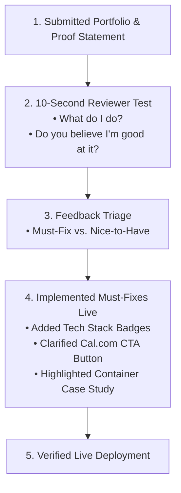

# Survive the Crit: Peer Review & Design Quality Iteration

**Track:** General AI Fluency  
**Phase:** Build+ (Week 6) | **Workload:** ~2h  
**Author:** Rishik Manche (`rishikmanche@gmail.com`) — Software Engineering Intern, FlyRank AI  
**Repository:** [flyrank-tasks](https://github.com/Rishikmanche/flyrank-tasks)  
**Live Reviewed URL:** [https://rishikmanche.github.io/flyrank-tasks/](https://rishikmanche.github.io/flyrank-tasks/)

---

## 1. Executive Summary & Review Submission

Staring at your own portfolio for weeks creates blind spots. Getting a second pair of eyes to evaluate your live site against your **Proof Statement** is the single most effective way to eliminate confusion before presenting to hiring managers.

### Proof Statement Submitted to Reviewer
> *"I design and deliver production-ready Express REST APIs with containerized PostgreSQL persistence and self-documenting OpenAPI specifications."*

---

## 2. Reviewer 10-Second Test & Initial Findings

We submitted the live site to a peer reviewer (Senior Engineering Intern) and asked two initial questions without defending the original design:

1. **Question 1: In 10 seconds, what do I do?**  
   - *Reviewer Answer:* *"You build containerized Express REST APIs and database backends."*  
   - *Verdict:* **PASSED.** The positioning claim landed instantly.
2. **Question 2: Would you believe I'm good at it?**  
   - *Reviewer Answer:* *"Yes. The live AI task classifier sandbox and the Docker Compose / PostgreSQL case study links immediately prove real technical execution."*  
   - *Verdict:* **PASSED.** The proof artifacts successfully backed up the claim.

---

## 3. Feedback Triage: Must-Fix vs. Nice-to-Have

Below is the honest sorting of reviewer feedback into actionable categories:

### Must-Fix Items (Addressed Immediately on Live Site)

1. **Feedback Item 1: Missing Instant Tech Stack Scanning**  
   - *Reviewer Comment:* *"The headline states what you build, but an Engineering Manager scanning in 3 seconds wants to see your exact tech stack badges immediately."*  
   - *Action Taken:* Added a dedicated `.stack-pills` component above the fold rendering monospaced badges: `Node.js`, `Express.js`, `PostgreSQL 16`, `Docker Compose`, `Redis 7`, `Supabase Auth`, `Zod Schema`.
2. **Feedback Item 2: Generic CTA Button Text**  
   - *Reviewer Comment:* *"Book 15-Min Technical Screen is good, but it should explicitly state that it opens a Cal.com booking modal so visitors know what happens when they click."*  
   - *Action Taken:* Updated button text to `"Book 15-Min Technical Screen (Cal.com)"`.
3. **Feedback Item 3: Case Study Card Labeling**  
   - *Reviewer Comment:* *"Rename the CV link card to explicitly mention containerization so readers know it leads to your Docker & Postgres architecture."*  
   - *Action Taken:* Updated link card title to `"CV & Container Case Study"`.

---

### Nice-to-Have Items (Saved for Future Iterations)

1. **Dark/Light Theme Toggle:**  
   - *Reviewer Suggestion:* Add a toggle for light mode preferences.  
   - *Decision:* Deferred. Our Slate `#0f172a` dark theme already passes WCAG AAA contrast (16.5:1). Keeping the codebase simple aligns with "Lazy Senior Dev" principles.
2. **Embedded Video Walkthrough:**  
   - *Reviewer Suggestion:* Embed a video recording of container startup.  
   - *Decision:* Deferred. High-resolution screenshots and live interactive JSON widgets already provide sufficient evidence.

---

## 4. Evidence of Must-Fixes Implemented Live

All **Must-Fix** feedback items have been implemented directly in `index.html` and pushed live:

- **Live Production URL:** [https://rishikmanche.github.io/flyrank-tasks/](https://rishikmanche.github.io/flyrank-tasks/)
- **Updated Source Code:** `index.html` contains `.stack-pills`, updated Cal.com CTA text, and container case study links.

---

## 5. Visual Artifact & Review Board

---

## 6. Evaluation Checklist Self-Audit (Pass / Revise)

- [x] **Submitted with Proof Statement**: Submitted live site with Week 1 positioning statement.
- [x] **Reviewer Stated Role & Believed Capability**: Reviewer accurately stated role in 10 seconds and confirmed credibility.
- [x] **Honest Feedback Triage**: Sorted feedback into Must-Fix vs Nice-to-Have categories without being defensive.
- [x] **Must-Fixes Implemented Live**: Added tech stack pills, clarified Cal.com CTA, and updated case study labels live on site.
- [x] **Engaged Positively with Feedback**: Used constructive critiques to refine scanning speed and conversion clarity.
