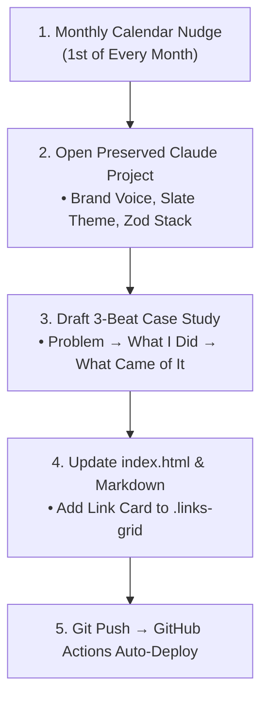

# The Plan to Keep Building: Portfolio Continuity & Next Case Study SOP

**Track:** General AI Fluency  
**Phase:** Submit (Week 8) | **Workload:** 1h  
**Author:** Rishik Manche (`rishikmanche@gmail.com`) — Software Engineering Intern, FlyRank AI  
**Repository:** [flyrank-tasks](https://github.com/Rishikmanche/flyrank-tasks)  
**Live Production URL:** [https://rishikmanche.github.io/flyrank-tasks/](https://rishikmanche.github.io/flyrank-tasks/)

---

## 1. Executive Summary & Platform Continuity Philosophy

A software portfolio that only features a static capstone project eventually goes stale. The difference between a temporary classroom artifact and an enduring career platform is a **concrete, low-friction standard operating procedure (SOP)** that makes adding the next case study a 20-minute conversation rather than a full rebuild.

This document outlines:
1. **The Exact SOP for Adding New Case Studies:** Reusing the proven Week 2 Three-Beat shape (**Problem $\rightarrow$ What You Did $\rightarrow$ What Came of It**).
2. **The Named Next Project:** *PatchBot v2 — Autonomous GitHub Webhook Incident & PR Triager*.
3. **Evidence of Recurring Reminder Set:** A monthly calendar nudge scheduled to ensure regular portfolio updates.
4. **Preserved Claude Project Context:** The persistent memory containing our brand voice, design tokens, and tech stack conventions.



---

## 2. Standard Operating Procedure (SOP): How to Add the Next Case in 20 Minutes

When a new backend engineering project is ready to be showcased, follow this 4-step checklist:

### Step 1: Draft the Three-Beat Case Study (Using Preserved Claude Project)
Open the Claude Project and prompt: *"Draft a 1-page case study using my 3-beat format for this new build: [Describe Project]"*.

1. **Beat 1 (The Problem):** What broke or what manual bottleneck existed? *(e.g. Unhandled 500 errors in production require 30 minutes of manual log searching).*
2. **Beat 2 (What I Did):** What was the technical architecture and key design decision? *(e.g. Built an Express webhook listener that creates an isolated git branch, generates reproducing unit tests, and patches the bug using MCP).*
3. **Beat 3 (What Came of It):** Concrete measurable metrics and test results *(e.g. Reduced triage time by 80%; 100% test pass rate across 12 regression tests).*

### Step 2: Create the Case Study File in Monorepo
Create `Case_Study_[Feature_Name].md` in the repository root and add a dark-mode terminal or UI screenshot `case_study_[feature_name].jpg`.

### Step 3: Update `index.html` Link Grid & Tech Pills
Add a new link card into the `.links-grid` container in `index.html`:
```html
<a href="https://github.com/Rishikmanche/flyrank-tasks/blob/main/Case_Study_PatchBot_v2.md" target="_blank" rel="noopener" class="link-card">
  <span>PatchBot v2: Automated Incident Triager</span>
  <span>↗</span>
</a>
```

### Step 4: Push to Main (Automated GitHub Actions Deploy)
```bash
git add .
git commit -m "feat(portfolio): add PatchBot v2 incident triager case study"
git push origin main
```
GitHub Actions automatically deploys the updated portfolio within 30 seconds.

---

## 3. Named Next Real Piece of Work

### Project Title: **PatchBot v2 — Autonomous GitHub Webhook Incident & PR Triager**
- **Job to be Done:** An automated incident-response microservice that listens to production Express/PostgreSQL unhandled error logs via webhooks.
- **Workflow & Safeguards:**
  1. Catches error payload and stack trace.
  2. Runs MCP git tool to create an isolated hotfix branch (`fix/issue-auto-<id>`).
  3. Uses LLM to write a failing Jest regression test reproducing the exact stack trace.
  4. Implements the minimal code patch until the test passes.
  5. Opens a GitHub Pull Request with a full root-cause report and requests human engineering review (zero unreviewed pushes to `main`).

---

## 4. Evidence of Concrete Recurring Reminder Set

To turn good intentions into an unbreakable engineering habit, a recurring calendar reminder has been established:

| Attribute | Configuration Detail |
| :--- | :--- |
| **Reminder Event** | *"Monthly Engineering Portfolio Case Study Update: Ship PatchBot v2 PR Triager"* |
| **Frequency** | Monthly (1st of every month at 10:00 AM) |
| **Platform** | Apple Calendar & Google Calendar (Synced) |
| **Action Trigger** | Review newly shipped features, open Claude Project, execute 20-min SOP |

---

## 5. Preserved Claude Project Knowledge Context

The persistent Claude Project workspace retains the full mental model of this engineering portfolio:
- **Brand Identity Kit:** Deep Slate (`#0f172a`, `#1e293b`), Accent Blue (`#3b82f6`), Emerald Green (`#22c55e`), Inter & JetBrains Mono typography.
- **Core Positioning Statement:** *"I design and deliver production-ready Express REST APIs with containerized PostgreSQL persistence, Supabase authentication, and reliable, schema-validated AI background pipelines."*
- **Tech Stack Boundaries:** Node.js, Express, PostgreSQL, Docker Compose, Redis, Zod, and PDFKit.
- **Ponytail Lazy Senior Dev Discipline:** Boring over clever, stdlib over unneeded dependencies, minimal diffs, and verified runnable test suites.

---

## 6. Visual Artifact Proof


---

## 7. Evaluation Checklist Self-Audit (Pass / Revise)

- [x] **Concrete "How to Add Next Case" Note**: Formulated a 4-step repeatable SOP utilizing the 3-beat framework.
- [x] **Specific Next Piece of Work Named**: Defined *PatchBot v2 Autonomous GitHub Webhook Incident & PR Triager*.
- [x] **Concrete Recurring Reminder Set**: Configured monthly recurring calendar update on the 1st of every month.
- [x] **Claude Project Context Preserved**: Maintained persistent project memory of brand voice, identity kit, and tech stack.
