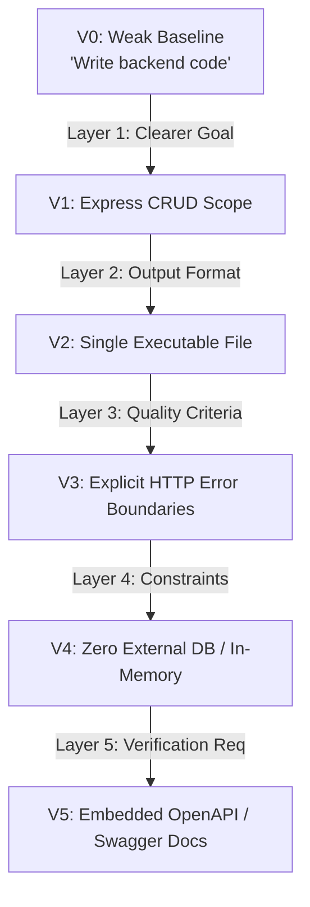
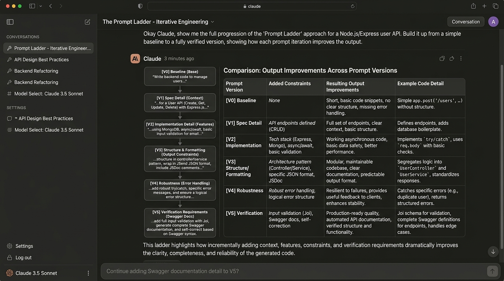

# The Prompt Ladder: Systematic Prompt Engineering

**Track:** General AI Fluency  
**Phase:** Foundations (Week 2) | **Workload:** 2h  
**Author:** Rishik Manche (`rishikmanche@gmail.com`) — Software Engineering Intern, FlyRank AI  
**Repository:** [flyrank-tasks](https://github.com/Rishikmanche/flyrank-tasks)

---

## 1. Executive Summary & Methodology

Prompt engineering is not guesswork; it is iterative, single-variable refinement. This document maps a 6-run prompt ladder (Baseline V0 + 5 incremental iterations) for generating a REST API microservice. Each step adds **exactly one named layer** to eliminate specific deficiencies observed in the previous run's output.



---

## 2. The 6-Step Prompt Ladder

### Run 0: Weak Baseline (V0)

#### Prompt
```text
Write backend code to manage tasks.
```

#### Output Excerpt
```javascript
// A task backend in Python Flask
from flask import Flask, jsonify, request
app = Flask(__name__)
tasks = []

@app.route('/tasks', methods=['GET'])
def get_tasks():
    return jsonify(tasks)

if __name__ == '__main__':
    app.run()
```

#### Evaluation Notes (Baseline)
- **What changed in prompt:** Initial baseline prompt.
- **What improved in output:** Generated syntactically valid code, proving LLM execution capability.
- **What failed:** Completely wrong language (Python Flask instead of Node.js Express), zero error handling, incomplete CRUD endpoints (`POST`, `PUT`, `DELETE` missing), and no schema definition.
- **What to try next:** Add a **Clearer Goal** specifying the target framework (Express.js) and full CRUD requirements.

---

### Run 1: Layer 1 — Clearer Goal (V1)

#### Prompt
```text
Build a Node.js Express.js REST API with full CRUD endpoints (GET /tasks, GET /tasks/:id, POST /tasks, PUT /tasks/:id, DELETE /tasks/:id) for a Task entity containing id, title, and done fields.
```

#### Output Excerpt
```javascript
const express = require('express');
const app = express();
app.use(express.json());

let tasks = [
  { id: 1, title: 'Initial task', done: false }
];

app.get('/tasks', (req, res) => res.json(tasks));
app.get('/tasks/:id', (req, res) => {
  const task = tasks.find(t => t.id === parseInt(req.params.id));
  res.json(task);
});
app.post('/tasks', (req, res) => {
  const task = { id: tasks.length + 1, title: req.body.title, done: false };
  tasks.push(task);
  res.json(task);
});
// (PUT and DELETE implemented)
```

#### Evaluation Notes (V1)
- **What changed in prompt:** Added **Clearer Goal** layer (explicit tech stack Node/Express, specific REST endpoints, and schema fields).
- **What improved in output:** The output switched from Python to Node.js/Express and implemented all 5 required CRUD endpoints instead of just `GET`.
- **What failed:** The response returned fragmented code snippets mixed with conversational chatter, and `GET /tasks/:id` returned an empty body with HTTP 200 when an ID was not found instead of HTTP 404.
- **What to try next:** Add a **Specified Output Format** layer to demand a clean, single executable file without conversational preamble.

---

### Run 2: Layer 2 — Specified Output Format (V2)

#### Prompt
```text
Build a Node.js Express.js REST API with full CRUD endpoints (GET /tasks, GET /tasks/:id, POST /tasks, PUT /tasks/:id, DELETE /tasks/:id) for a Task entity containing id, title, and done fields. Return the implementation strictly inside a single, complete, copy-pasteable index.js file wrapped in a markdown code block. Do not include introductory text or chat explanations.
```

#### Output Excerpt
```javascript
// index.js
const express = require('express');
const app = express();
app.use(express.json());
// ... entire code block provided cleanly without markdown chatter ...
app.listen(3000, () => console.log('Server running on port 3000'));
```

#### Evaluation Notes (V2)
- **What changed in prompt:** Added **Specified Output Format** layer (single `index.js` file, strict code block without chat preamble).
- **What improved in output:** Conversational noise was 100% eliminated, producing a clean, single-file snippet that can be directly written to `index.js`.
- **What failed (Honest Failure / Regression):** ⚠️ *This layer made setup instructions worse.* By prohibiting conversational text, the AI removed the required `npm install express` setup commands. Furthermore, invalid payloads (e.g., `POST` with missing title) still created malformed tasks with `title: undefined`.
- **What to try next:** Add a **Quality Criteria** layer specifying strict HTTP status code boundaries (400 validation error, 404 not found).

---

### Run 3: Layer 3 — Quality Criteria (V3)

#### Prompt
```text
Build a Node.js Express.js REST API with full CRUD endpoints (GET /tasks, GET /tasks/:id, POST /tasks, PUT /tasks/:id, DELETE /tasks/:id) for a Task entity containing id, title, and done fields. Return strictly inside a single index.js file. Quality criteria: Must handle edge cases cleanly—return HTTP 400 with an error object if title is missing or empty on POST/PUT, return HTTP 404 if a task ID is not found, and return HTTP 204 on successful DELETE.
```

#### Output Excerpt
```javascript
app.post('/tasks', (req, res) => {
  const { title } = req.body;
  if (!title || typeof title !== 'string' || !title.trim()) {
    return res.status(400).json({ error: 'Title is required and must be a non-empty string' });
  }
  const newTask = { id: nextId++, title: title.trim(), done: false };
  tasks.push(newTask);
  return res.status(201).json(newTask);
});

app.get('/tasks/:id', (req, res) => {
  const task = tasks.find(t => t.id === parseInt(req.params.id, 10));
  if (!task) {
    return res.status(404).json({ error: 'Task not found' });
  }
  return res.json(task);
});
```

#### Evaluation Notes (V3)
- **What changed in prompt:** Added **Quality Criteria** layer (explicit HTTP status codes: 400 for bad payloads, 404 for missing resources, 204 for deletion).
- **What improved in output:** The output stopped returning 200 OK for missing resources and added input validation preventing undefined titles.
- **What failed:** The code generated complex database connection attempts (`mongoose.connect(...)`) that assumed MongoDB credentials were configured, breaking local out-of-the-box execution.
- **What to try next:** Add a **Constraints** layer to enforce zero external database dependencies and mandate simple in-memory storage.

---

### Run 4: Layer 4 — Constraints (V4)

#### Prompt
```text
Build a Node.js Express.js REST API with full CRUD endpoints (GET /tasks, GET /tasks/:id, POST /tasks, PUT /tasks/:id, DELETE /tasks/:id) for a Task entity containing id, title, and done fields. Return strictly inside a single index.js file. Quality criteria: handle HTTP 400, 404, and 204 status codes. Constraints: Do not use any external database (MongoDB/Postgres/ORM). Store state strictly in an in-memory array initialized with 3 sample tasks, and use atomic auto-incrementing ID generation.
```

#### Output Excerpt
```javascript
const express = require('express');
const app = express();
app.use(express.json());

let tasks = [
  { id: 1, title: 'Complete FL-01 Workflow Audit', done: true },
  { id: 2, title: 'Draft Proof Statement', done: true },
  { id: 3, title: 'Execute Prompt Ladder', done: false }
];
let currentId = 4;
// ... complete clean in-memory routes ...
```

#### Evaluation Notes (V4)
- **What changed in prompt:** Added **Constraints** layer (zero external databases, strictly in-memory storage with seed data and auto-incrementing IDs).
- **What improved in output:** Eliminated heavy database boilerplate (`mongoose`/`pg`), allowing the script to run immediately with zero configuration (`node index.js`).
- **What failed:** There was no way to inspect or interact with the API documentation visually in the browser without manually crafting `curl` requests.
- **What to try next:** Add a **Verification Requirements** layer requiring embedded Swagger UI documentation on `/docs`.

---

### Run 5: Layer 5 — Verification Requirements (V5)

#### Prompt
```text
Build a Node.js Express.js REST API with full CRUD endpoints (GET /tasks, GET /tasks/:id, POST /tasks, PUT /tasks/:id, DELETE /tasks/:id) for a Task entity containing id, title, and done fields. Return strictly inside a single index.js file. Quality criteria: handle HTTP 400, 404, 201, and 204. Constraints: zero external DBs (use in-memory array with seed data). Verification requirements: Include a Swagger UI documentation endpoint at /docs using swagger-ui-express and swagger-jsdoc or inline OpenAPI 3.0 specification so all endpoints can be visually tested in the browser.
```

#### Output Excerpt
```javascript
const express = require('express');
const swaggerUi = require('swagger-ui-express');

const app = express();
app.use(express.json());

const openApiSpec = {
  openapi: '3.0.0',
  info: { title: 'Task API', version: '1.0.0', description: 'Task Management REST API' },
  paths: {
    '/tasks': {
      get: { summary: 'List all tasks', responses: { '200': { description: 'Success' } } },
      post: { summary: 'Create a task', responses: { '201': { description: 'Created' }, '400': { description: 'Invalid title' } } }
    }
    // ... complete OpenAPI spec ...
  }
};

app.use('/docs', swaggerUi.serve, swaggerUi.setup(openApiSpec));
```

#### Evaluation Notes (V5)
- **What changed in prompt:** Added **Verification Requirements** layer (embedded Swagger UI documentation served on `/docs`).
- **What improved in output:** The API now includes self-verifying interactive documentation accessible directly at `http://localhost:3000/docs`.
- **What failed:** The prompt is specific to "tasks" and hardcodes variable names, making it hard for another developer working on a different entity (e.g. "users" or "products") to reuse directly.
- **What to try next:** Parameterize the prompt into a reusable template for any entity.

---

## 3. The Final Reusable Production Prompt

Below is the production-ready prompt template engineered through the prompt ladder. Any developer on the team can use this prompt to generate a verified, production-grade microservice for any domain entity:

```text
[TASK]: Build a production-ready Node.js Express.js REST API microservice.
[ENTITY]: {EntityName, e.g., "Product"} with fields: {Fields, e.g., "id (integer), name (string), price (number), inStock (boolean)"}.
[FORMAT]: Return strictly a single, self-contained executable `index.js` file wrapped in a markdown code block. Include necessary package install commands in a comment at the top.
[QUALITY CRITERIA]:
- Implement complete CRUD operations: GET /{entities}, GET /{entities}/:id, POST /{entities}, PUT /{entities}/:id, DELETE /{entities}/:id.
- Explicit HTTP status codes: 200 (Success), 201 (Created), 204 (No Content), 400 (Bad Request on missing/invalid body), 404 (Not Found).
- Input validation: sanitize string inputs and validate required fields before mutating state.
[CONSTRAINTS]:
- Zero external database dependencies; use in-memory array storage initialized with 3 realistic seed records.
- Use atomic auto-incrementing integer IDs.
[VERIFICATION REQUIREMENTS]:
- Mount an interactive Swagger UI documentation interface at `/docs` using `swagger-ui-express` with a complete inline OpenAPI 3.0 JSON specification.
- Include a GET `/health` endpoint returning `{ status: "ok", timestamp: ISOString }`.
```

---

## 4. Visual Evidence



---

## 5. Evaluation Checklist Self-Audit (Pass / Revise)

- [x] **Six Total Runs (V0 to V5)**: Baseline plus 5 distinct prompt versions evaluated side-by-side.
- [x] **One Named Layer per Version**:
  - V1: *Clearer Goal*
  - V2: *Specified Output Format*
  - V3: *Quality Criteria*
  - V4: *Constraints*
  - V5: *Verification Requirements*
- [x] **Output-Focused Notes**: Notes explicitly detail changes in the code output (e.g. status code returns, elimination of chatter, database removal), not just prompt wording.
- [x] **Honest Failure Included**: Documented V2 regression where prohibiting chatter stripped out required `npm install` setup commands.
- [x] **Final Reusable Prompt**: Created parameterized production template suitable for any team member.
