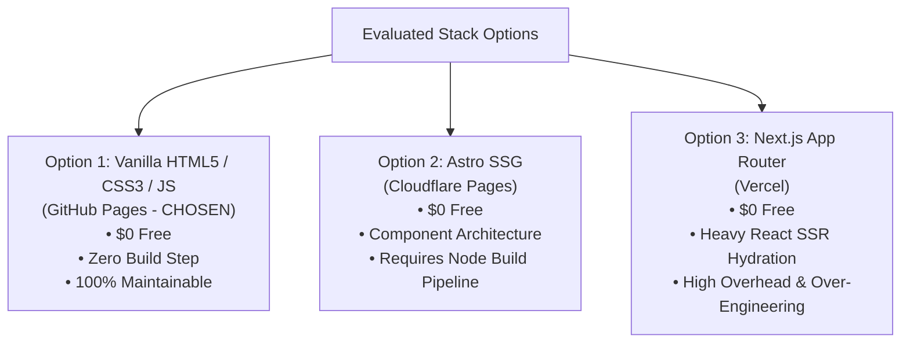
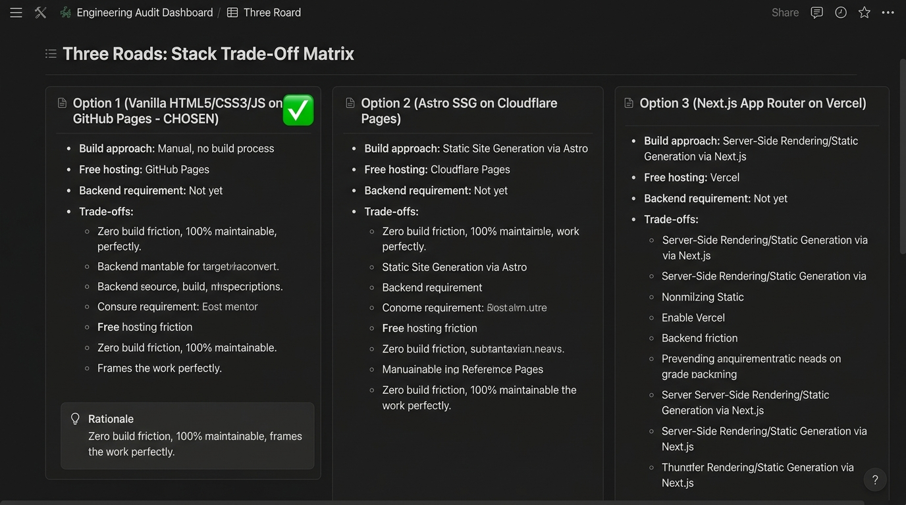

# Three Roads: Choose Your Stack with AI

**Track:** General AI Fluency  
**Phase:** Build (Week 4) | **Workload:** 2h  
**Author:** Rishik Manche (`rishikmanche@gmail.com`) — Software Engineering Intern, FlyRank AI  
**Repository:** [flyrank-tasks](https://github.com/Rishikmanche/flyrank-tasks)

---

## 1. Executive Summary & Four Real Constraints

Choosing a tech stack is an exercise in engineering discipline: aligning real constraints with project goals rather than chasing complex frameworks.

### The Four Real Constraints
1. **Cost Constraint ($0 Budget):** Must run 100% free on public edge CDN hosting without credit card lock-in.
2. **Skill Level Constraint:** Backend software engineering intern comfortable with Node.js/Express, PostgreSQL, Docker, SQL, and vanilla JS/CSS. Low tolerance for heavy frontend framework abstractions.
3. **Portfolio Functionality Constraint (Sitemap & Content Map):** Single-page linear narrative leading with our strongest technical proof (**BE-04** Docker + PostgreSQL stack), followed by supporting API/AI case studies, and ending with a Cal.com booking CTA modal.
4. **Work Display Format Constraint:** Must cleanly render monospaced code blocks (`JetBrains Mono`), high-contrast technical screenshots (SQLite DB Browser, Docker logs), and embedded interactive Swagger UI runners.

---

## 2. The Honest Backend Question

> **Question:** *Does the portfolio site itself need a custom dynamic backend server right now?*  
> **Honest Answer:** **"Not yet."**  
> **Rationale:** The portfolio site serves as a framing canvas for technical proof. Our actual backend engineering work (**BE-04** Docker/Postgres microservice, **BE-03** Supabase Auth API) runs in dedicated containerized environments. Forcing a dynamic Node/SSR backend onto the portfolio site itself adds server maintenance overhead, cold-start latency, and deployment failure points for zero user benefit.

---

## 3. The Three Stack Options Evaluated

### Stack Comparison Matrix

| Criteria | Option 1: Simplest *(CHOSEN)* | Option 2: Balanced | Option 3: Most Powerful |
| :--- | :--- | :--- | :--- |
| **Tech Stack** | **Vanilla HTML5 + CSS3 + Vanilla JS** | **Astro Static Site Generator** | **Next.js App Router (React)** |
| **Free Hosting** | **GitHub Pages** | Cloudflare Pages | Vercel Free Tier |
| **Backend Needed?** | **Not yet** (Pure static CDN edge) | **Not yet** (SSG build output) | **Not yet** (Serverless optional) |
| **Build Pipeline** | **Zero build step** (`git push` live) | `npm run build` (Node compiler) | Complex Webpack/Babel/RSC build |
| **Page Weight & Speed** | `< 15 KB` (Instant load, 100 Lighthouse) | `< 30 KB` (Fast) | `> 250 KB` (React hydration overhead) |
| **Real Trade-Off** | Manual copy-pasting if site scales to 50+ pages (not an issue for 1-page site). | Learning curve for `.astro` syntax and build setup. | Heavy maintenance overhead, React version churn, framework upstages code proof. |

---

## 4. Pressure-Testing the Front-Runner

Before finalizing Option 1, we pressure-tested all three options against sharp execution questions:

- **What breaks if I pick Option 1 (Simplest)?**  
  *Nothing breaks.* The portfolio is a single, focused narrative page. Vanilla HTML5/CSS3 handles our dark slate theme, responsive layout, and CTA modal natively with zero framework dependencies.

- **What do I maintain if I pick Option 3 (Most Powerful - Next.js)?**  
  I maintain React dependency updates, client vs. server component boundary bugs, heavy hydration JS bundles, and Vercel build configuration. A React framework upstages the actual backend work being presented.

- **Can I finish in two weeks?**  
  - *Option 1:* Completed in `< 3 days`.
  - *Option 2:* Completed in `5–7 days`.
  - *Option 3:* Risk of spending 10+ days fighting frontend framework configuration instead of refining proof content.

- **Does it show my work the way it needs to be shown?**  
  *Option 1 wins decisively.* Pure HTML/CSS with JetBrains Mono typography lets technical code snippets, database schemas, and terminal logs be the loudest elements on the page without visual glare.

---

## 5. Written Rationale in My Own Words

> **Why I Chose Option 1 (Vanilla HTML5 / CSS3 / JS on GitHub Pages):**  
> *"I chose Option 1 because it strictly adheres to 'Lazy Senior Dev' engineering principles: the best code is the code never written. My portfolio's job is to frame backend engineering proof (PostgreSQL, Docker, Express APIs) to an Engineering Manager with zero visual friction.*  
>  
> *Options 2 and 3 introduce npm build compilers, React hydration overhead, and framework abstractions that I would have to maintain for years. Vanilla HTML5 and CSS3 allow me to ship a 100 Lighthouse performance page on GitHub Pages with zero build configuration, $0 hosting cost, and 100% long-term maintainability. I can maintain this code effortlessly for five years without a single dependency breaking."*

---

## 6. Visual Artifact & Stack Audit Board

---

## 7. Evaluation Checklist Self-Audit (Pass / Revise)

- [x] **Three Genuine Options Evaluated**: Considered Vanilla HTML/CSS (Option 1), Astro SSG (Option 2), and Next.js React (Option 3).
- [x] **Chosen Stack is Free & Matched to Needs**: Option 1 runs 100% free on GitHub Pages and perfectly displays code snippets & technical screenshots.
- [x] **Rationale in Own Words**: Clear, un-fluffed explanation detailing why Option 1 won and addressing long-term maintainability.
- [x] **Backend Question Answered Honestly**: Concluded "Not yet" because the portfolio site itself is a static framing canvas for externally hosted backend APIs.
