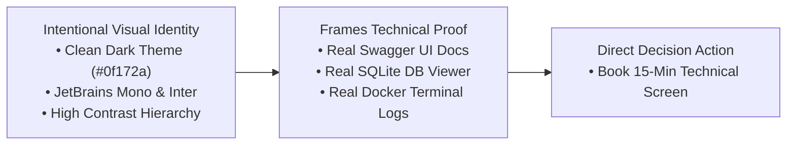
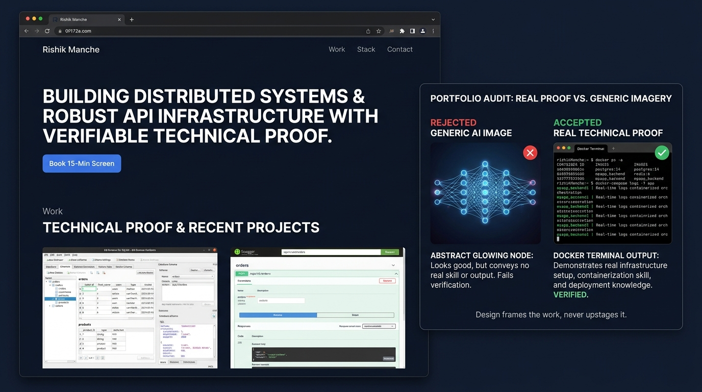

# Consistency, Not Talent (and Frame, Not Upstage)

**Track:** General AI Fluency  
**Phase:** Foundations (Week 3) | **Workload:** 90 min  
**Author:** Rishik Manche (`rishikmanche@gmail.com`) — Software Engineering Intern, FlyRank AI  
**Repository:** [flyrank-tasks](https://github.com/Rishikmanche/flyrank-tasks)

---

## 1. Executive Summary & Core Design Philosophy

Design on a developer portfolio serves one single objective: **frame the work, never upstage it.**

A portfolio is not a canvas for graphic design experimentation or AI-generated decorative art. An Engineering Manager evaluating backend technical proof wants zero visual friction, ultra-readable typography, clear high-contrast hierarchy, and authentic evidence (real terminal outputs, database schema viewers, and Swagger API runners).



---

## 2. Visual Identity System (Style Guide)

Below is the minimalist, intentional visual design system created for the portfolio build:

### Color Palette (Restrained & High Contrast)
- **Background (Canvas):** `#0f172a` (Slate 900 — Deep dark theme, zero glare)
- **Container / Cards:** `#1e293b` (Slate 800 — Subtle surface elevation)
- **Borders & Dividers:** `#334155` (Slate 700 — 1px crisp separation)
- **Primary Text:** `#f8fafc` (Slate 50 — Pure readable white)
- **Secondary Text:** `#94a3b8` (Slate 400 — Muted technical subtext)
- **Primary Action (CTA):** `#3b82f6` (Blue 500 — Single high-contrast action button for *Book 15-Min Screen*)

### Typography
- **Headings & Body:** `Inter`, `-apple-system`, `sans-serif` (Clean, legible geometric sans)
- **Code & API Specifications:** `JetBrains Mono`, `SFMono-Regular`, `monospace` (Precision code alignment)

### Layout & Spacing Rules
- **Container Width:** Max 900px centered, zero horizontal overflow.
- **Spacing Grid:** 8px base unit (16px component padding, 32px section gaps).
- **Rule of Restraint:** Maximum of 1 accent color used exclusively for the primary conversion button.

---

## 3. Claude Project Standing Visual Instructions

The following design rules have been added to the **FlyRank Portfolio Build & Tutor** Claude Project:

```text
VISUAL DESIGN & ASSET JUDGMENT RULES:
- Enforce 'Frame, Not Upstage': Design exists only to highlight technical proof (Swagger UI, DB schema, terminal logs).
- Never suggest generic AI-generated artwork (glowing brains, floating robots, neon circuit grids, abstract 3D shapes).
- Reject decorative distraction: Use clean dark mode (#0f172a), Inter typography, JetBrains Mono code blocks, and a single blue CTA (#3b82f6).
- When selecting visual assets, prioritize real working screenshots over generated media 100% of the time.
```

---

## 4. Asset Curation & Judgment Audit Table

To practice design judgment, 5 visual assets were evaluated for the portfolio build. Generative AI can produce hundreds of decorative images in seconds, but **only real technical evidence earns a place on the page**.

| Asset # | Asset Description | Asset Source | Judgment Decision | Rationale for Acceptance / Rejection |
| :--- | :--- | :--- | :--- | :--- |
| **Asset 1** | Abstract glowing neon neural network & 3D brain graphic | AI Generated (Midjourney/DALL-E) | ❌ **REJECTED** | **Decorates without proving.** Looks generic and amateur; conveys zero technical competency to an Engineering Manager. |
| **Asset 2** | Futuristic robot typing code on a laptop keyboard | AI Generated (DALL-E 3) | ❌ **REJECTED** | **Upstages the content.** Distracts from real code deliverables and creates a "stock photo" feel. |
| **Asset 3** | Multicolored glowing gradient hero background banner | AI Generated / CSS Generator | ❌ **REJECTED** | **Violates high-contrast readability.** Creates visual noise behind the proof statement text. Replaced with clean dark background `#0f172a`. |
| **Asset 4** | Real **DB Browser for SQLite** window showing `tasks.db` schema and executed queries | Real Technical Screenshot | ✅ **ACCEPTED** | **Verifies real database skills.** Shows actual SQL execution (`SELECT * FROM tasks WHERE done = 0`), table structure, and data persistence. |
| **Asset 5** | Real **Docker Compose** terminal output showing container orchestration & curl persistence check | Real Technical Screenshot | ✅ **ACCEPTED** | **Proves containerization & infrastructure.** Demonstrates `docker compose up`, `docker compose restart`, PostgreSQL, Redis, and API execution in live action. |

---

## 5. Visual Artifact & Design Proof



---

## 6. Evaluation Checklist Self-Audit (Pass / Revise)

- [x] **Intentional Visual Identity**: Established restrained 5-color palette, Inter/JetBrains Mono typography, and 900px max-width container rules.
- [x] **"Frame, Not Upstage" Rule Applied**: Visual layout prioritizes readability of proof statement and technical case studies over decorative graphics.
- [x] **Claude Project Updated**: Visual standing instructions saved in Claude Project setup.
- [x] **Asset Curation Audit**: Evaluated 5 visual assets, rejecting 3 generic AI graphics in favor of 2 real technical proof artifacts (DB Browser for SQLite & Docker Compose terminal).
